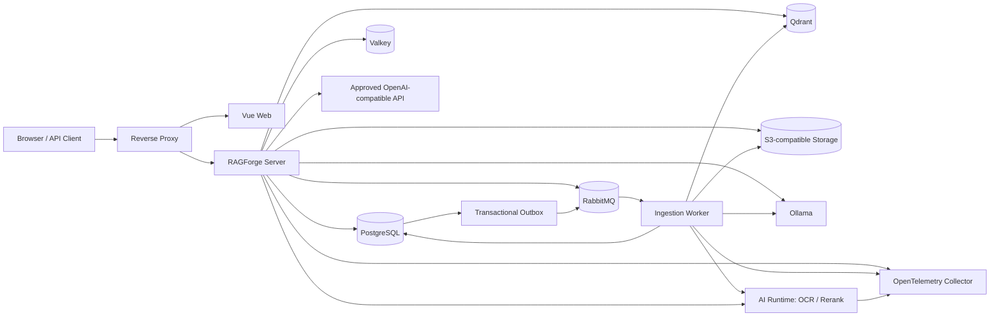

# RAGForge 总体架构

## 1. 架构目标

系统首先优化可追溯性、隔离性和演进成本，其次才是组件数量。MVP 采用 **模块化单体 + 独立摄取 Worker + 小型 AI Runtime**，避免过早微服务化，同时把资源形态完全不同的在线请求、批量索引和 Python AI 任务分离。

## 2. 可部署单元

### 2.1 `ragforge-server`

承担身份、空间、数据源配置、同步编排、检索、对话、Provider、提示词、评估编排、审计和管理 API。它是业务规则的权威，不把空间授权交给 Worker 或 Web 判断。

### 2.2 `ragforge-ingestion-worker`

消费版本化任务，执行连接器、解析、规范化、分块、embedding、索引验证和发布准备。Worker 可水平扩展，但同一资源版本的处理依靠幂等键和租约避免重复副作用。

### 2.3 `ragforge-web`

一个 Vue SPA，通过角色和空间权限呈现用户、编辑和管理视图。不通过维护多个前端应用制造权限分叉；后端始终是授权源。

### 2.4 `ragforge-ai-runtime`

仅暴露 OCR、rerank 等受控内部 API。它不持有用户、空间、对话等业务真相，也不直接向浏览器开放。Java 能稳定承担的流程留在主系统，防止形成第二个业务后端。

## 3. 模块化单体边界

| 模块 | 责任 | 允许依赖 |
|---|---|---|
| `identity` | 账号、Session、service token | `shared` |
| `space` | 空间、成员、角色、出境策略 | `identity`, `shared` |
| `source` | 数据源定义、凭据引用、checkpoint | `space`, `shared` |
| `ingestion` | Pipeline、Job、Artifact、Index Version | `source`, `provider`, `shared` |
| `provider` | Provider、Model Profile、路由、能力测试 | `space`, `shared` |
| `retrieval` | 查询、混合检索、rerank、证据选择 | `space`, `provider`, `ingestion` 的已发布契约 |
| `chat` | Conversation、Run、Step、流式事件、工具 | `retrieval`, `provider`, `space` |
| `prompt` | 模板与不可变版本、空间绑定 | `space`, `shared` |
| `evaluation` | 数据集、运行、指标、基线 | 只依赖公开 application ports |
| `audit` | 安全和管理审计 | 订阅领域事件，不反向控制业务 |
| `shared` | ID、时间、错误、Outbox 等窄基础能力 | 不依赖任何业务模块 |

模块通过 application port、领域事件和只读 projection 合作，不跨模块直接修改表。使用 ArchUnit 或 Spring Modulith 测试强制依赖方向。

## 4. 数据所有权

- PostgreSQL：业务真相、配置版本、Job/Run/Step、审计和 usage ledger。
- Object Storage：原始文件、规范化 artifact、大型解析报告、评估报告。
- Qdrant：可重建的检索索引，不作为唯一真相。
- Valkey：Session、短期缓存、限流和短租约；丢失后系统应能恢复。
- RabbitMQ：传递任务，不保存最终业务状态。

每个内容实体、索引 point 和缓存 key 必须带 `space_id`。Qdrant 查询除了 collection/index version 过滤，还必须包含 `space_id` payload filter。

## 5. 一致性和失败模型

1. API 在一个 PostgreSQL 事务中写业务状态与 Outbox。
2. Relay 将 Outbox 事件发布到 RabbitMQ，并记录发布结果。
3. Worker 以 `job_id + step + artifact_version` 作为幂等边界。
4. 外部写入先生成可验证的新版本，最后以数据库事务切换 active index pointer。
5. 重试使用指数退避和抖动；永久错误直接进入人工处理，临时错误到达阈值后进入 DLQ。
6. Consumer ack 只在副作用和状态持久化完成后发生。

系统接受跨资源的最终一致性，但不得接受权限决策、usage 去重和 active index 指针的模糊一致性。

## 6. 扩展协议

核心 SPI：

- `SourceConnector`
- `DocumentParser`
- `MetadataEnricher`
- `ChunkingStrategy`
- `EmbeddingProvider`
- `RerankProvider`
- `RetrievalStrategy`
- `ChatProvider`
- `ReadOnlyTool`

SPI 输入输出必须使用仓库自有的稳定领域对象；第三方 SDK 对象限制在 adapter 内。每个实现声明 `type`、`version`、能力、配置 JSON Schema 和健康检查方式。

## 7. 架构守则

- 不在 Controller 中编排 RAG 流程。
- 不从其他模块直接访问 JPA Repository。
- 不把 LangChain/Spring AI/供应商 SDK 类型写入领域模型和公共契约。
- 不依赖向量库返回顺序作为稳定业务标识。
- 不原地修改已发布的索引、Prompt 或 Pipeline 版本。
- 不允许 AI Runtime 通过共享数据库绕过主系统 API。

## 8. 参考与借鉴边界

- Java AI 抽象优先使用 [Spring AI](https://github.com/spring-projects/spring-ai) 的依赖，不复制框架源码。
- 文档读取能力优先评估 [Spring AI Alibaba Extensions](https://github.com/spring-ai-alibaba/spring-ai-extensions)，但企业 Obsidian 增量连接器由本项目掌控。
- 摄取可解释性、父子分块和 Retrieval Test 参考 [RAGFlow](https://github.com/infiniflow/ragflow)，复用代码时遵守 Apache-2.0 Notice。
- 工作区和本地优先体验参考 [AnythingLLM](https://github.com/Mintplex-Labs/anything-llm)，不照搬其整体架构。
