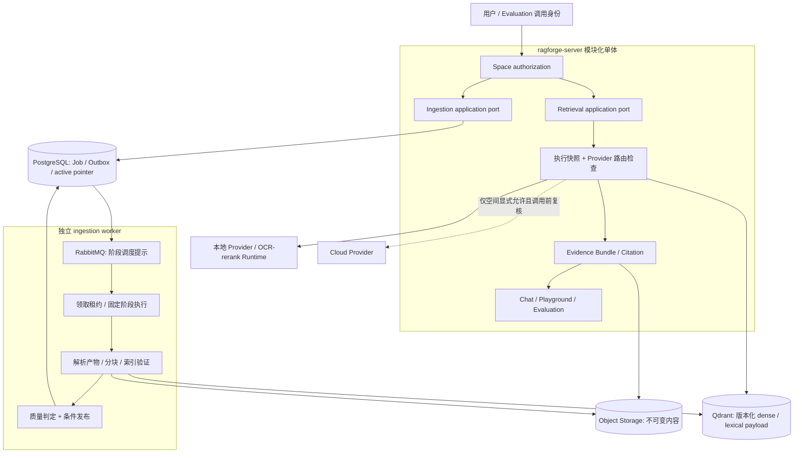

# 知识执行架构演进提案

- 文档版本：`knowledge-execution-proposal.v1`；日期：2026-09-05。
- 状态：**Accepted，实施待拆卡**；关联 [ADR-0013](adr/0013-versioned-knowledge-execution.md)，已于 2026-09-05 由项目负责人接受。本文定义后续实现约束，不代表新接口已经发布。
- 现行规则以 [总体架构](ARCHITECTURE.md)、[ADR-0006](adr/0006-versioned-ingestion-and-indexes.md)、[ADR-0012](adr/0012-durable-bm25.md) 为准。本提案不替代 Accepted ADR。
- 外部事实及来源见[开源对标记录](../07-research/2026-09-05-knowledge-architecture-benchmark.md)；下文是 RAGForge 自有设计推论，没有性能提升结论。

## 1. 当前事实与目标差异

审计基线为 `2ad59b9ff2552cece954ce875e6c153f54536f1d`；代码事实由本轮审计提供，文档设计不自动等于已实现能力。

| 领域 | 已有事实 | 本提案增量 |
|---|---|---|
| 部署 | 模块化 Java 单体、独立 ingestion worker；AI Runtime 仅 OCR/rerank | 不增加部署单元、Python 业务后端或通用图引擎 |
| 摄取 | 已有 PipelineVersion、JobAttempt、阶段记录、幂等与原子索引发布 | 把阶段依赖、输入身份、重放与租约失效约束收敛成受控执行约定 |
| 解析 | 已有 ParsedArtifact/ParseReport、版本和空间字段 | 补可验证产物清单与版本化解析质量判定，复用已有对象 |
| 分块 | 文档设计含语义父子块；生产 handler 当前每文档一个 parent，按字符上限/换行切 child、无 overlap，token 为按空白估算 | 先记录真实策略版本；语义分块单独立卡、离线比较后再考虑上线 |
| 索引闸门 | 已有维度检查、candidate validate、VALIDATING/READY | 在已有闸门中补解析质量、lineage 完整性及判定证据 |
| 检索 | 已有 RetrievalProfileVersion、混合检索、RRF/rerank、扩展与 Evidence Bundle；所查服务先 dense 后 BM25 | 统一入口的执行快照；有界并行只是后续可选优化，不能称已经并行 |
| BM25 | Qdrant 持久 payload；每次查询 scroll 并重建统计 | 沿用 ADR-0012，不引入持久倒排服务，不声称当前具有持久倒排结构 |
| 权限与历史 | 已有 space RBAC、引用重鉴权、Deletion Job 和恢复墓碑 | 明确历史派生内容、缓存和重放的权限适用范围；尚未全量追踪历史读取实现 |

代码依据：[生产摄取 handler](../../apps/ingestion-worker/src/main/java/com/ragforge/ingestion/pipeline/BusinessIngestionSideEffectHandler.java)（51–96、179–228）、[候选索引构建](../../apps/ingestion-worker/src/main/java/com/ragforge/ingestion/pipeline/SpaceCandidateIndexBuilder.java)（57–87）、[ParseReport](../../apps/ingestion-worker/src/main/java/com/ragforge/ingestion/parser/ParseReport.java)（7–18）、[检索服务](../../apps/server/src/main/java/com/ragforge/server/retrieval/RetrievalService.java)（107–120）。这些局部审计事实不构成全仓能力或漏洞判断。

## 2. 目标边界与数据流

图中连线是逻辑调用或数据依赖；Outbox relay 沿现有实现传递消息，RabbitMQ 不保存业务真相。所有内容流携带并验证 `space_id`，不能把图中的共用存储理解成可跨空间读取。

1. 用户请求先校验 Session/service token 与空间成员权限；路径空间、资源空间和认证授权范围必须一致。
2. Server 固定配置及来源版本后创建 Job/Outbox；Worker 只消费已验证身份和引用，不接受客户端指定任意对象路径。
3. Worker 经 SourceConnector 获取内容；凭据只用 secret reference。模型/OCR 出境在实际调用前检查空间政策，旧快照不授予新权限。
4. 新产物与索引在隔离版本构建，验证成功后条件切换 PostgreSQL active pointer。
5. 每次检索固定一个 index/profile 组合，Qdrant 同时约束 `space_id` 和 `index_version_id`；物料读取核验空间、版本、范围和 hash。
6. Evidence 到 Citation 只用结构化标识及位置；模型生成的 URL/文件名不能成为 provenance。返回正文及引用前执行当前权限检查。

## 3. 领域命名与所有权

本节是概念增量的唯一命名表，不是 SQL、DTO 或事件 schema；不预先要求每个概念一张新表。

| 名称 | 归属与身份 | 建议责任 |
|---|---|---|
| `PipelineVersion` | ingestion，已有不可变版本 | 记录有限阶段依赖、实现版本及非敏感配置 hash；不允许任意代码/循环 |
| `PipelineStepExecution` | ingestion，已有阶段记录 | 记录 step key、attempt、输入/输出引用、状态、租约 fencing token、失败分类 |
| `ParsedArtifact` / `ParseReport` | ingestion，已有对象 | 复用身份，增补可验证 lineage 与质量结果；不另造平行解析领域 |
| `ArtifactManifest` | ingestion，拟议值对象 | `space_id`、revision、pipeline/parser 版本、父产物 ID、内容 hash、受控 object reference、位置映射版本 |
| `IndexValidationResult` | ingestion，拟议判定记录 | 绑定 index、manifest 集合 hash、质量策略版本、检查结果与耗时；不给动态文本决定发布 |
| `RetrievalExecutionSnapshot` | retrieval，拟议不可变快照 | 绑定空间、index、profile、有效参数、实际 route/model 版本、执行器版本和允许的降级策略 |
| `Evidence` / `Citation` | retrieval/chat，已有证据对象 | 关联快照及既有 revision/chunk/位置；引用标识稳定不等于永久可读 |
| `Deletion Job` | 沿用现有删除流程 | 沿用墓碑、跨存储清理和恢复后重应用删除记录，不新建重复清理系统 |

Provider 名称沿用 `ProviderConnection`、`ModelProfileVersion`、`ModelRouteVersion`、`SpaceModelBinding`；连接仍按空间隔离。执行快照只存已解析版本和安全参数，不存 credential、原始客户 prompt 或凭据 Header。

## 4. 受控阶段执行与发布

建议先固定 `FETCH → PARSE → CHUNK → EMBED → INDEX → VALIDATE → PUBLISH` 的有限阶段。连接器发现及 checkpoint 仍属现有 SourceConnector 生命周期，不改为通用工作流产品。

- 沿用 `job_id + step + artifact_version` 幂等语义；持久化键同时限定 `space_id`，记录输入 hash。相同键不同输入拒绝，attempt 是重试记录而非重复副作用的新身份。
- 领取与续租由持久状态的条件更新和单调 fencing token 确认；Valkey 可加速协调，但其丢失不能让旧 Worker 获得提交权。
- 对象/point 写入使用版本化目标和可重复的身份。写成功但未 ack 时，重投先核验副作用和 hash，再完成记录；不承诺消息 exactly-once。
- 重放保留原终态，新建 attempt 或派生 Job，记录 `replay_of`；复用上游产物前重新验证当前授权、输入身份及保留状态。
- 改 parser/pipeline/config 会创建新产物身份并使受影响的下游失效；不能用“从失败步继续”跨越不兼容版本。
- `VALIDATE` 沿用 candidate 完整性、维度和空间检查；新增解析质量指标的策略版本及 PASS/FAIL 证据，阈值需要固定评估集校准，本文不凭空给数值。
- `PUBLISH` 仅接受 READY 且对应验证通过的目标，在事务中检查空间、目标版本、预期 active pointer、有效租约、删除状态和政策变更；竞争失败重新验证，不能最后写入者覆盖。
- checkpoint 在变更成功持久化后的既有提交边界推进；重试不能跳过未完成变更，prune 不能把临时访问失败解释为来源删除。

| 失败点 | 恢复规则 | 可观察证据 |
|---|---|---|
| 临时网络/Provider 超时 | 有界退避重试；不自动云回退 | step、attempt、分类、耗时、允许的 route |
| 永久格式错误/质量不合格 | 失败隔离并暴露人工修复入口；不发布 | ParseReport、检查代码与策略版本 |
| Worker 崩溃/过期持有者回写 | 新 attempt 领取，旧 fencing token 拒绝提交 | lease 冲突和去重计数 |
| 对象成功、状态提交失败 | 重投核对 hash；不可见孤儿按保留策略回收 | manifest 校验与孤儿计数 |
| 发布事务前后中断 | 读持久 pointer 判定结果；旧 ACTIVE 不受构建失败污染 | index、预期/实际 pointer、发布结果 |
| 删除或撤权与执行竞争 | 下一受保护读/写出前停止；不复用过期授权 | 安全原因码，不记录原文 |

## 5. 统一检索与证据生命周期

Chat、Playground 和 Evaluation 应调用同一 retrieval application port；入口可提供不同的已授权参数，但核心过滤、召回、融合、rerank、扩展与证据校验只保留一条实现路径。Evaluation 使用显式测试身份及脱敏/合成数据，不使用绕过授权的“全空间”入口。

快照在一次检索开始时解析并冻结 index/profile/模型版本、有效 top-k/filter/context budget、执行器版本和降级策略；真正发生的 fallback 与错误另记执行结果。固定版本保证可解释的输入配置，不保证外部模型逐字确定性。

- 同一执行不能在 dense、BM25 与物料读取之间重新解析 active index。对象或旧版本被删除时明确失败，不偷偷读取新版本凑齐结果。
- 线上与离线比较同时记录数据集版本、快照、执行器版本、实际 route 和结果指标。若改变分块/检索行为，必须另卡执行 offline comparison；本次文档检查不充当评估。
- 查询原文不进入通用 trace。必要审计数据沿用受控保留策略；快照、日志、缓存键仅放安全参数、受控引用或 hash。
- 缓存至少绑定空间、index/profile/执行器版本、查询和过滤器 hash；命中后仍做当前授权和墓碑校验。配置冻结不能冻结用户权限。

来源生命周期与内容可读性必须分开：

| 情形 | 建议读取与同步语义 |
|---|---|
| 暂停同步 / 同步失败 | 停止新同步或告警；既有内容是否有效沿现有授权，失败不等于删除 |
| 软归档 | 仅管理状态；若产品要求停止可读，必须显式执行禁用/撤访问动作，不能隐含推断 |
| 来源删除 / 文档删除 / 空间删除 | 先持久墓碑并拒绝读取，再由现有 Deletion Job 清理；不等待下一次重建才生效 |
| 成员、token、空间或来源访问被撤销 | 当前调用身份立即失去对应访问；space RBAC 保持唯一权限模型，不引入文档 ACL |
| 云出境被关闭 | 新调用阻止，运行中在下一模型/工具调用前复核；快照不能沿用旧批准 |

当前授权适用于 citation preview、material fetch、历史回答及其摘录、缓存命中和重放。历史回答若包含不可读来源的派生内容，默认阻止该回答正文返回，只提供无内容的不可用状态；不尝试仅删引用后保留泄露的摘录。审计可保留身份/hash/状态，但正文按删除与保留政策处理。

流式执行在下一授权检查及写出前发现撤权即停止，已发送 token 无法撤回；历史记录再次读取仍受当前权限限制。来源治理的具体权限字段及事务边界待安全设计，本文不据局部审计宣称当前存在漏洞。

沿用[数据出境与保留](../06-security-compliance/DATA_EGRESS_AND_RETENTION.md)的 Deletion Job、备份例外及恢复后重应用墓碑。应用回滚、旧 index pointer 恢复、备份恢复都不能恢复已撤销的可见性。

## 6. 分步实施条件与回滚

以下是后续卡片顺序。ADR 已接受，但仍须拆出预算票据并完成契约评审；本次不修改代码、schema、migration 或部署配置。

| 阶段 | 可验收切片 | 进入下一阶段的条件 | 回滚 |
|---|---|---|---|
| A：契约与基线 | 固定对象映射、质量策略和权限语义；补现行串行/分块基线 | producer/consumer schema 与安全评审通过 | 撤回提案，无运行时影响 |
| B：产物与阶段 | 在已有阶段中记录 manifest、lineage 与 fencing；保留旧读路径 | 重投、租约、空间隔离与产物损坏用例通过 | 禁用新执行入口；保留记录，不破坏旧读取 |
| C：验证与发布 | 先影子记录解析质量，再启用经过校准的发布闸门 | 失败不发布、竞争不覆盖、旧版本回滚通过 | 在授权允许且未删除的版本间恢复 pointer |
| D：检索快照 | 三入口共用路径并记录统一快照；先不改召回算法 | 同输入路径一致性与权限回归通过 | 停用新快照写入；旧快照仍按版本读取 |
| E：历史与恢复 | 覆盖派生内容、缓存、重放及备份恢复的当前授权 | 删除/撤权矩阵和流式中断安全评审通过 | 保留墓碑/再授权约束，禁止回滚为旧宽松读取 |

B–D 在 E 的安全矩阵通过前仅允许影子执行，并关闭用户入口；正式按空间启用须先完成 E。若旧应用不能保持墓碑或当前再授权约束，禁止回滚到该旧应用，改为关闭功能或前向修复，不能先上线再补历史权限。

未来新增兼容字段只是设计方向，不等于已发布契约。新增表/字段必须单独由迁移 owner 编号，先扩展读兼容再切写；不兼容事件另建 major version，未识别快照版本明确拒绝重放。代码回退不能删除 lineage、审计或删除记录。

## 7. 后续可执行验收计划

测试名称是待建用例标识，本轮没有执行或宣称这些运行时测试通过。

| 需求 | 测试动作 | 通过条件 |
|---|---|---|
| RF-ARCH-001 | 同消息重复投递；在写对象后杀 Worker；旧租约持有者迟到提交 | 副作用去重、旧 token 拒绝、可恢复 attempt、终态不篡改 |
| RF-ARCH-002 | 篡改 hash/位置、注入空解析结果/错空间/错维度；并发发布 | 闸门可定位失败、ACTIVE 不变化；仅预期 pointer 的合法提交成功 |
| RF-ARCH-002 | parser 配置升级后重放；回滚旧 index | 不复用不兼容产物，dense/lexical 使用同一合法版本 |
| RF-ARCH-003 | 同一版本、固定 query 与参数分别经三个入口执行 | 候选、过滤、证据身份一致；差异仅为声明的入口参数 |
| RF-ARCH-003 | 执行中切 active pointer、关闭云出境、Provider 故障 | 不混版本、不越权出境；只执行批准的降级或可解释失败 |
| RF-ARCH-004 | 对历史回答、引用预览、物料、缓存、重放逐一删除/撤权 | 全部阻止正文与派生内容泄露；暂停同步不误删 |
| RF-ARCH-004 | 流式期间撤权；应用/索引/备份回滚后再读 | 后续写出停止，墓碑持续生效，旧授权不复活 |

所有用例含双空间同名内容/相似 ID 的反例；日志仅记录标识、hash、耗时及安全错误分类。检索行为变化另记固定评估配置与质量/延迟/资源对比；阈值由实施票据给定，不能拿架构图代替证据。

## 8. 假设、待决事项与非目标

- 假设：当前规模先适合有限固定阶段，现有存储和任务基础可承载增量；容量与延迟收益尚未测量。
- 待决：manifest 嵌入既有 artifact 还是单独存储；质量阈值/样本版本；快照最小保留期限；来源禁用的精确产品动作。全部在后续契约卡收敛。
- 非目标：微服务拆分、通用 Agent 画布、文档 ACL、跨空间搜索、第三方源码复制、替换 BM25 后端、宣称语义分块已落地。
- 本次交付仅为提案和文档门禁证据；产品范围、风险和追溯由编排者同步，ADR 接受必须由人明确决定。
