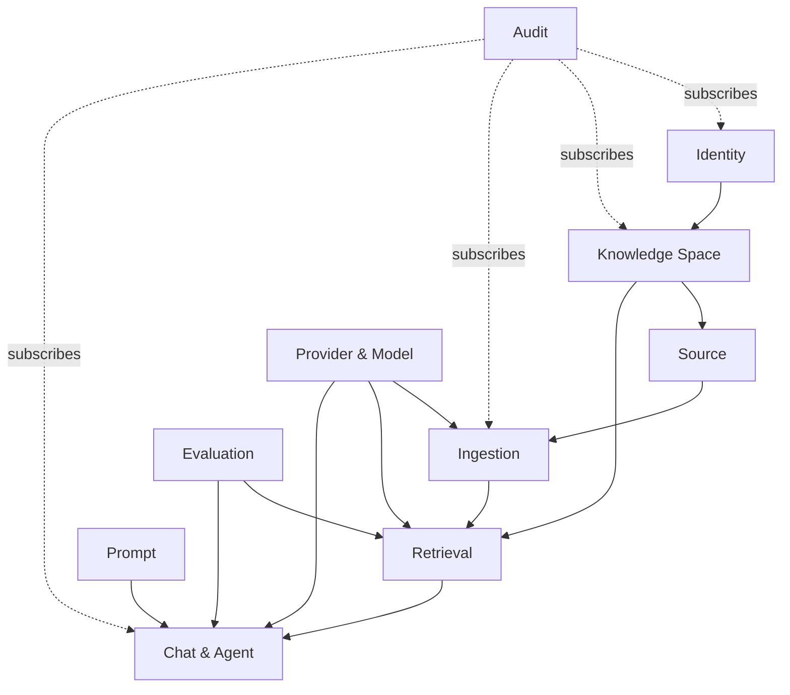

# 领域模型

## 1. 限界上下文关系



## 2. 关键聚合

### 2.1 Identity

- `User`：账号状态、凭据版本、平台角色。
- `Session`：服务端 Session，支持吊销和过期。
- `ServiceToken`：hash、scopes、expires_at、revoked_at、last_used_at。

### 2.2 Knowledge Space

- `KnowledgeSpace`：名称、状态、云端出境策略、active bindings。
- `SpaceMembership`：user、role、加入/移除审计。
- `SpaceModelBinding`：用途到 route/profile 的版本化绑定。

### 2.3 Source

- `DataSource`：connector type、非敏感配置、credential reference、同步策略。
- `SourceCheckpoint`：Git commit、filesystem scan cursor、web ETag 等连接器状态。
- `SourceDocument`：稳定逻辑身份，承载相对路径/URI 和生命周期。
- `DocumentRevision`：内容 hash、源版本、artifact、发现时间。

`SourceDocument` 不因内容更新而换 ID；`DocumentRevision` 永不原地修改。重命名是否保持逻辑 ID 由连接器提供的稳定标识和 hash 规则共同判断。

### 2.4 Ingestion

- `PipelineDefinition` / `PipelineVersion`。
- `IngestionJob` / `JobAttempt` / `PipelineStepExecution`。
- `ParsedArtifact` / `ParseReport`。
- `ParentChunk` / `ChildChunk` / `ChunkOverride`。
- `IndexVersion`：BUILDING、VALIDATING、READY、ACTIVE、RETIRED、FAILED。

### 2.5 Provider

- `ProviderConnection`：endpoint、credential ref、自定义 Header、状态。
- `ModelProfile`：模型标识、能力、上下文、维度、价格和参数。
- `ModelRoute`：主/备候选及兼容条件，但仍受空间出境批准约束。
- `ProviderTestRun`：实测能力和错误分类。

### 2.6 Retrieval and Chat

- `RetrievalProfile`：dense/BM25/RRF/rerank/filter/expansion 参数和版本。
- `Conversation`：严格属于一个空间。
- `Run`：一次用户请求的业务状态和最终输出。
- `Step`：REWRITE、RETRIEVE、RERANK、TOOL、GENERATE。
- `Evidence`：document revision、chunk、位置、分数、所用 index。
- `Citation`：回答片段与 Evidence 的受控映射。
- `ModelInvocation` / `ToolInvocation` / `UsageLedgerEntry`。

## 3. 全局标识和时间

- 业务 ID 使用 UUIDv7，数据库字段为 `uuid`。
- 外部公开 ID 不复用数据库自增主键。
- 所有时间以 UTC `timestamptz` 保存，前端按用户时区显示。
- 每张可变表含 `created_at`、`updated_at` 和乐观锁版本；审计表只追加。

## 4. 空间隔离不变量

1. 内容资源必须有非空 `space_id`。
2. 跨聚合引用必须验证两端属于同一空间。
3. service token scope 与空间成员权限取交集，不取并集。
4. 索引和缓存查询缺少空间过滤时直接失败，不提供“全局默认”。
5. 删除空间先撤销访问和 route，再异步清理对象、向量和历史。

## 5. 状态机

### 5.1 Run / Step

```text
QUEUED -> RUNNING -> SUCCEEDED
                  -> FAILED
                  -> CANCELLED
```

最终状态不可逆。重试产生新的 attempt/invocation，不把 FAILED 改回 RUNNING。

### 5.2 Chunk Override

```text
NONE -> ACTIVE -> NEEDS_REVIEW -> ACTIVE
                  |             -> DISCARDED
```

源 revision 更新时，不自动把旧 override 应用到新文本。

## 6. 关系模型设计原则

- 模块拥有独立 schema 或明确表前缀，数据库账号权限随部署成熟度逐步拆分。
- 大型原文和模型响应不直接堆入高频业务表，改存对象并保留 hash/URI。
- JSONB 用于连接器/供应商扩展配置，但核心过滤、约束和报表字段结构化。
- 软删除不能代替历史版本；用户隐私删除需要单独的可验证清理流程。
