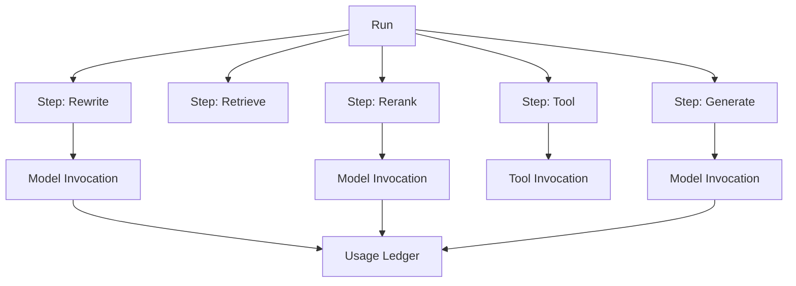

# Provider、Prompt 与 Run 模型

## 1. Provider Registry

`ProviderConnection` 只描述连接和鉴权；`ModelProfileVersion` 描述一个可调用模型及能力；`ModelRouteVersion` 描述同一用途的候选顺序和兼容约束。三者分开可以避免修改 endpoint 时篡改历史调用证据。

## 2. 能力协议

标准能力：

- `CHAT`
- `EMBEDDING`
- `RERANK`
- `STREAMING`
- `TOOLS`
- `JSON_SCHEMA`
- `VISION`
- `USAGE_REPORTING`
- `CUSTOM_HEADERS`

模型 Profile 还记录上下文窗口、最大输出、embedding 维度、tokenizer、并发/速率限制、价格表版本和允许参数。声明值与连接测试结果分别保存。

## 3. Provider Adapter

首批 adapter：

- Ollama：本地 `qwen3.5:9b` 用于 chat；embedding 使用专用 embedding 模型而不是 chat 模型。
- Generic OpenAI-compatible：base URL、API key、headers、model name 可配置。
- AI Runtime：本地 rerank/OCR 的内部 provider。

错误统一映射为：`AUTHENTICATION`、`RATE_LIMIT`、`QUOTA`、`MODEL_NOT_FOUND`、`CONTEXT_OVERFLOW`、`CONTENT_POLICY`、`TIMEOUT`、`UNAVAILABLE`、`UNSUPPORTED_CAPABILITY`、`INVALID_RESPONSE`。

## 4. Connection Test

发布模型 Profile 前执行适用的最小测试：

1. 鉴权和模型存在性。
2. 非流 chat 与流式终止。
3. tool calling / JSON Schema 约束。
4. embedding dimension 和空输入行为。
5. usage 字段或本地估算。
6. timeout、取消和错误映射。

测试输入使用无敏感固定样本；响应限长并脱敏存档。

## 5. Prompt 版本

模型：`PromptTemplate -> PromptVersion -> SpacePromptBinding`。

- PromptVersion 发布后不可变，保存模板、变量 schema、输出契约、变更说明和作者。
- 变量由服务端白名单装配，不允许用户覆盖 system 或 tool policy。
- 每次 ModelInvocation 保存 prompt version、渲染内容 hash 和可选短期调试 artifact。
- 原始调试 prompt 默认 7 天删除；长期保留 hash、版本和结构化用量。

## 6. Run / Step / Invocation

Run/Step 使用 `QUEUED/RUNNING/SUCCEEDED/FAILED/CANCELLED`。一个 Step 可有多次 Invocation，但每次调用是独立不可变记录。Run 最终答案关联实际使用的 evidence、citation、prompt、route 和 index version。

## 7. 路由和出境不变量

- 路由前同时检查空间授权、数据分类、Provider 区域/用途和模型能力。
- Failover 只在同一出境等级与兼容能力内。
- embedding 模型切换产生新 index，不混用不同维度/语义空间。
- reranker 失败是否回退到 RRF 结果由 Retrieval Profile 显式决定并记录 degraded 状态。
- 估算成本与供应商报告 usage 分开保存，账本注明来源。

Spring AI 作为 Java adapter 基础，避免供应商类型进入领域层。具体 API 以开始实现时的 [Spring AI 官方仓库](https://github.com/spring-projects/spring-ai) 与官方文档为准。

