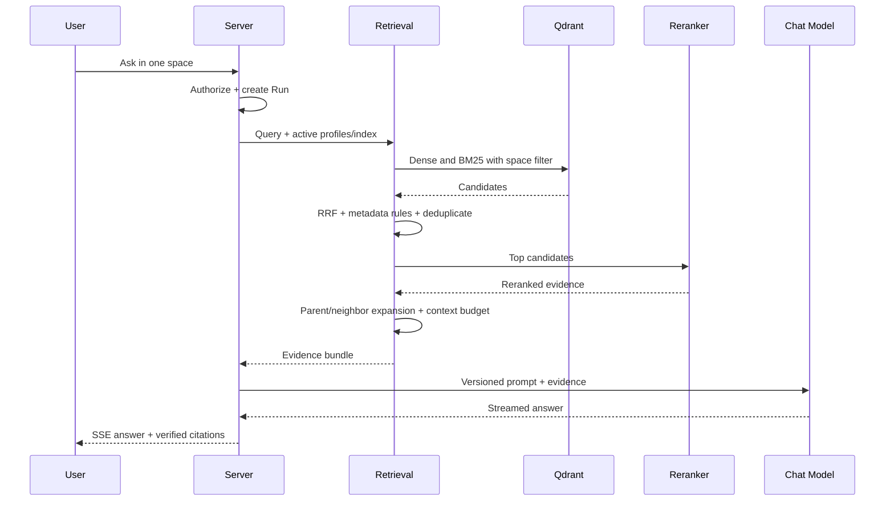

# 检索、引用与对话生成

## 1. 在线链路

## 2. 默认检索配置

1. Query normalization 和可选 rewrite；原问题始终保留用于审计和评估。
2. dense top 30 与 BM25 top 30 并行。
3. Reciprocal Rank Fusion 合并，去除重复 child。
4. rerank 前 20，最终至多 8 个 context children。
5. 根据 token budget 扩展 parent/neighbor，不挤占系统指令和回答预算。
6. 如果可靠证据低于阈值，进入拒答策略。

所有 top-k、权重、阈值、过滤器、reranker 和扩展规则属于不可变 `RetrievalProfileVersion`。默认值不是硬编码真理。

## 3. 证据与引用

模型收到每个 evidence 的内部稳定标识。回答中的 citation token 由服务端解析和校验，只允许引用本次 Evidence Bundle 中的 ID。

Citation 至少保存：

- `space_id`, `index_version_id`。
- `source_document_id`, `document_revision_id`。
- `parent_chunk_id`, `child_chunk_id`。
- heading/page/sheet/slide/line-range 等位置。
- 原检索、融合、rerank 分数和使用原因。
- 回答字符区间或 claim 标识。

模型输出的文件名或 URL 不能直接作为可信引用。引用点击由服务端重新鉴权，并从版本化 artifact 展示上下文。

## 4. 拒答和降级

应拒答情形：没有命中、命中低于阈值、证据互相冲突且无法消解、用户无权读取、Provider/Tool 失败导致证据不完整、问题要求超出知识库能力。

降级顺序只能在空间批准的兼容 route 内发生。例如本地 chat timeout 后，若空间未允许云端出境，则返回可解释错误，而不是调用云端。

## 5. Retrieval Playground

每次实验展示：

- 原 query、rewrite query、filter 和 active index。
- dense rank、BM25 rank、RRF 分数与候选交集。
- rerank 前后排序、被排除原因。
- parent/neighbor 扩展和最终 token budget。
- 每段耗时、模型调用、token 和估算成本。
- 配置 A/B 差异和评估集结果。

只有通过评估阈值和人工抽样的配置才能发布为 active profile。产品形态参考 [RAGFlow Retrieval Test](https://github.com/infiniflow/ragflow/blob/main/docs/guides/dataset/run_retrieval_test.md)，实现和数据模型由本项目自有。

## 6. Read-only Agent

MVP 工具：

- `knowledge.search`：当前空间内检索。
- `document.read`：读取本次用户有权访问的版本化文档片段。
- `web.fetch`：仅空间白名单 URL，限制 DNS/IP、重定向、大小、MIME 和超时。

每次工具调用记录 schema version、脱敏参数、授权结果、开始/结束、输出 hash、错误和 trace。禁止 Shell、SQL、任意 URL、写文件和写外部系统。

## 7. SSE 恢复和取消

- 每个事件有 Run 内单调 `sequence` 和稳定 `event_id`。
- 事件类型至少含 run/step 状态、answer delta、citation、usage、error、done。
- 服务端短期保存事件，客户端可用 `Last-Event-ID` 重连。
- cancel 是幂等操作；Run 进入 `CANCELLED` 后不再接受新增 answer delta。
- 调用重试创建新 invocation；usage ledger 用供应商 request ID 或本地幂等键去重。
