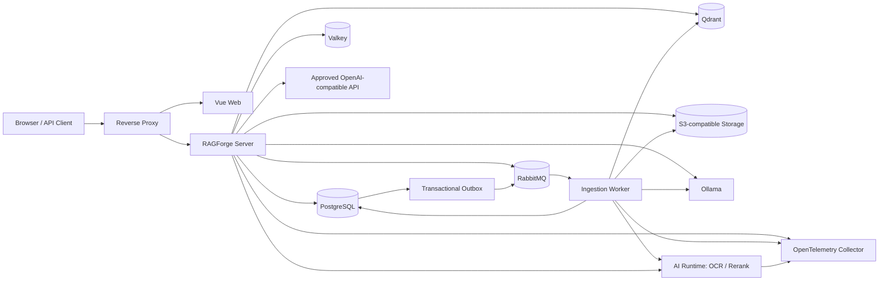
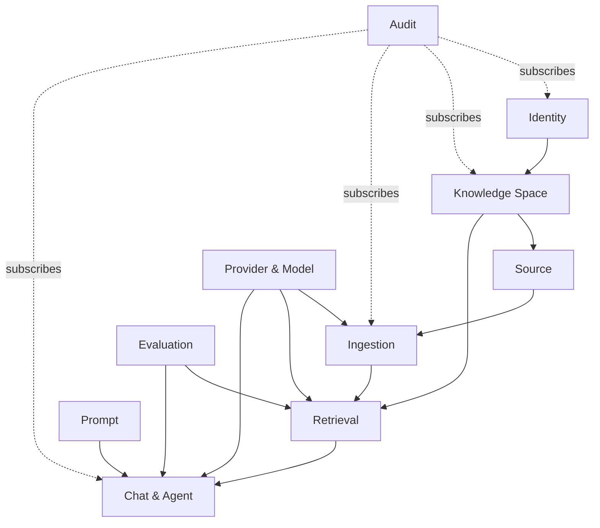
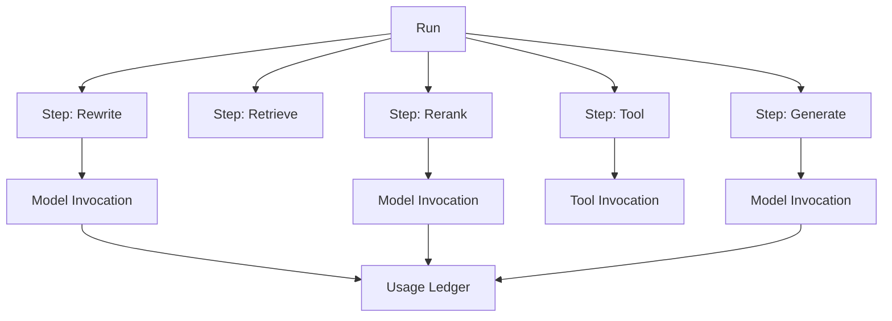
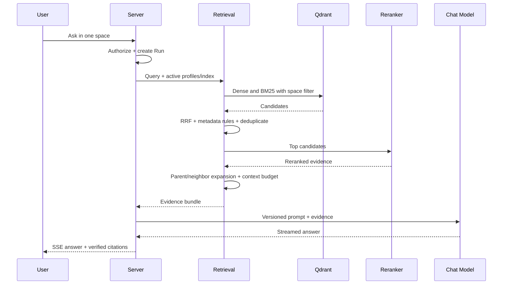
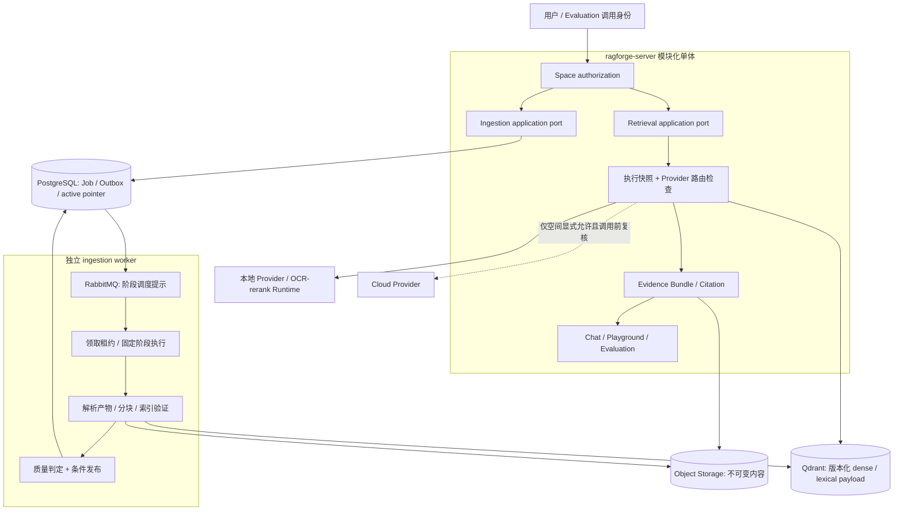

# 02-架构与领域设计

本文件是 RAGForge 的架构主文档。它按“总体边界 → 领域模型 → 摄取 → Provider/Run → 检索/问答 → API/事件 → 演进约束”的顺序合并原架构文档，保留每个原文的设计细节、已实现边界和未实现声明。

架构决策正文集中在 `07-架构决策记录.md`；本文件描述系统如何工作，不复制 ADR 的完整历史。

## 收录源文件

- `ARCHITECTURE.md`
- `DOMAIN_MODEL.md`
- `INGESTION_PIPELINE.md`
- `PROVIDER_AND_RUN_MODEL.md`
- `RETRIEVAL_AND_CHAT.md`
- `API_AND_EVENTS.md`
- `ARCHITECTURE_EVOLUTION.md`

---

## 原始文档：`ARCHITECTURE.md`

### RAGForge 总体架构

#### 1. 架构目标

系统首先优化可追溯性、隔离性和演进成本，其次才是组件数量。MVP 采用 **模块化单体 + 独立摄取 Worker + 小型 AI Runtime**，避免过早微服务化，同时把资源形态完全不同的在线请求、批量索引和 Python AI 任务分离。



#### 2. 可部署单元

##### 2.1 `ragforge-server`

承担身份、空间、数据源配置、同步编排、检索、对话、Provider、提示词、评估编排、审计和管理 API。它是业务规则的权威，不把空间授权交给 Worker 或 Web 判断。

##### 2.2 `ragforge-ingestion-worker`

消费版本化任务，执行连接器、解析、规范化、分块、embedding、索引验证和发布准备。Worker 可水平扩展，但同一资源版本的处理依靠幂等键和租约避免重复副作用。

##### 2.3 `ragforge-web`

一个 Vue SPA，通过角色和空间权限呈现用户、编辑和管理视图。不通过维护多个前端应用制造权限分叉；后端始终是授权源。

##### 2.4 `ragforge-ai-runtime`

仅暴露 OCR、rerank 等受控内部 API。它不持有用户、空间、对话等业务真相，也不直接向浏览器开放。Java 能稳定承担的流程留在主系统，防止形成第二个业务后端。

#### 3. 模块化单体边界

| 模块 | 责任 | 允许依赖 |
|---|---|---|
| `identity` | 账号、Session、service token | `shared` |
| `space` | 空间、成员、角色、出境策略 | `identity`, `shared` |
| `source` | 数据源定义、凭据引用、checkpoint | `space`, `shared` |
| `ingestion` | Pipeline、Job、Artifact、Index Version | `source`, `provider`, `shared` |
| `provider` | Provider、Model Profile、路由、能力测试 | `space`, `shared` |
| `retrieval` | 查询、混合检索、rerank、证据选择 | `space`, `provider`, `ingestion` 的已发布契约 |
| `chat` | Conversation、Run、Step、流式事件、工具 | `retrieval`, `provider`, `space` |
| `prompt` | 模板与不可变版本、空间绑定 | `space`, `shared` |
| `evaluation` | 数据集、运行、指标、基线 | 只依赖公开 application ports |
| `audit` | 安全和管理审计 | 订阅领域事件，不反向控制业务 |
| `shared` | ID、时间、错误、Outbox 等窄基础能力 | 不依赖任何业务模块 |

模块通过 application port、领域事件和只读 projection 合作，不跨模块直接修改表。使用 ArchUnit 或 Spring Modulith 测试强制依赖方向。

#### 4. 数据所有权

- PostgreSQL：业务真相、配置版本、Job/Run/Step、审计和 usage ledger。
- Object Storage：原始文件、规范化 artifact、大型解析报告、评估报告。
- Qdrant：可重建的检索索引，不作为唯一真相。
- Valkey：Session、短期缓存、限流和短租约；丢失后系统应能恢复。
- RabbitMQ：传递任务，不保存最终业务状态。

每个内容实体、索引 point 和缓存 key 必须带 `space_id`。Qdrant 查询除了 collection/index version 过滤，还必须包含 `space_id` payload filter。

#### 5. 一致性和失败模型

1. API 在一个 PostgreSQL 事务中写业务状态与 Outbox。
2. Relay 将 Outbox 事件发布到 RabbitMQ，并记录发布结果。
3. Worker 以 `job_id + step + artifact_version` 作为幂等边界。
4. 外部写入先生成可验证的新版本，最后以数据库事务切换 active index pointer。
5. 重试使用指数退避和抖动；永久错误直接进入人工处理，临时错误到达阈值后进入 DLQ。
6. Consumer ack 只在副作用和状态持久化完成后发生。

系统接受跨资源的最终一致性，但不得接受权限决策、usage 去重和 active index 指针的模糊一致性。

#### 6. 扩展协议

核心 SPI：

- `SourceConnector`
- `DocumentParser`
- `MetadataEnricher`
- `ChunkingStrategy`
- `EmbeddingProvider`
- `RerankProvider`
- `RetrievalStrategy`
- `ChatProvider`
- `ReadOnlyTool`

SPI 输入输出必须使用仓库自有的稳定领域对象；第三方 SDK 对象限制在 adapter 内。每个实现声明 `type`、`version`、能力、配置 JSON Schema 和健康检查方式。

#### 7. 架构守则

- 不在 Controller 中编排 RAG 流程。
- 不从其他模块直接访问 JPA Repository。
- 不把 LangChain/Spring AI/供应商 SDK 类型写入领域模型和公共契约。
- 不依赖向量库返回顺序作为稳定业务标识。
- 不原地修改已发布的索引、Prompt 或 Pipeline 版本。
- 不允许 AI Runtime 通过共享数据库绕过主系统 API。

#### 8. 参考与借鉴边界

- Java AI 抽象优先使用 [Spring AI](https://github.com/spring-projects/spring-ai) 的依赖，不复制框架源码。
- 文档读取能力优先评估 [Spring AI Alibaba Extensions](https://github.com/spring-ai-alibaba/spring-ai-extensions)，但企业 Obsidian 增量连接器由本项目掌控。
- 摄取可解释性、父子分块和 Retrieval Test 参考 [RAGFlow](https://github.com/infiniflow/ragflow)，复用代码时遵守 Apache-2.0 Notice。
- 工作区和本地优先体验参考 [AnythingLLM](https://github.com/Mintplex-Labs/anything-llm)，不照搬其整体架构。

#### 9. 已接受架构演进（实施待拆卡）

[知识执行演进总设计](./02-架构与领域设计.md)在现行模块化单体与独立 Worker 边界内，定义受控阶段、可验证解析产物与统一检索快照；[ADR-0013](./07-架构决策记录.md)已于 2026-09-05 接受。现行 Accepted ADR 与持久化 BM25 保持有效。实现前仍须独立拆卡并完成契约、迁移与安全验证；本节不声明能力已上线。

---

## 原始文档：`DOMAIN_MODEL.md`

### 领域模型

#### 1. 限界上下文关系



#### 2. 关键聚合

##### 2.1 Identity

- `User`：账号状态、凭据版本、平台角色。
- `Session`：服务端 Session，支持吊销和过期。
- `ServiceToken`：hash、scopes、expires_at、revoked_at、last_used_at。

##### 2.2 Knowledge Space

- `KnowledgeSpace`：名称、状态、云端出境策略、active bindings。
- `SpaceMembership`：user、role、加入/移除审计。
- `SpaceModelBinding`：用途到 route/profile 的版本化绑定。

##### 2.3 Source

- `DataSource`：connector type、非敏感配置、credential reference、同步策略。
- `SourceCheckpoint`：Git commit、filesystem scan cursor、web ETag 等连接器状态。
- `SourceDocument`：稳定逻辑身份，承载相对路径/URI 和生命周期。
- `DocumentRevision`：内容 hash、源版本、artifact、发现时间。

`SourceDocument` 不因内容更新而换 ID；`DocumentRevision` 永不原地修改。重命名是否保持逻辑 ID 由连接器提供的稳定标识和 hash 规则共同判断。

##### 2.4 Ingestion

- `PipelineDefinition` / `PipelineVersion`。
- `IngestionJob` / `JobAttempt` / `PipelineStepExecution`。
- `ParsedArtifact` / `ParseReport`。
- `ParentChunk` / `ChildChunk` / `ChunkOverride`。
- `IndexVersion`：BUILDING、VALIDATING、READY、ACTIVE、RETIRED、FAILED。

##### 2.5 Provider

- `ProviderConnection`：endpoint、credential ref、自定义 Header、状态。
- `ModelProfile`：模型标识、能力、上下文、维度、价格和参数。
- `ModelRoute`：主/备候选及兼容条件，但仍受空间出境批准约束。
- `ProviderTestRun`：实测能力和错误分类。

##### 2.6 Retrieval and Chat

- `RetrievalProfile`：dense/BM25/RRF/rerank/filter/expansion 参数和版本。
- `Conversation`：严格属于一个空间。
- `Run`：一次用户请求的业务状态和最终输出。
- `Step`：REWRITE、RETRIEVE、RERANK、TOOL、GENERATE。
- `Evidence`：document revision、chunk、位置、分数、所用 index。
- `Citation`：回答片段与 Evidence 的受控映射。
- `ModelInvocation` / `ToolInvocation` / `UsageLedgerEntry`。

#### 3. 全局标识和时间

- 业务 ID 使用 UUIDv7，数据库字段为 `uuid`。
- 外部公开 ID 不复用数据库自增主键。
- 所有时间以 UTC `timestamptz` 保存，前端按用户时区显示。
- 每张可变表含 `created_at`、`updated_at` 和乐观锁版本；审计表只追加。

#### 4. 空间隔离不变量

1. 内容资源必须有非空 `space_id`。
2. 跨聚合引用必须验证两端属于同一空间。
3. service token scope 与空间成员权限取交集，不取并集。
4. 索引和缓存查询缺少空间过滤时直接失败，不提供“全局默认”。
5. 删除空间先撤销访问和 route，再异步清理对象、向量和历史。

#### 5. 状态机

##### 5.1 Run / Step

```text
QUEUED -> RUNNING -> SUCCEEDED
                  -> FAILED
                  -> CANCELLED
```

最终状态不可逆。重试产生新的 attempt/invocation，不把 FAILED 改回 RUNNING。

##### 5.2 Chunk Override

```text
NONE -> ACTIVE -> NEEDS_REVIEW -> ACTIVE
                  |             -> DISCARDED
```

源 revision 更新时，不自动把旧 override 应用到新文本。

#### 6. 关系模型设计原则

- 模块拥有独立 schema 或明确表前缀，数据库账号权限随部署成熟度逐步拆分。
- 大型原文和模型响应不直接堆入高频业务表，改存对象并保留 hash/URI。
- JSONB 用于连接器/供应商扩展配置，但核心过滤、约束和报表字段结构化。
- 软删除不能代替历史版本；用户隐私删除需要单独的可验证清理流程。

#### 7. 已接受领域演进（实施待拆卡）

[演进总设计](./02-架构与领域设计.md)复用现有 PipelineVersion、PipelineStepExecution、ParsedArtifact/ParseReport 与 Evidence/Citation，定义 ArtifactManifest、IndexValidationResult 和 RetrievalExecutionSnapshot 的概念职责。准确命名、空间身份及保留边界见总设计第 3、5 节；这些值对象或记录不是已发布 DTO、数据库表或新建迁移。[ADR-0013](./07-架构决策记录.md)已接受，具体实现仍待独立设计与验证。

---

## 原始文档：`INGESTION_PIPELINE.md`

### 版本化知识摄取流水线

#### 1. 目标

摄取系统要回答三个问题：某段知识从哪里来、经历了什么处理、当前线上为什么使用这个版本。所有处理都围绕不可变 revision、artifact 和 pipeline version，而不是围绕可被覆盖的临时文件。

#### 2. 标准流程


每个 Step 至少记录：`step_type`、实现和配置版本、输入/输出 hash、状态、开始/结束、attempt、错误分类、重试、模型、token/成本、artifact URI 和 trace ID。

#### 3. SourceConnector 契约

```text
discover(checkpoint, rules) -> SourceChangeSet
fetch(sourceRef, expectedVersion) -> ContentStream + SourceMetadata
commitCheckpoint(changeSet, result) -> NewCheckpoint
```

规则：

- 连接器只读，不修改来源系统。
- checkpoint 只在相应变更成功持久化后推进。
- change set 区分 ADDED、MODIFIED、MOVED、DELETED、UNCHANGED。
- include/exclude 在规范化 `/` 路径上执行，不能依赖 Windows 分隔符。
- 凭据通过 secret reference 获取，不写入任务 payload 或日志。

#### 4. Obsidian/Git 首版要求

- 生产通过 Git connector 拉取 Gitee，开发可只读挂载本地仓库。
- 解析 YAML frontmatter、Markdown 标题、代码块、表格、callout 和 wikilink。
- 保留 vault-relative path、heading anchor、wikilink target、create/update metadata。
- `.obsidian/`、附件和用户指定路径遵守 include/exclude；附件只在受支持时单独入库。
- 支持 `ai_index: false` 作为显式排除元数据，但不能把它当作唯一安全规则。
- Git commit SHA 进入 revision provenance；删除在新 index 版本中移除，历史记录仍可审计。

[Spring AI Alibaba Extensions 的 Obsidian reader](https://github.com/spring-ai-alibaba/spring-ai-extensions/tree/main/document-readers/spring-ai-alibaba-starter-document-reader-obsidian)可用于理解基础模型，但现有公开实现不覆盖企业所需的 include/exclude、checkpoint、完整增量同步和 Windows/Linux 路径一致性，因此本项目保留自己的 `ObsidianConnector` 与契约测试。

#### 5. 解析和 OCR

优先级：原生结构化解析 → 文本质量检测 → 仅对低质量/扫描页 OCR → 结构恢复。

Parse Report 包含：

- MIME、页数、字符/token 估算。
- 原生提取与 OCR 页数。
- 空页、乱码、重复页眉页脚、表格/图片等告警。
- 标题层级、页码/幻灯片/工作表映射。
- parser name/version、耗时和失败原因。

候选 Java reader 可从 [Spring AI Alibaba Extensions](https://github.com/spring-ai-alibaba/spring-ai-extensions) 的 PDFBox、Tika、POI 和 Markdown 模块评估；采用依赖优先于复制源码。

#### 6. 父子分块

- Parent 建议 1000–1500 tokens，保留完整小节语义。
- Child 建议 300–500 tokens，适度 overlap，仅 child embedding 和直接召回。
- child 保存 parent ID、文档位置、标题路径、页码和字符/token 范围。
- 检索命中 child 后按预算扩展 parent 或相邻 child；引用仍落到精确 child。
- 表格、代码、列表和标题边界使用专用策略，不能只按字符硬切。

默认值只是假设，必须由本项目评估集验证。父子策略参考 [RAGFlow child chunking guide](https://github.com/infiniflow/ragflow/blob/main/docs/guides/dataset/configure_child_chunking_strategy.md)。

#### 7. 幂等和版本发布

- 内容 hash 相同且 parser/pipeline 配置未变时允许复用 artifact。
- embedding cache key 至少包括 normalized text hash、model profile version 和维度。
- 新 index 写入独立 collection/partition 或严格 index version payload。
- VALIDATING 阶段检查文档数、chunk 数、向量维度、孤儿关系、抽样检索和空间过滤。
- 发布只切换 PostgreSQL 中 active pointer；旧索引至少保留 24 小时并在无引用后清理。
- 任何步骤失败都不能污染 ACTIVE 索引。

#### 8. Chunk Studio

必须展示：原文件/版本、解析结果、Parse Report、parent-child 树、token、metadata、vector 状态、引用锚点、override 和错误。人工编辑不改原 artifact，而是创建可审计 override。源 revision 更新后旧 override 转 `NEEDS_REVIEW`。

#### 9. 关键指标

- source discovery lag、documents/min、pages/min、chunks/min。
- 各 parser 成功率、OCR 触发率、乱码/空文本率。
- 每 Step 时延、重试、DLQ、队列深度、最老消息年龄。
- embedding token、成本、cache hit 和 provider error。
- published/failed index count、索引大小、孤儿 point count。

#### 10. 已接受摄取演进（实施待拆卡）

[演进总设计](./02-架构与领域设计.md)第 1 节区分设计与局部代码事实：所查生产 handler 当前每文档一个 parent，child 按字符上限/换行切分且无 overlap，不能把第 6 节目标当成已经实现。第 4 节在现有幂等、candidate validation 与原子发布上定义版本化产物清单、质量证据及租约重放约束；不重新发明 SourceConnector 或 Deletion Job。分块行为变更需单独离线评估，[ADR-0013](./07-架构决策记录.md)已接受但尚未实施。

---

## 原始文档：`PROVIDER_AND_RUN_MODEL.md`

### Provider、Prompt 与 Run 模型

#### 1. Provider Registry

`ProviderConnection` 只描述连接和鉴权；`ModelProfileVersion` 描述一个可调用模型及能力；`ModelRouteVersion` 描述同一用途的候选顺序和兼容约束。三者分开可以避免修改 endpoint 时篡改历史调用证据。

当前实现保持 connection 与 Profile 同属一个 `space_id`：平台管理员必须同时是目标空间成员，才能登记或实测 connection；空间管理员选择经过实测的 connection 创建 Profile/Route；Editor/Viewer 只读。若未来改为全局 connection + 空间分配，必须先用 ADR 定义分配关系、外键、凭据可见性和迁移策略，不能把 `space_id = NULL` 当作隐式共享。

#### 2. 能力协议

标准能力：

- `CHAT`
- `EMBEDDING`
- `RERANK`
- `STREAMING`
- `TOOLS`
- `JSON_SCHEMA`
- `VISION`
- `USAGE_REPORTING`
- `CUSTOM_HEADERS`

模型 Profile 还记录上下文窗口、最大输出、embedding 维度、tokenizer、并发/速率限制、价格表版本和允许参数。声明值与连接测试结果分别保存。

#### 3. Provider Adapter

首批 adapter：

- Ollama：本地 `qwen3.5:9b` 用于 chat；embedding 使用专用 embedding 模型而不是 chat 模型。
- Generic OpenAI-compatible：base URL、API key、headers、model name 可配置。
- AI Runtime：本地 rerank/OCR 的内部 provider。

错误统一映射为：`AUTHENTICATION`、`RATE_LIMIT`、`QUOTA`、`MODEL_NOT_FOUND`、`CONTEXT_OVERFLOW`、`CONTENT_POLICY`、`TIMEOUT`、`UNAVAILABLE`、`UNSUPPORTED_CAPABILITY`、`INVALID_RESPONSE`。

#### 4. Connection Test

发布模型 Profile 前执行适用的最小测试：

1. 鉴权和模型存在性。
2. 非流 chat 与流式终止。
3. tool calling / JSON Schema 约束。
4. embedding dimension 和空输入行为。
5. usage 字段或本地估算。
6. timeout、取消和错误映射。

测试输入使用无敏感固定样本；响应限长并脱敏存档。

实现约束：CHAT/EMBEDDING 测试复用 production adapter；云端测试要求本次请求显式确认，只发送固定合成文本。请求前重新解析 endpoint，LOCAL 只能访问本地/私网地址，CLOUD 只能通过 HTTPS 访问公网地址；测试结果不保存请求/响应正文、Header 或 credential reference。Profile 发布读取同 connection、model、purpose 的最新测试；最新结果必须成功，声明能力必须是 verified capabilities 子集，embedding 维度必须精确一致。没有 RERANK adapter 时返回 `UNSUPPORTED_CAPABILITY`，不得用 CHAT 成功冒充 RERANK 验证。

#### 5. Prompt 版本

模型：`PromptTemplate -> PromptVersion -> SpacePromptBinding`。

- PromptVersion 发布后不可变，保存模板、变量 schema、输出契约、变更说明和作者。
- 变量由服务端白名单装配，不允许用户覆盖 system 或 tool policy。
- 每次 ModelInvocation 保存 prompt version、渲染内容 hash 和可选短期调试 artifact。
- 原始调试 prompt 默认 7 天删除；长期保留 hash、版本和结构化用量。

#### 6. Run / Step / Invocation



Run/Step 使用 `QUEUED/RUNNING/SUCCEEDED/FAILED/CANCELLED`。一个 Step 可有多次 Invocation，但每次调用是独立不可变记录。Run 最终答案关联实际使用的 evidence、citation、prompt、route 和 index version。

#### 7. 路由和出境不变量

- 路由前同时检查空间授权、数据分类、Provider 区域/用途和模型能力。
- Failover 只在同一出境等级与兼容能力内。
- embedding 模型切换产生新 index，不混用不同维度/语义空间。
- reranker 失败是否回退到 RRF 结果由 Retrieval Profile 显式决定并记录 degraded 状态。
- 估算成本与供应商报告 usage 分开保存，账本注明来源。

Spring AI 作为 Java adapter 基础，避免供应商类型进入领域层。具体 API 以开始实现时的 [Spring AI 官方仓库](https://github.com/spring-projects/spring-ai) 与官方文档为准。

---

## 原始文档：`RETRIEVAL_AND_CHAT.md`

### 检索、引用与对话生成

> 基线阅读说明：下述链路与默认配置包含设计目标。所查生产服务当前先执行 dense 再执行 BM25，不能将第 2 节的并行目标当作已实现；持久化 lexical payload 与查询时重建统计沿用 [ADR-0012](./07-架构决策记录.md)。

#### 1. 在线链路



#### 2. 默认检索配置

1. Query normalization 和可选 rewrite；原问题始终保留用于审计和评估。
2. dense top 30 与 BM25 top 30 并行。
3. Reciprocal Rank Fusion 合并，去除重复 child。
4. rerank 前 20，最终至多 8 个 context children。
5. 根据 token budget 扩展 parent/neighbor，不挤占系统指令和回答预算。
6. 如果可靠证据低于阈值，进入拒答策略。

所有 top-k、权重、阈值、过滤器、reranker 和扩展规则属于不可变 `RetrievalProfileVersion`。默认值不是硬编码真理。

#### 3. 证据与引用

模型收到每个 evidence 的内部稳定标识。回答中的 citation token 由服务端解析和校验，只允许引用本次 Evidence Bundle 中的 ID。

Citation 至少保存：

- `space_id`, `index_version_id`。
- `source_document_id`, `document_revision_id`。
- `parent_chunk_id`, `child_chunk_id`。
- heading/page/sheet/slide/line-range 等位置。
- 原检索、融合、rerank 分数和使用原因。
- 回答字符区间或 claim 标识。

模型输出的文件名或 URL 不能直接作为可信引用。引用点击由服务端重新鉴权，并从版本化 artifact 展示上下文。

#### 4. 拒答和降级

应拒答情形：没有命中、命中低于阈值、证据互相冲突且无法消解、用户无权读取、Provider/Tool 失败导致证据不完整、问题要求超出知识库能力。

降级顺序只能在空间批准的兼容 route 内发生。例如本地 chat timeout 后，若空间未允许云端出境，则返回可解释错误，而不是调用云端。

#### 5. Retrieval Playground

每次实验展示：

- 原 query、rewrite query、filter 和 active index。
- dense rank、BM25 rank、RRF 分数与候选交集。
- rerank 前后排序、被排除原因。
- parent/neighbor 扩展和最终 token budget。
- 每段耗时、模型调用、token 和估算成本。
- 配置 A/B 差异和评估集结果。

只有通过评估阈值和人工抽样的配置才能发布为 active profile。产品形态参考 [RAGFlow Retrieval Test](https://github.com/infiniflow/ragflow/blob/main/docs/guides/dataset/run_retrieval_test.md)，实现和数据模型由本项目自有。

#### 6. Read-only Agent

MVP 工具：

- `knowledge.search`：当前空间内检索。
- `document.read`：读取本次用户有权访问的版本化文档片段。
- `web.fetch`：仅空间白名单 URL，限制 DNS/IP、重定向、大小、MIME 和超时。

每次工具调用记录 schema version、脱敏参数、授权结果、开始/结束、输出 hash、错误和 trace。禁止 Shell、SQL、任意 URL、写文件和写外部系统。

#### 7. SSE 恢复和取消

- 每个事件有 Run 内单调 `sequence` 和稳定 `event_id`。
- 事件类型至少含 run/step 状态、answer delta、citation、usage、error、done。
- 服务端短期保存事件，客户端可用 `Last-Event-ID` 重连。
- cancel 是幂等操作；Run 进入 `CANCELLED` 后不再接受新增 answer delta。
- Production generation 使用 Provider 原生流协议：Ollama 为 NDJSON，OpenAI-compatible/MiMo 为 SSE。Provider frame 不直接进入浏览器或持久化；服务端只增量解码结构化输出根级 `answer_text`，按最多 4096 UTF-16 code unit 的事件片段保存为 `answer.delta`。完整 JSON、claim 和 citation token allow-list 仍必须在终态统一校验；失败、拒答或取消时客户端必须清除暂态文本。
- Answer 创建期间使用预分配的稳定 `answer_id` 关联 delta/citation/done。同实例 cancel 直接触发当前 `CancellationToken`；其他实例的 cancel 通过 durable run-event fan-out 通知生成实例。HTTP stream、总输出（1 MB）和回答请求均有限时/限长；取消后的 delta 由事件存储再次 fail-closed 拒绝。
- 调用重试创建新 invocation；usage ledger 用供应商 request ID 或本地幂等键去重。

#### 8. 已接受检索执行演进（实施待拆卡）

[演进总设计](./02-架构与领域设计.md)第 5 节定义 Chat、Playground、Evaluation 共用 retrieval application port，以 RetrievalExecutionSnapshot 固定 index/profile/模型及有效参数；已有混合检索、Evidence Bundle 和 citation allow-list 继续作为基础。快照不固定权限，历史回答、引用、物料、缓存和重放仍须当前授权；删除与撤权约束不能随索引回滚撤销。具体生命周期与验收统一见总设计，[ADR-0013](./07-架构决策记录.md)已接受但尚未实施。

---

## 原始文档：`API_AND_EVENTS.md`

### API 与事件设计规范

#### 1. REST 基线

- Base path：`/api/v1`。
- JSON 字段、资源、数据库和事件使用英文。
- ID 使用 UUIDv7 字符串；时间使用 UTC ISO-8601。
- 错误采用 `application/problem+json`（RFC 9457）并增加稳定 `code`、`correlationId` 和安全的 field errors。
- 列表默认 cursor pagination；只对小型稳定字典使用 offset/page。
- 写入接口支持 `Idempotency-Key`，服务端校验同 key 的 request hash。
- 乐观并发使用 version/ETag，冲突返回 409/412。

#### 2. 身份和浏览器安全

- 本地账号登录建立服务端 Session，Cookie 为 HttpOnly、Secure（非本地）、SameSite。
- 状态变更请求需要 CSRF token；CORS 使用显式 origin allowlist。
- service token 只用于非浏览器 API，使用 `Authorization: Bearer`，日志不得记录 token。
- 不采用长期 JWT 作为浏览器会话，确保服务端可立即吊销权限和 Session。

#### 3. 资源示例

```text
POST   /api/v1/sessions
DELETE /api/v1/sessions/current
GET    /api/v1/spaces
POST   /api/v1/spaces
PUT    /api/v1/spaces/{spaceId}/members/{userId}
POST   /api/v1/spaces/{spaceId}/sources
POST   /api/v1/spaces/{spaceId}/sources/{sourceId}/syncs
GET    /api/v1/spaces/{spaceId}/ingestion-jobs/{jobId}
POST   /api/v1/spaces/{spaceId}/conversations
POST   /api/v1/spaces/{spaceId}/conversations/{conversationId}/runs
GET    /api/v1/spaces/{spaceId}/runs/{runId}/events
POST   /api/v1/spaces/{spaceId}/runs/{runId}/cancel
```

即使 path 含 `spaceId`，服务端仍从认证上下文校验成员关系，且校验 path 资源与数据库记录的空间一致。

#### 4. SSE 协议

建议事件：

- `run.status`
- `step.status`
- `answer.delta`
- `citation.added`
- `usage.updated`
- `run.error`
- `run.completed`

每个事件包含 `id`、`sequence`、`runId`、`occurredAt`、`type` 和 versioned payload。重连携带 `Last-Event-ID`；事件保留窗口和超限后的快照恢复行为在契约中明确。

#### 5. 领域/集成事件

事件 envelope：

```json
{
  "eventId": "uuid-v7",
  "eventType": "ingestion.job.requested.v1",
  "occurredAt": "2026-08-12T00:00:00Z",
  "producer": "ragforge-server",
  "correlationId": "uuid-v7",
  "causationId": "uuid-v7",
  "spaceId": "uuid-v7",
  "aggregateId": "uuid-v7",
  "payload": {}
}
```

规则：

- event type 末尾带 major schema version。
- 消费者忽略未知可选字段；破坏性变更新建 major type。
- payload 不放二进制、密钥、完整原文和无限制模型响应，只放 artifact reference。
- Schema 放在 `contracts/events/` 并做 producer/consumer contract tests。
- 事件至少一次投递，消费者必须幂等；不声称 RabbitMQ 提供 exactly-once。

#### 6. OpenAPI 生命周期

OpenAPI 是对外 REST 契约的事实来源。CI 至少检查语法、lint、breaking change、生成客户端一致性和敏感字段示例。API 尚未实现前，`contracts/openapi/` 只保留规范和 README，不提交虚假可用接口。

#### 7. 已接受执行契约演进（实施待拆卡）

[演进总设计](./02-架构与领域设计.md)定义阶段 lineage、质量判定与检索执行快照；概念字段不等于已发布 API 或 event schema。本轮不改 `contracts`、不添加可用接口示例、不预先发布新事件名。[ADR-0013](./07-架构决策记录.md)已接受；由单一契约 owner 在后续卡片定义字段与兼容性，落实 producer/consumer tests；破坏性事件变更新 major version，旧客户端不得把未知快照版本当成可重放版本。

---

## 原始文档：`ARCHITECTURE_EVOLUTION.md`

### 知识执行架构演进提案

- 文档版本：`knowledge-execution-proposal.v1`；日期：2026-09-05。
- 状态：**Accepted，实施待拆卡**；关联 [ADR-0013](./07-架构决策记录.md)，已于 2026-09-05 由项目负责人接受。本文定义后续实现约束，不代表新接口已经发布。
- 现行规则以 [总体架构](./02-架构与领域设计.md)、[ADR-0006](./07-架构决策记录.md)、[ADR-0012](./07-架构决策记录.md) 为准。本提案不替代 Accepted ADR。
- 外部事实及来源见[开源对标记录](./06-安全合规与研究.md)；下文是 RAGForge 自有设计推论，没有性能提升结论。

#### 1. 当前事实与目标差异

审计基线为 `2ad59b9ff2552cece954ce875e6c153f54536f1d`；代码事实由本轮审计提供，文档设计不自动等于已实现能力。

| 领域 | 已有事实 | 本提案增量 |
|---|---|---|
| 部署 | 模块化 Java 单体、独立 ingestion worker；AI Runtime 仅 OCR/rerank | 不增加部署单元、Python 业务后端或通用图引擎 |
| 摄取 | 已有 PipelineVersion、JobAttempt、阶段记录、幂等与原子索引发布 | 把阶段依赖、输入身份、重放与租约失效约束收敛成受控执行约定 |
| 解析 | 已有 ParsedArtifact/ParseReport、版本和空间字段 | 补可验证产物清单与版本化解析质量判定，复用已有对象 |
| 分块 | 文档设计含语义父子块；生产 handler 当前每文档一个 parent，按字符上限/换行切 child、无 overlap，token 为按空白估算 | 先记录真实策略版本；语义分块单独立卡、离线比较后再考虑上线 |
| 索引闸门 | 已有维度检查、candidate validate、VALIDATING/READY | 在已有闸门中补解析质量、lineage 完整性及判定证据 |
| 检索 | 已有 RetrievalProfileVersion、混合检索、RRF/rerank、扩展与 Evidence Bundle；所查服务先 dense 后 BM25 | 统一入口的执行快照；有界并行只是后续可选优化，不能称已经并行 |
| BM25 | Qdrant 持久 payload；每次查询 scroll 并重建统计 | 沿用 ADR-0012，不引入持久倒排服务，不声称当前具有持久倒排结构 |
| 权限与历史 | 已有 space RBAC、引用重鉴权、Deletion Job 和恢复墓碑 | 明确历史派生内容、缓存和重放的权限适用范围；尚未全量追踪历史读取实现 |

代码依据：[生产摄取 handler](../backend/ingestion-worker/src/main/java/com/ragforge/ingestion/pipeline/BusinessIngestionSideEffectHandler.java)（51–96、179–228）、[候选索引构建](../backend/ingestion-worker/src/main/java/com/ragforge/ingestion/pipeline/SpaceCandidateIndexBuilder.java)（57–87）、[ParseReport](../backend/ingestion-worker/src/main/java/com/ragforge/ingestion/parser/ParseReport.java)（7–18）、[检索服务](../backend/server/src/main/java/com/ragforge/server/retrieval/RetrievalService.java)（107–120）。这些局部审计事实不构成全仓能力或漏洞判断。

#### 2. 目标边界与数据流



图中连线是逻辑调用或数据依赖；Outbox relay 沿现有实现传递消息，RabbitMQ 不保存业务真相。所有内容流携带并验证 `space_id`，不能把图中的共用存储理解成可跨空间读取。

1. 用户请求先校验 Session/service token 与空间成员权限；路径空间、资源空间和认证授权范围必须一致。
2. Server 固定配置及来源版本后创建 Job/Outbox；Worker 只消费已验证身份和引用，不接受客户端指定任意对象路径。
3. Worker 经 SourceConnector 获取内容；凭据只用 secret reference。模型/OCR 出境在实际调用前检查空间政策，旧快照不授予新权限。
4. 新产物与索引在隔离版本构建，验证成功后条件切换 PostgreSQL active pointer。
5. 每次检索固定一个 index/profile 组合，Qdrant 同时约束 `space_id` 和 `index_version_id`；物料读取核验空间、版本、范围和 hash。
6. Evidence 到 Citation 只用结构化标识及位置；模型生成的 URL/文件名不能成为 provenance。返回正文及引用前执行当前权限检查。

#### 3. 领域命名与所有权

本节是概念增量的唯一命名表，不是 SQL、DTO 或事件 schema；不预先要求每个概念一张新表。

| 名称 | 归属与身份 | 建议责任 |
|---|---|---|
| `PipelineVersion` | ingestion，已有不可变版本 | 记录有限阶段依赖、实现版本及非敏感配置 hash；不允许任意代码/循环 |
| `PipelineStepExecution` | ingestion，已有阶段记录 | 记录 step key、attempt、输入/输出引用、状态、租约 fencing token、失败分类 |
| `ParsedArtifact` / `ParseReport` | ingestion，已有对象 | 复用身份，增补可验证 lineage 与质量结果；不另造平行解析领域 |
| `ArtifactManifest` | ingestion，拟议值对象 | `space_id`、revision、pipeline/parser 版本、父产物 ID、内容 hash、受控 object reference、位置映射版本 |
| `IndexValidationResult` | ingestion，拟议判定记录 | 绑定 index、manifest 集合 hash、质量策略版本、检查结果与耗时；不给动态文本决定发布 |
| `RetrievalExecutionSnapshot` | retrieval，拟议不可变快照 | 绑定空间、index、profile、有效参数、实际 route/model 版本、执行器版本和允许的降级策略 |
| `Evidence` / `Citation` | retrieval/chat，已有证据对象 | 关联快照及既有 revision/chunk/位置；引用标识稳定不等于永久可读 |
| `Deletion Job` | 沿用现有删除流程 | 沿用墓碑、跨存储清理和恢复后重应用删除记录，不新建重复清理系统 |

Provider 名称沿用 `ProviderConnection`、`ModelProfileVersion`、`ModelRouteVersion`、`SpaceModelBinding`；连接仍按空间隔离。执行快照只存已解析版本和安全参数，不存 credential、原始客户 prompt 或凭据 Header。

#### 4. 受控阶段执行与发布

建议先固定 `FETCH → PARSE → CHUNK → EMBED → INDEX → VALIDATE → PUBLISH` 的有限阶段。连接器发现及 checkpoint 仍属现有 SourceConnector 生命周期，不改为通用工作流产品。

- 沿用 `job_id + step + artifact_version` 幂等语义；持久化键同时限定 `space_id`，记录输入 hash。相同键不同输入拒绝，attempt 是重试记录而非重复副作用的新身份。
- 领取与续租由持久状态的条件更新和单调 fencing token 确认；Valkey 可加速协调，但其丢失不能让旧 Worker 获得提交权。
- 对象/point 写入使用版本化目标和可重复的身份。写成功但未 ack 时，重投先核验副作用和 hash，再完成记录；不承诺消息 exactly-once。
- 重放保留原终态，新建 attempt 或派生 Job，记录 `replay_of`；复用上游产物前重新验证当前授权、输入身份及保留状态。
- 改 parser/pipeline/config 会创建新产物身份并使受影响的下游失效；不能用“从失败步继续”跨越不兼容版本。
- `VALIDATE` 沿用 candidate 完整性、维度和空间检查；新增解析质量指标的策略版本及 PASS/FAIL 证据，阈值需要固定评估集校准，本文不凭空给数值。
- `PUBLISH` 仅接受 READY 且对应验证通过的目标，在事务中检查空间、目标版本、预期 active pointer、有效租约、删除状态和政策变更；竞争失败重新验证，不能最后写入者覆盖。
- checkpoint 在变更成功持久化后的既有提交边界推进；重试不能跳过未完成变更，prune 不能把临时访问失败解释为来源删除。

| 失败点 | 恢复规则 | 可观察证据 |
|---|---|---|
| 临时网络/Provider 超时 | 有界退避重试；不自动云回退 | step、attempt、分类、耗时、允许的 route |
| 永久格式错误/质量不合格 | 失败隔离并暴露人工修复入口；不发布 | ParseReport、检查代码与策略版本 |
| Worker 崩溃/过期持有者回写 | 新 attempt 领取，旧 fencing token 拒绝提交 | lease 冲突和去重计数 |
| 对象成功、状态提交失败 | 重投核对 hash；不可见孤儿按保留策略回收 | manifest 校验与孤儿计数 |
| 发布事务前后中断 | 读持久 pointer 判定结果；旧 ACTIVE 不受构建失败污染 | index、预期/实际 pointer、发布结果 |
| 删除或撤权与执行竞争 | 下一受保护读/写出前停止；不复用过期授权 | 安全原因码，不记录原文 |

#### 5. 统一检索与证据生命周期

Chat、Playground 和 Evaluation 应调用同一 retrieval application port；入口可提供不同的已授权参数，但核心过滤、召回、融合、rerank、扩展与证据校验只保留一条实现路径。Evaluation 使用显式测试身份及脱敏/合成数据，不使用绕过授权的“全空间”入口。

快照在一次检索开始时解析并冻结 index/profile/模型版本、有效 top-k/filter/context budget、执行器版本和降级策略；真正发生的 fallback 与错误另记执行结果。固定版本保证可解释的输入配置，不保证外部模型逐字确定性。

- 同一执行不能在 dense、BM25 与物料读取之间重新解析 active index。对象或旧版本被删除时明确失败，不偷偷读取新版本凑齐结果。
- 线上与离线比较同时记录数据集版本、快照、执行器版本、实际 route 和结果指标。若改变分块/检索行为，必须另卡执行 offline comparison；本次文档检查不充当评估。
- 查询原文不进入通用 trace。必要审计数据沿用受控保留策略；快照、日志、缓存键仅放安全参数、受控引用或 hash。
- 缓存至少绑定空间、index/profile/执行器版本、查询和过滤器 hash；命中后仍做当前授权和墓碑校验。配置冻结不能冻结用户权限。

来源生命周期与内容可读性必须分开：

| 情形 | 建议读取与同步语义 |
|---|---|
| 暂停同步 / 同步失败 | 停止新同步或告警；既有内容是否有效沿现有授权，失败不等于删除 |
| 软归档 | 仅管理状态；若产品要求停止可读，必须显式执行禁用/撤访问动作，不能隐含推断 |
| 来源删除 / 文档删除 / 空间删除 | 先持久墓碑并拒绝读取，再由现有 Deletion Job 清理；不等待下一次重建才生效 |
| 成员、token、空间或来源访问被撤销 | 当前调用身份立即失去对应访问；space RBAC 保持唯一权限模型，不引入文档 ACL |
| 云出境被关闭 | 新调用阻止，运行中在下一模型/工具调用前复核；快照不能沿用旧批准 |

当前授权适用于 citation preview、material fetch、历史回答及其摘录、缓存命中和重放。历史回答若包含不可读来源的派生内容，默认阻止该回答正文返回，只提供无内容的不可用状态；不尝试仅删引用后保留泄露的摘录。审计可保留身份/hash/状态，但正文按删除与保留政策处理。

流式执行在下一授权检查及写出前发现撤权即停止，已发送 token 无法撤回；历史记录再次读取仍受当前权限限制。来源治理的具体权限字段及事务边界待安全设计，本文不据局部审计宣称当前存在漏洞。

沿用[数据出境与保留](./06-安全合规与研究.md)的 Deletion Job、备份例外及恢复后重应用墓碑。应用回滚、旧 index pointer 恢复、备份恢复都不能恢复已撤销的可见性。

#### 6. 分步实施条件与回滚

以下是后续卡片顺序。ADR 已接受，但仍须拆出预算票据并完成契约评审；本次不修改代码、schema、migration 或部署配置。

| 阶段 | 可验收切片 | 进入下一阶段的条件 | 回滚 |
|---|---|---|---|
| A：契约与基线 | 固定对象映射、质量策略和权限语义；补现行串行/分块基线 | producer/consumer schema 与安全评审通过 | 撤回提案，无运行时影响 |
| B：产物与阶段 | 在已有阶段中记录 manifest、lineage 与 fencing；保留旧读路径 | 重投、租约、空间隔离与产物损坏用例通过 | 禁用新执行入口；保留记录，不破坏旧读取 |
| C：验证与发布 | 先影子记录解析质量，再启用经过校准的发布闸门 | 失败不发布、竞争不覆盖、旧版本回滚通过 | 在授权允许且未删除的版本间恢复 pointer |
| D：检索快照 | 三入口共用路径并记录统一快照；先不改召回算法 | 同输入路径一致性与权限回归通过 | 停用新快照写入；旧快照仍按版本读取 |
| E：历史与恢复 | 覆盖派生内容、缓存、重放及备份恢复的当前授权 | 删除/撤权矩阵和流式中断安全评审通过 | 保留墓碑/再授权约束，禁止回滚为旧宽松读取 |

B–D 在 E 的安全矩阵通过前仅允许影子执行，并关闭用户入口；正式按空间启用须先完成 E。若旧应用不能保持墓碑或当前再授权约束，禁止回滚到该旧应用，改为关闭功能或前向修复，不能先上线再补历史权限。

未来新增兼容字段只是设计方向，不等于已发布契约。新增表/字段必须单独由迁移 owner 编号，先扩展读兼容再切写；不兼容事件另建 major version，未识别快照版本明确拒绝重放。代码回退不能删除 lineage、审计或删除记录。

#### 7. 后续可执行验收计划

测试名称是待建用例标识，本轮没有执行或宣称这些运行时测试通过。

| 需求 | 测试动作 | 通过条件 |
|---|---|---|
| RF-ARCH-001 | 同消息重复投递；在写对象后杀 Worker；旧租约持有者迟到提交 | 副作用去重、旧 token 拒绝、可恢复 attempt、终态不篡改 |
| RF-ARCH-002 | 篡改 hash/位置、注入空解析结果/错空间/错维度；并发发布 | 闸门可定位失败、ACTIVE 不变化；仅预期 pointer 的合法提交成功 |
| RF-ARCH-002 | parser 配置升级后重放；回滚旧 index | 不复用不兼容产物，dense/lexical 使用同一合法版本 |
| RF-ARCH-003 | 同一版本、固定 query 与参数分别经三个入口执行 | 候选、过滤、证据身份一致；差异仅为声明的入口参数 |
| RF-ARCH-003 | 执行中切 active pointer、关闭云出境、Provider 故障 | 不混版本、不越权出境；只执行批准的降级或可解释失败 |
| RF-ARCH-004 | 对历史回答、引用预览、物料、缓存、重放逐一删除/撤权 | 全部阻止正文与派生内容泄露；暂停同步不误删 |
| RF-ARCH-004 | 流式期间撤权；应用/索引/备份回滚后再读 | 后续写出停止，墓碑持续生效，旧授权不复活 |

所有用例含双空间同名内容/相似 ID 的反例；日志仅记录标识、hash、耗时及安全错误分类。检索行为变化另记固定评估配置与质量/延迟/资源对比；阈值由实施票据给定，不能拿架构图代替证据。

#### 8. 假设、待决事项与非目标

- 假设：当前规模先适合有限固定阶段，现有存储和任务基础可承载增量；容量与延迟收益尚未测量。
- 待决：manifest 嵌入既有 artifact 还是单独存储；质量阈值/样本版本；快照最小保留期限；来源禁用的精确产品动作。全部在后续契约卡收敛。
- 非目标：微服务拆分、通用 Agent 画布、文档 ACL、跨空间搜索、第三方源码复制、替换 BM25 后端、宣称语义分块已落地。
- 本次交付仅为提案和文档门禁证据；产品范围、风险和追溯由编排者同步，ADR 接受必须由人明确决定。
