# 开发与交付流程

## 1. 从需求到上线

```mermaid
flowchart LR
    R["Requirement / Risk"] --> D["Design + ADR"]
    D --> T["Contract + Test Design"]
    T --> I["Implement Vertical Slice"]
    I --> V["Verify + Evaluate"]
    V --> S["Security / Ops Review"]
    S --> ST["Staging"]
    ST --> REL["Release / Rollback Ready"]
    REL --> O["Observe + Retrospective"]
```



## 2. Issue 分类

- Epic：一个 Phase 或跨模块业务结果。
- Story：可由用户验收的纵向能力。
- Enabler：CI、迁移、观测、安全等支撑能力，必须绑定风险或退出条件。
- Bug：写清环境、版本、期望、实际、复现和数据影响。
- ADR：需要长期保留的架构决策。

## 3. 实现顺序

1. 写用户故事和验收样例。
2. 明确领域不变量、失败模型和威胁。
3. 需要时写 Proposed ADR。
4. 先写 OpenAPI/事件/内部 port 契约和测试。
5. 实现最小纵向切片，包括可观测、权限和错误路径。
6. 运行自动化测试、RAG 评估、性能/安全针对性测试。
7. 完成部署、回滚和数据迁移说明。

## 4. CI Pipeline 目标

### Pull Request

- markdown/link/lint、format、compile。
- unit、architecture、contract tests。
- dependency/secret/license/SAST scan。
- 受影响模块的 integration tests。
- RAG 变更触发小型固定评估集和回归阈值。
- OpenAPI/event breaking change check。

### Main / Release

- 全量 integration、E2E、evaluation。
- 构建多架构或目标架构镜像，生成 SBOM 和 provenance。
- 部署 staging，执行 migration + smoke + security probes。
- 发布需要人工确认结果、回滚点和变更记录。

## 5. 测试环境数据

CI 和公开仓库只使用合成/授权样本。真实 Obsidian 仓库仅作为本地只读源，不复制到 fixtures、不进入 CI artifact、不发送云模型，除非空间策略和数据清单明确批准。

## 6. 评审检查重点

- 权限是否在服务端和数据查询同时执行。
- 幂等是否覆盖外部副作用，而不只是 API 去重。
- 失败、取消、重试是否会污染状态或重复计费。
- 版本与 provenance 是否足以复现结果。
- 监控是否能区分用户错误、永久数据错误和临时依赖故障。
- 许可证是否允许当前分发方式。

## 7. 多 Agent 并行开发

多 Agent 采用“主 Agent 编排 + 一任务一分支一 worktree + 主分支顺序集成”。主 Agent 不把存在共享契约、迁移序号或同一文件写冲突的任务强行并行化。执行规则以根目录 [AGENTS.md](../../AGENTS.md) 为准，可直接使用 [多 Agent 循环执行提示词](MULTI_AGENT_LOOP_PROMPT.md)。

每个执行 Agent 在独立 worktree 中完成一个有验收边界的任务，运行相关测试并以中文 Conventional Commit 提交。主 Agent 审查后按依赖顺序合并，每批合并运行仓库级验证；一个 Phase 的全部退出条件满足后，再提交中文阶段验收记录。

## 8. Windows 本地开发启动

本地只保留一套 `ragforge-p1` 环境，统一使用 [`scripts/dev/start-local.bat`](../../scripts/dev/start-local.bat)
启动当前源码。源码 Server/Web 分别监听 `25082` 和 `25174`；基础设施端口为 PostgreSQL
`25432`、Qdrant `26333/26334`、RabbitMQ `25672/25673`、Valkey `26379`、MinIO
`29000/29001`。账号、空间和业务数据均来自同一套数据库和数据卷。

```powershell
.\scripts\dev\start-local.bat
Invoke-RestMethod http://127.0.0.1:25082/actuator/health
Invoke-WebRequest http://127.0.0.1:25174/
```

只有执行隔离测试时才使用新的 `-ProjectName`，日常开发不要再启动第二套环境：

```powershell
python scripts/dev/core.py --project-name ragforge-p1 config
```

停止时使用 `python scripts/dev/core.py --project-name ragforge-p1 down`；
宿主机启动的 Server、Worker 和 Web 进程需按 `tmp/local-run/*.pid` 停止。不要为了释放端口
停止其他项目的 Compose 服务。
