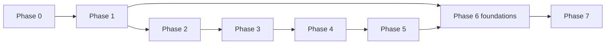

# RAGForge 交付路线图

## 1. 路线原则

本项目没有强制截止日，采用阶段进入/退出条件控制质量。每个阶段都交付可演示的纵向能力、自动化证据、运维证据和复盘；不以“学习完某技术”作为里程碑。

## Phase 0：竞品基准与许可证闸门

### 目标

用同一数据和问题理解成熟产品的真实能力与成本，形成有证据的 Build/Borrow 决策。

### 工作项

- 独立运行 RAGFlow 与 AnythingLLM，不把它们的部署混入 RAGForge。
- 准备 30–50 份脱敏文档和 30 个问题，覆盖标题、表格、长文、扫描 PDF、无答案和冲突证据。
- 记录安装资源、解析质量、分块、召回、引用、拒答、管理体验、可观察性和失败恢复。
- 检查候选仓库许可证，建立复用登记表和第三方 Notice 流程。
- 完成关键 ADR 的 Accepted 状态。

### 退出条件

- [GitHub 基准报告](../07-research/GITHUB_BENCHMARK.md) 的实验结果部分填写完成。
- 每个“借用”项都有 license + exact commit + use mode 决策。
- 首版验收数据集可在仓库内合法保存，或有可复现生成脚本。
- 不再存在会改变整体技术栈的开放问题。

## Phase 1：工程与领域骨架

### 用户结果

开发者可一条命令启动 core profile；用户能登录、创建空间并看到按角色裁剪的页面。

### 工作项

- Maven/Java 多模块、Vue、Python 工程和统一开发命令。
- Compose core：PostgreSQL、Qdrant、RabbitMQ、Valkey、对象存储、Ollama 连接。
- GitHub Actions：格式、构建、单测、架构测试、依赖缓存、SBOM、secret/dependency scan。
- Flyway migrations、UUIDv7、RFC 9457、cursor、correlation ID、Outbox 基础。
- 本地账号、Session、CSRF、空间 RBAC、审计骨架。

### 退出条件

- 新环境按文档可重复启动。
- 跨空间授权集成测试通过。
- 数据库迁移、备份冒烟和健康检查可执行。
- CI 对空白业务骨架全部通过。

## Phase 2：Provider、Prompt 与 Run 纵向切片

### 用户结果

管理员可登记 Ollama/OpenAI-compatible 模型、实测能力；用户发起一次无 RAG 对话并可观察 Run/Step/usage。

### 工作项

- Provider Registry、Model Profile/Route/Space Binding。
- Ollama 与通用 OpenAI-compatible adapter。
- Prompt Version、Model Invocation、Usage Ledger。
- SSE sequence/replay/cancel、错误分类和限流。
- 云端出境开关与禁止静默 failover 的测试。

### 退出条件

- 本地 `qwen3.5:9b` 完成功能验收。
- Mock 云端支持 20 条链路的协议/并发测试。
- 断流、重连、取消、超时、重试不重复 usage。
- 安全测试证明未授权空间无法调用云 route。

## Phase 3：版本化摄取流水线

### 用户结果

Editor 可上传文件并同步本地目录/Git；控制台可查看每一步和解析报告。

### 工作项

- 文件、本地目录、Git 连接器；Web connector 可在本阶段末或 Phase 5 前完成。
- 病毒扫描、Tika/POI/PDF/Markdown、OCR fallback。
- Obsidian YAML/heading/wikilink/路径/删除/移动的契约测试。
- Pipeline/Revision/Artifact/Job/Attempt/Step 版本模型。
- RabbitMQ、Outbox、幂等、重试、DLQ、checkpoint。
- Object storage 和 Parse Report。

### 退出条件

- 初次全量和增量同步在 Windows dev 与 Linux acceptance 行为一致。
- 中途失败不会推进错误 checkpoint 或污染 active data。
- 重投不产生重复 revision/artifact。
- 解析质量样本和 OCR 样本达到设定门槛。

## Phase 4：Chunk Studio、索引与检索

### 用户结果

Editor 可检查/修订 chunk；用户可检索；高级用户可 A/B 对比 retrieval profile。

### 工作项

- 父子分块、引用锚点、override/NEEDS_REVIEW。
- embedding profile 与缓存、Qdrant index version。
- dense + BM25 + RRF + rerank + parent expansion。
- Candidate index 验证、active pointer、24 小时旧索引保留。
- Chunk Studio 和 Retrieval Playground。

### 退出条件

- 30 问基准 `Recall@10` 和 `MRR@10` 达成阶段阈值。
- 100 万 child chunk 数据量下检索目标有可复现证据。
- 空间过滤、索引切换和回滚测试通过。
- 人工 override 的源更新冲突不会静默覆盖。

## Phase 5：带引用问答与只读 Agent

### 用户结果

用户获得可核验引用、可解释拒答，并可调用受控知识/文档/网页工具。

### 工作项

- Evidence Bundle、context budget 和 citation validator。
- 版本化 RAG prompt、流式回答和引用交互。
- `knowledge.search`、`document.read`、白名单 `web.fetch`。
- SSRF/redirect/content-size 防护、tool schema 和审计。
- 反馈收集与错误分类。

### 退出条件

- citation precision、faithfulness、abstention 阶段指标达标。
- 模型不能引用 Evidence Bundle 外的来源。
- Agent 无法访问 Shell、SQL、非白名单网络或其他空间。
- 故障/取消/降级均有用户可理解状态和 Trace。

## Phase 6：评估、观测、安全与恢复

### 用户结果

团队可持续评估变更、定位问题、演练恢复，并判断是否达到可部署标准。

### 工作项

- 120+ 用例，版本化 dataset/run/baseline。
- Promptfoo CI matrix/red-team；Langfuse OTel 可选 profile。
- Prometheus/Grafana/Loki/Tempo、SLO、告警和 Runbook。
- 威胁建模、上传/SSRF/越权/提示注入/供应链测试。
- PostgreSQL/Object/Qdrant 备份、隔离恢复演练。
- 保留与删除 Job、审计导出、成本报表。

### 退出条件

- 所有质量和隔离门槛达到 [项目章程](../00-governance/PROJECT_CHARTER.md)。
- RPO 24h、RTO 4h 的恢复演练有证据。
- P0/P1 安全问题为 0，依赖和镜像无未接受严重漏洞。
- On-call 可仅依赖 Dashboard + Runbook 定位规定故障。

阶段治理例外：质量/安全人工复核门槛仅可在用户明确批准后豁免；此时必须保留未执行复核的事实、残余风险和可重新开启复核的条件，不得将豁免描述为人工复核通过。

### Phase 7 业务闭环增量（2026-08-24）

- 已补齐核心业务所需的文件/文件夹/网页来源入口、模型选择、会话历史、连续追问和会话归档 API 与前端入口。
- 网页来源默认 fail-closed：必须配置 RAGFORGE_WEB_SOURCE_ALLOWED_HOSTS（映射到 ragforge.web-source.allowed-hosts），并通过空间云端出境授权、DNS 公网地址、大小和媒体类型检查。
- 本增量不改变 Phase 7 Linux 部署、升级、回滚、SBOM 和公开化退出条件；这些条件仍未因业务页面完成而自动满足。

本轮业务闭环增量（2026-08-23）：Phase 2 的 Provider 切换能力扩展了 MiMo Chat，Phase 3 的数据源入口扩展了前端本地 notes 文件夹选择；两项复用既有 Provider、revision/artifact、摄取和索引边界，不改变 Phase 6 已完成状态。MiMo 真实云 Chat 与本地 `qwen3.5:9b` RAG E2E 已有证据；真实个人 notes 文件选择需用户手势，完成后再补充实际 corpus 摄取证据。

本轮管理与前端闭环增量（2026-08-24）：新增平台管理员用户生命周期管理、空间编辑/归档、成员查询/角色调整/移除及最后管理员保护；前端补齐对应入口，统一按浏览器 IANA 时区显示，并修复 Prompt 选择变量未声明导致的运行时错误。Chat 大模型默认优先云端 MiMo，但仍受空间显式授权和 fail-closed 出境策略约束；Embedding/Rerank 不因 Chat 选择而自动出境。该增量不改变 Phase 6 已完成状态，也不宣称 Phase 7 的 Linux 交付、视觉验收或生产发布条件已完成。

## Phase 7：Linux 交付与可公开准备

状态（2026-08-29）：`implementation-reconciliation`。本阶段先依据代码与可执行门禁补齐 MVP 断点，再进入 Linux 发布：平台初始化、Provider 能力实测、生成 streaming/cancel、Git 来源、反馈/审计、durable retrieval/rerank 和自动化测试均不能因已有契约或页面文字而视为完成。随后才执行容器加固、干净 Ubuntu、升级/回滚、SBOM/扫描和公共化检查。执行以 [`PHASE_7_CHECKLIST.md`](PHASE_7_CHECKLIST.md) 和 [`PHASE_7_EXECUTION_PLAN.md`](../08-records/phase-7/PHASE_7_EXECUTION_PLAN.md) 为准。

### 用户结果

在干净 Ubuntu 24.04 环境可部署、升级、回滚和验收；仓库具备私有使用和后续公开条件。

### 工作项

- Compose core/observability/llmops profiles 和生产 override。
- 非 root 容器、固定 digest、资源限额、健康/就绪、Secret 注入。
- 安装、升级、回滚、备份、恢复、故障手册。
- 数据迁移兼容矩阵、release notes、SBOM、镜像签名（若选用）。
- 全仓秘密、个人信息、Obsidian 私有内容和第三方 Notice 清理。

### 退出条件

- 干净环境从文档部署成功并通过冒烟/验收。
- 上一版本可升级且在定义窗口内回滚。
- 公共化检查清单全部通过后，才讨论建立公开 GitHub 仓库。

## 2. 依赖关系

安全、测试、文档和可观测性不是 Phase 6 才开始；Phase 6 是统一收敛和达标。
