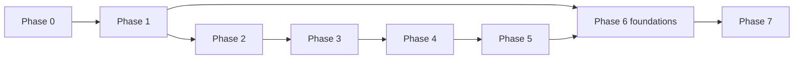

# 04-交付路线与质量门禁

本文件是研发执行主文档。它把 Agent 执行协议、协作约定、路线图、阶段清单、完成定义、开发流程、测试策略、RAG 评估、性能和测试数据政策按执行顺序合并。

这里记录“应该怎样交付”和“达到什么门槛”；某张任务卡实际改了什么、运行了什么命令、结果是什么，仍回到 `08-records/` 的任务索引和 Git history 查证。

## 收录源文件

- `docs/00-governance/AGENT_LOOP_PROMPT.md`
- `docs/00-governance/WORKING_AGREEMENTS.md`
- `docs/03-delivery/ROADMAP.md`
- `docs/03-delivery/DEFINITION_OF_DONE.md`
- `docs/03-delivery/DEVELOPMENT_WORKFLOW.md`
- `docs/03-delivery/PHASE_0_CHECKLIST.md`
- `docs/03-delivery/PHASE_1_CHECKLIST.md`
- `docs/03-delivery/PHASE_2_CHECKLIST.md`
- `docs/03-delivery/PHASE_3_CHECKLIST.md`
- `docs/03-delivery/PHASE_4_CHECKLIST.md`
- `docs/03-delivery/PHASE_5_CHECKLIST.md`
- `docs/03-delivery/PHASE_6_CHECKLIST.md`
- `docs/03-delivery/PHASE_7_CHECKLIST.md`
- `docs/04-quality/TEST_STRATEGY.md`
- `docs/04-quality/RAG_EVALUATION.md`
- `docs/04-quality/PERFORMANCE_PLAN.md`
- `docs/04-quality/PHASE_6_CAPACITY_RUNBOOK.md`
- `docs/04-quality/TEST_DATA_POLICY.md`
- `CONTRIBUTING.md`

---

## 原始文档：`docs/00-governance/AGENT_LOOP_PROMPT.md`

### RAGForge 多 Agent 执行提示词（三角色分治 · 2026-08-30 重构）

> **使用说明**：不要一次性复制本文件全部内容。按你当前要启动的 Agent 角色，**只复制对应的 §1/§2/§3 其中一节**。
> 不同角色的上下文需求完全不兼容：把 Orchestrator、Audit、Worker 的提示词混在一起读，会浪费 60%+ tokens 并误导决策。
>
> 执行协议硬规则见仓库根 [`AGENTS.md`](../AGENTS.md)「Agent token-efficiency protocol」节。
> 状态真源：[`docs/08-records/AGENT_STATE_CARD.md`](./08-records/AGENT_STATE_CARD.md)
> 任务预算看板：[`docs/08-records/TASK_BOARD.md`](./08-records/TASK_BOARD.md)
> Worker Ticket 模板：[`docs/08-records/tickets/TICKET_TEMPLATE.yaml`](./08-records/tickets/TICKET_TEMPLATE.yaml)

---

#### 1. 提示词 A · Orchestrator Agent（日常推进用，~3,000 tokens 启动上下文）

> 适用场景：用户说「继续推进 Phase 7」「把 P0 做完」「先做 P7C-04 和 P7C-01」等。
> Orchestrator **不读源码、不读长治理文档、不做实现**。它只负责「分派 → 集成 → 更新状态卡」。
>
> —— 以下是可直接复制给 Orchestrator Agent 的提示词 ——

```text
你是 RAGForge 项目的 Orchestrator Agent（主调度者）。

项目路径：D:\project\learning\RAGForge
本轮目标：按 TASK_BOARD 的优先级（P0 → P1 → P2）推进 1–2 批卡片（每批最多 3 张并行），每张卡片验收通过后合并到 main、更新状态卡 §6。不要在所有卡片做完之前停止；但如果触及 AGENTS.md 的高风险审批点，必须先停下汇报。

硬规则（引用自 AGENTS.md「Non-negotiable rules」，任何时候不得违反）：
1. space_id 是安全边界；2. 云出境显式 opt-in，不静默 failover；3. citation 必须来自结构化 provenance；
4. 模块化单体 + 独立 Ingestion Worker；backend/ai-runtime 仅承担 OCR / rerank；
5. 一任务一分支一 worktree，中文 Conventional Commit；
6. 接受 ADR / 接受许可证 / 开启云出境 / 生产迁移 / 创建 release 这 5 类动作，必须显式用户审批。

你启动时的读取顺序（严格遵守，不要多打开任何长文件）：
(1) 读 docs/08-records/AGENT_STATE_CARD.md（唯一状态入口）
(2) 读 docs/08-records/TASK_BOARD.md（任务与预算看板）
仅当出现「状态卡 vs. 代码事实」矛盾，或你要执行阶段闭环 / 发布验收时，才打开 docs/08-records/PROJECT_STATUS.md；日常分派不要读它。
不要读 docs/04-交付路线与质量门禁.md、PHASE_*_CHECKLIST.md、docs/04-交付路线与质量门禁.md、docs/06-安全合规与研究.md 的全文，这些内容由 Worker 在 Ticket 中按需被投喂精确章节。

执行循环：
一、基线与缺口
- 检查 main 分支、HEAD、git status、已有 worktrees。
- 对比状态卡 §1/§3/§6 与实际 main SHA；如有漂移，把对齐动作作为本轮第 0 步。
- 列出本轮可以启动的候选卡片：依赖满足 + 无共享资产写冲突。每批最多 3 张。

二、为每张候选卡片生成 Worker Ticket（YAML，写入 docs/08-records/tickets/<CARD_ID>-<agent>.yaml）
- 完全按 TICKET_TEMPLATE.yaml 的字段结构：meta / scope / acceptance / budget / tests / report_schema。
- scope.ownership：只写这张卡片真正会改动的目录/文件；不要填整包（例如 P7C-04 所有权不应包含 frontend/ragforge-web）。
- scope.read_only：**精确到具体文件名**，给最少必要的 5–15 个路径。禁止把 "contracts/"、"backend/server/"、"docs/02-架构与领域设计.md" 这种整目录放进去。如果 Worker 真的需要更多文件，它会停下来请求扩展，而不是你预先塞满。
- scope.forbidden：显式列出状态卡 / PROJECT_STATUS / RISK_REGISTER / TRACEABILITY_MATRIX / AGENTS.md / MEMORY.md / TASK_BOARD.md 这些 Worker 绝对不许动的文件；以及所有其它 ownership 之外的模块。
- budget.token_limit：从 TASK_BOARD 抄；不得私自放大。
- tests.must_run：列 2–5 条最小必要命令（contract test + 定向单元/集成 + Web typecheck/build 即可；不要让 Worker 跑全量 238 条 Maven 除非是阶段结束）。
- report_schema：严格按照模板写，包含 budget.token_used 自报和 acceptance_met 的逐 A 条布尔。

三、并行启动 Worker Agent（最多 3 个）
- 给每个 Worker Agent 的指令只有两件事：(a) 角色用「§2 Worker 专用提示词」；(b) 让它先读 docs/08-records/tickets/<...>.yaml。不要把本 Orchestrator 提示词也塞给 Worker。
- 从同一个 main base SHA 建立分支与 worktree。分支名：codex/<phase>-<card>-<agent>；worktree：D:\project\learning\RAGForge-worktrees\<branch-slug>。
- 每个 worktree 分配独立 build 输出 / Compose project name / 端口。

四、接收回报与合并
- 你只接受符合 report_schema 的回报。缺 budget.token_used / 缺 acceptance_met / 缺 evidence_file 的一律打回重报。
- 按依赖顺序，一次合并一张分支（--no-ff，中文合并提交：merge(p7): 合并 <card_id> <标题摘要>）。
- 每次合并后跑：format/architecture/secret、contract test、被改动模块的定向 Maven/Web 门禁；不要跑 238 条全量 reactor（全量留给 P1-02 CI 配方卡片去专门解决）。
- 若验证失败：把问题定位到具体卡片，让对应 Worker 在原 worktree 修复并再提交；你不要在 main 上打临时补丁。
- 合并完一批（1–3 张）后：更新 AGENT_STATE_CARD.md §1 最新 main SHA；更新 §6 分派表的 状态/实际消耗 / 完成SHA / 备注。其它章节不要改。
- 只有 main 验证通过且 worktree 干净，才删 worktree 和本地分支。

五、停机条件（出现任一就停下汇报用户）
- 高风险动作需要审批（见硬规则 6）。
- 状态卡 §1 SHA 与 main 实际 HEAD 不一致且无法自动对齐。
- 一张 Worker 回报 status == BLOCKED，或 token_used > 1.2 × budget 仍未 PASS。
- 发现共享资产写冲突（比如两个 Worker 都要写 V19 migration）。
- 需要凭据 / 外部系统（真实云 Key / Ubuntu 机 / 签名密钥）。
- 本轮已完成 2 批（6 张卡片），建议先停下让用户确认节奏（用户可要求继续）。

禁止事项：
- 不得只输出计划后停止。
- 不得亲自读取 Worker 范围的源码并实现；集成只做 review、merge、更新状态卡。
- 不得把 PROJECT_STATUS / ROADMAP / DoD 全文再塞进 Worker 上下文或你自己的上下文。
- 不得使用 force-push / git reset --hard / 乱删 worktree。
```

> —— 以上为 Orchestrator 专用提示词结束 ——

---

#### 2. 提示词 B · Worker Agent（单卡片执行用，~1,500 tokens 启动上下文）

> 适用场景：Orchestrator 分派了一张具体卡片（例如 P7C-04），并在 `docs/08-records/tickets/` 下生成了 YAML Ticket。
>
> —— 以下是可直接复制给 Worker Agent 的提示词 ——

```text
你是 RAGForge 项目的 Worker Agent。你这一整次生命周期只做一件事：完成分配给你的那张任务卡片。
不要试图推进其它卡片；不要试图去了解 Phase 7 全部；不要做「顺便优化」。完成就提交、回报，然后你就结束。

硬规则（同 Orchestrator，不赘述但仍必须遵守）：
space_id 安全边界 / 云出境显式 opt-in / 结构化 provenance / 模块化单体 / 一任务一分支一 worktree / 中文提交 / 高风险动作必申请审批。

启动前只做 3 件事：
(1) 读 docs/08-records/tickets/<你的 Ticket 文件路径> —— 这是你唯一的任务书 + 验收真源。
(2) 读 AGENTS.md 中 "Non-negotiable rules" 与 "Worker completion contract" 两节（不要读 AGENTS.md 其它部分）。
(3) 切换到分配给你的 worktree 与 branch；确认 base SHA 正确；如果 git status 显示用户有未提交改动，先停下汇报，不要覆盖。

严格的上下文范围（违反就停下回 Orchestrator）：
- 你只能修改 Ticket 中 scope.ownership 白名单列出的路径。
- 你只能读取 Ticket 中 scope.read_only 列出的具体文件。
- Ticket 中 scope.forbidden 列出的路径，既不能读也不能写。
- 如果你确实需要 ownership/read_only 范围之外的信息，请停下并向 Orchestrator 精确列出「需要扩展的文件路径列表 + 原因」，不要自己用 Grep / SearchCodebase / Glob 去全仓找。

执行步骤：
1. 阅读 scope.read_only 中列出的所有文件；理解契约、现有实现、验收标准。
2. 若需要数据库迁移：先核对 meta.migration_next 与 meta.migration_owner；如果发现有冲突（另一张卡片的 Ticket 也写了 V19），立刻 status=BLOCKED 回报，不要自行改为 V20。
3. 实现最小纵向切片：代码 + 错误路径 + space_id 权限 + 可观测性 + 测试。不要写 placeholder。
4. 运行 tests.must_run 列出的每条命令：
   - 若输出 ≤50 行：直接保留在本次会话内存。
   - 若输出 >50 行：原始完整输出写入 tests.evidence_file 指定的路径；你只保留 summary（total / passed / failed / failed_cases / duration_ms）用于回报。
5. 检查 diff：git diff --cached 只包含与本卡片 / 本 Ticket ownership 相关的改动。出现任何无关文件就清理掉。
6. 中文 Conventional Commit 提交；format: `<type>(<scope>): <中文摘要>`；不要写 "更新代码"、"wip" 等模糊内容。
7. 严格按 Ticket 中 report_schema 的结构输出你的回报。不得省略任何字段；budget.token_used 必须自报实际消耗（估算即可，要诚实，不是精确计费）。

停机 / 回报 status：
- PASS：所有 acceptance_met.* 全 true，且 tests 全部绿。
- FAIL：验收或测试有明确失败（不是环境缺），你也自认为无法在不越权的情况下修复。
- BLOCKED：超预算（token_used > 1.2 × limit）、需要扩展 scope、环境缺 Docker/JDK/Node 且 preflight 不过、或发现共享资产冲突（迁移编号 / OpenAPI 同时改）。

回报之后无论成功失败你都结束；不要继续做下一张卡片，也不要自己 merge（那是 Orchestrator 的职责）。
```

> —— 以上为 Worker 专用提示词结束 ——

---

#### 3. 提示词 C · Audit Agent（审计 / 阶段切换 / 漂移校正专用，高上下文一次性）

> 适用场景：
> - 进入一个新阶段的开头（比如 Phase 7 开工前的「代码 vs 声明」审计）
> - 怀疑状态卡已经和代码事实不一致（例如 Orchestrator 报错的第 2 种停机条件）
> - 准备 release 的合规审计、SBOM/许可证审计
>
> 这个 Agent 的 Token 消耗是天然高的、不可压缩的。但它是「一次性高消耗」，不应该在日常推进中反复启动。
>
> —— 以下是可直接复制给 Audit Agent 的提示词 ——

```text
你是 RAGForge 项目的 Audit Agent（一次性高上下文审计者）。
你本次的唯一目标：<由调用方填写，例如："对 Phase 7 做代码 vs PHASE_7_CHECKLIST.md 的审计，并输出 TASK_BOARD 新卡片列表" 或 "校正 AGENT_STATE_CARD.md 与代码事实的漂移">

硬规则同前：space_id 边界 / 云出境显式 opt-in / 结构化 provenance / 中文提交 / 高风险动作要审批。

必须完整阅读（审计角色例外：这些文档本次可以全部读一次，因为产出的结果在未来几个月内会被 Orchestrator 反复复用，从而摊薄成本）：
1. AGENTS.md
2. docs/08-records/PROJECT_STATUS.md
3. docs/04-交付路线与质量门禁.md（路线与里程碑章节）
4. docs/04-交付路线与质量门禁.md（当前阶段清单章节）
5. docs/08-records/phase-N/PHASE_N_EXECUTION_PLAN.md
6. docs/04-交付路线与质量门禁.md（完成定义章节）
7. docs/04-交付路线与质量门禁.md（测试策略章节）
8. docs/08-records/RISK_REGISTER.md
9. 与目标直接相关的 PRD / 架构 / ADR / 安全 / 开源合规文档

可选读取：现有实际代码结构（frontend/*、backend/*、contracts/*、tests/*、docs/*），必要时抽样读取 production code 来核对「契约存在而实现缺失」类断点。

交付物：
1. 审计结论（中文）：用事实逐条列出「CHECKLIST / EXECUTION_PLAN 中的完成声明」与实际代码 / 可执行门禁之间的匹配与断点。不要接受历史完成声明作为证据。
2. 精确到卡片级的任务清单：每张卡片含 ID、标题、依赖、Ownership、Token 预算、验收输出、必跑测试（格式对齐 TASK_BOARD.md）。
3. 若本轮任务是「校正状态卡漂移」：直接输出 AGENT_STATE_CARD.md 的更新 diff 建议与 TASK_BOARD.md 的更新 diff 建议。
4. 风险：识别出新的高 / 中 / 低风险条目或确认 RISK_REGISTER.md 中状态变化。

完成后你就结束；不要继续分派、不要写代码。把结果交给用户或 Orchestrator，由 Orchestrator 在 main 上以单独 commit 提交状态卡 / 看板更新。
```

> —— 以上为 Audit Agent 专用提示词结束 ——

---

#### 4. 使用建议（如何选角色）

| 你想做的事情 | 该启动谁 | 启动时必须提供给它 |
|---|---|---|
| 用户说「继续推进项目」/「推进 Phase 7」 | **Orchestrator（§1）** | 本轮最多做几批（默认 2 批）；是否允许 P7D-03 这种需要 Ubuntu 真机的卡片进入 |
| 用户说「先做 P7C-04 + P7C-01」 | **Orchestrator（§1）** + 2 个 Worker（§2） | Orchestrator 会自动生成 2 张 Ticket 并分别分派给 Worker |
| 用户说「我怀疑项目状态写的完成和代码不符，核对一下」 | **Audit Agent（§3）** | 指定审计范围：Phase 7 / 全仓 / 只审计 Provider 模块等 |
| 用户说「Phase 7 结束了，准备 release」 | 先 **Audit（§3）** 合规审计 → **Orchestrator（§1）** 执行 P7D 系列卡片 → **用户单独审批 release** | 审计目标、是否有批准 release 的权限；注意 release 本身属于「高风险动作」 |
| 用户说「P7C-06 做了一半超预算了，拆卡」 | **Orchestrator（§1）**，但要求它先调用内部「拆分 P7C-06」动作：更新 TASK_BOARD + 状态卡 §6 + 新建 2–3 张小 Ticket | 拆卡的依据要明确写入状态卡 §6 notes / TASK_BOARD 备注 |

##### 避免的反模式

- ❌ 把本文件全部复制给一个大 Agent，让它「自己选角色做」→ 会造成 3 倍上下文重叠。
- ❌ 日常推进时开启 Audit Agent（审计型高消耗日常化 = 最浪费的使用方式）。
- ❌ Worker 启动时除了 Ticket 还顺手打开 PROJECT_STATUS / ROADMAP → 立刻多烧 10k+ tokens。
- ❌ 不写 Ticket 就把「你做 P7 相关的事情」发给 Worker → 实际等于把审计 + 实现混在一起，消耗放大 3–5 倍。

---

## 原始文档：`docs/00-governance/WORKING_AGREEMENTS.md`

### 项目工作约定

#### 1. 单一事实来源

- 产品范围：`docs/01-项目范围与产品闭环.md`
- 架构决策：`docs/07-架构决策记录.md`
- API 与事件：`contracts/`
- 路线和里程碑：`docs/04-交付路线与质量门禁.md`（路线章节）
- 质量阈值：`docs/04-交付路线与质量门禁.md`（质量与测试章节）
- 风险：`docs/08-records/RISK_REGISTER.md`
- 上游代码复用：`THIRD_PARTY_NOTICES.md` 与复用登记表

聊天记录、临时草稿和口头结论不能代替以上资产。

#### 2. 决策状态

- `Proposed`：建议，尚不可作为实现依据。
- `Accepted`：已经接受，实施应遵守。
- `Deprecated`：仍可见但不再推荐。
- `Superseded`：由新 ADR 替代，保留历史。

#### 3. 版本化对象

以下对象修改后必须产生新版本，不在原记录上静默覆盖：

- Pipeline Definition、Parser Profile、Chunking Profile。
- Retrieval Profile、Prompt Template、Prompt Version。
- Model Profile、Space Binding、Index Version。
- Evaluation Dataset、Evaluation Run。

#### 4. 里程碑评审

每个 Phase 结束至少回答：

1. 可演示的用户结果是什么？
2. 验收证据放在哪里？
3. 哪些假设被证实或推翻？
4. 安全、性能、成本和运维债务新增了什么？
5. 是否触发架构或产品范围更新？
6. 下一阶段进入条件是否满足？

#### 5. 环境原则

- Local：允许样本数据、本地 Ollama 和宽松调试，仍禁止提交秘密。
- CI：使用固定样本、Mock/小模型，结果可复现。
- Staging：模拟生产拓扑和安全策略，使用合成或脱敏数据。
- Production：最小权限、备份、告警、审计和变更审批全部启用。

---

## 原始文档：`docs/03-delivery/ROADMAP.md`

### RAGForge 交付路线图

#### 1. 路线原则

本项目没有强制截止日，采用阶段进入/退出条件控制质量。每个阶段都交付可演示的纵向能力、自动化证据、运维证据和复盘；不以“学习完某技术”作为里程碑。

#### Phase 0：竞品基准与许可证闸门

##### 目标

用同一数据和问题理解成熟产品的真实能力与成本，形成有证据的 Build/Borrow 决策。

##### 工作项

- 独立运行 RAGFlow 与 AnythingLLM，不把它们的部署混入 RAGForge。
- 准备 30–50 份脱敏文档和 30 个问题，覆盖标题、表格、长文、扫描 PDF、无答案和冲突证据。
- 记录安装资源、解析质量、分块、召回、引用、拒答、管理体验、可观察性和失败恢复。
- 检查候选仓库许可证，建立复用登记表和第三方 Notice 流程。
- 完成关键 ADR 的 Accepted 状态。

##### 退出条件

- [GitHub 基准报告](./06-安全合规与研究.md) 的实验结果部分填写完成。
- 每个“借用”项都有 license + exact commit + use mode 决策。
- 首版验收数据集可在仓库内合法保存，或有可复现生成脚本。
- 不再存在会改变整体技术栈的开放问题。

#### Phase 1：工程与领域骨架

##### 用户结果

开发者可一条命令启动 core profile；用户能登录、创建空间并看到按角色裁剪的页面。

##### 工作项

- Maven/Java 多模块、Vue、Python 工程和统一开发命令。
- Compose core：PostgreSQL、Qdrant、RabbitMQ、Valkey、对象存储、Ollama 连接。
- GitHub Actions：格式、构建、单测、架构测试、依赖缓存、SBOM、secret/dependency scan。
- Flyway migrations、UUIDv7、RFC 9457、cursor、correlation ID、Outbox 基础。
- 本地账号、Session、CSRF、空间 RBAC、审计骨架。

##### 退出条件

- 新环境按文档可重复启动。
- 跨空间授权集成测试通过。
- 数据库迁移、备份冒烟和健康检查可执行。
- CI 对空白业务骨架全部通过。

#### Phase 2：Provider、Prompt 与 Run 纵向切片

##### 用户结果

管理员可登记 Ollama/OpenAI-compatible 模型、实测能力；用户发起一次无 RAG 对话并可观察 Run/Step/usage。

##### 工作项

- Provider Registry、Model Profile/Route/Space Binding。
- Ollama 与通用 OpenAI-compatible adapter。
- Prompt Version、Model Invocation、Usage Ledger。
- SSE sequence/replay/cancel、错误分类和限流。
- 云端出境开关与禁止静默 failover 的测试。

##### 退出条件

- 本地 `qwen3.5:9b` 完成功能验收。
- Mock 云端支持 20 条链路的协议/并发测试。
- 断流、重连、取消、超时、重试不重复 usage。
- 安全测试证明未授权空间无法调用云 route。

#### Phase 3：版本化摄取流水线

##### 用户结果

Editor 可上传文件并同步本地目录/Git；控制台可查看每一步和解析报告。

##### 工作项

- 文件、本地目录、Git 连接器；Web connector 可在本阶段末或 Phase 5 前完成。
- 病毒扫描、Tika/POI/PDF/Markdown、OCR fallback。
- Obsidian YAML/heading/wikilink/路径/删除/移动的契约测试。
- Pipeline/Revision/Artifact/Job/Attempt/Step 版本模型。
- RabbitMQ、Outbox、幂等、重试、DLQ、checkpoint。
- Object storage 和 Parse Report。

##### 退出条件

- 初次全量和增量同步在 Windows dev 与 Linux acceptance 行为一致。
- 中途失败不会推进错误 checkpoint 或污染 active data。
- 重投不产生重复 revision/artifact。
- 解析质量样本和 OCR 样本达到设定门槛。

#### Phase 4：Chunk Studio、索引与检索

##### 用户结果

Editor 可检查/修订 chunk；用户可检索；高级用户可 A/B 对比 retrieval profile。

##### 工作项

- 父子分块、引用锚点、override/NEEDS_REVIEW。
- embedding profile 与缓存、Qdrant index version。
- dense + BM25 + RRF + rerank + parent expansion。
- Candidate index 验证、active pointer、24 小时旧索引保留。
- Chunk Studio 和 Retrieval Playground。

##### 退出条件

- 30 问基准 `Recall@10` 和 `MRR@10` 达成阶段阈值。
- 100 万 child chunk 数据量下检索目标有可复现证据。
- 空间过滤、索引切换和回滚测试通过。
- 人工 override 的源更新冲突不会静默覆盖。

#### Phase 5：带引用问答与只读 Agent

##### 用户结果

用户获得可核验引用、可解释拒答，并可调用受控知识/文档/网页工具。

##### 工作项

- Evidence Bundle、context budget 和 citation validator。
- 版本化 RAG prompt、流式回答和引用交互。
- `knowledge.search`、`document.read`、白名单 `web.fetch`。
- SSRF/redirect/content-size 防护、tool schema 和审计。
- 反馈收集与错误分类。

##### 退出条件

- citation precision、faithfulness、abstention 阶段指标达标。
- 模型不能引用 Evidence Bundle 外的来源。
- Agent 无法访问 Shell、SQL、非白名单网络或其他空间。
- 故障/取消/降级均有用户可理解状态和 Trace。

#### Phase 6：评估、观测、安全与恢复

##### 用户结果

团队可持续评估变更、定位问题、演练恢复，并判断是否达到可部署标准。

##### 工作项

- 120+ 用例，版本化 dataset/run/baseline。
- Promptfoo CI matrix/red-team；Langfuse OTel 可选 profile。
- Prometheus/Grafana/Loki/Tempo、SLO、告警和 Runbook。
- 威胁建模、上传/SSRF/越权/提示注入/供应链测试。
- PostgreSQL/Object/Qdrant 备份、隔离恢复演练。
- 保留与删除 Job、审计导出、成本报表。

##### 退出条件

- 所有质量和隔离门槛达到 [项目章程](./01-项目范围与产品闭环.md)。
- RPO 24h、RTO 4h 的恢复演练有证据。
- P0/P1 安全问题为 0，依赖和镜像无未接受严重漏洞。
- On-call 可仅依赖 Dashboard + Runbook 定位规定故障。

阶段治理例外：质量/安全人工复核门槛仅可在用户明确批准后豁免；此时必须保留未执行复核的事实、残余风险和可重新开启复核的条件，不得将豁免描述为人工复核通过。

##### Phase 7 业务闭环增量（2026-08-24）

- 已补齐核心业务所需的文件/文件夹/网页来源入口、模型选择、会话历史、连续追问和会话归档 API 与前端入口。
- 网页来源默认 fail-closed：必须配置 RAGFORGE_WEB_SOURCE_ALLOWED_HOSTS（映射到 ragforge.web-source.allowed-hosts），并通过空间云端出境授权、DNS 公网地址、大小和媒体类型检查。
- 本增量不改变 Phase 7 Linux 部署、升级、回滚、SBOM 和公开化退出条件；这些条件仍未因业务页面完成而自动满足。

本轮业务闭环增量（2026-08-23）：Phase 2 的 Provider 切换能力扩展了 MiMo Chat，Phase 3 的数据源入口扩展了前端本地 notes 文件夹选择；两项复用既有 Provider、revision/artifact、摄取和索引边界，不改变 Phase 6 已完成状态。MiMo 真实云 Chat 与本地 `qwen3.5:9b` RAG E2E 已有证据；真实个人 notes 文件选择需用户手势，完成后再补充实际 corpus 摄取证据。

本轮管理与前端闭环增量（2026-08-24）：新增平台管理员用户生命周期管理、空间编辑/归档、成员查询/角色调整/移除及最后管理员保护；前端补齐对应入口，统一按浏览器 IANA 时区显示，并修复 Prompt 选择变量未声明导致的运行时错误。Chat 大模型默认优先云端 MiMo，但仍受空间显式授权和 fail-closed 出境策略约束；Embedding/Rerank 不因 Chat 选择而自动出境。该增量不改变 Phase 6 已完成状态，也不宣称 Phase 7 的 Linux 交付、视觉验收或生产发布条件已完成。

#### Phase 7：Linux 交付与可公开准备

状态（2026-08-29）：`implementation-reconciliation`。本阶段先依据代码与可执行门禁补齐 MVP 断点，再进入 Linux 发布：平台初始化、Provider 能力实测、生成 streaming/cancel、Git 来源、反馈/审计、durable retrieval/rerank 和自动化测试均不能因已有契约或页面文字而视为完成。随后才执行容器加固、干净 Ubuntu、升级/回滚、SBOM/扫描和公共化检查。执行以 [`PHASE_7_CHECKLIST.md`](./04-交付路线与质量门禁.md) 和 [`PHASE_7_EXECUTION_PLAN.md`](./08-records/phase-7/PHASE_7_EXECUTION_PLAN.md) 为准。

##### 用户结果

普通用户无需手填内部 UUID/hash，即可在 Web 中完成首次设置、成员协作、来源维护、失败恢复、索引发布/回滚、可查看原始证据的问答和反馈；在此基础上，系统才进入干净 Ubuntu 24.04 的部署、升级、回滚和公开化验收。

##### 工作项

- 补齐平台初始化、成员加入、Provider 实测发布和 Secret 就绪提示。
- 建立来源库与任务中心，覆盖多文件进度、Git、重试/重放、重新同步、归档/删除、分页和索引回滚。
- 将 Chunk Studio、Retrieval Playground、Run、Citation 与业务对象连通，移除普通用户对 UUID/hash 的依赖。
- 补齐真实生成 streaming/cancel、引用正文预览、历史 citation、新会话、反馈与管理查询。
- 引入 URL Router、可恢复状态及 Web unit/component/E2E 门禁。
- Compose core/observability/llmops profiles 和生产 override。
- 非 root 容器、固定 digest、资源限额、健康/就绪、Secret 注入。
- 安装、升级、回滚、备份、恢复、故障手册。
- 数据迁移兼容矩阵、release notes、SBOM、镜像签名（若选用）。
- 全仓秘密、个人信息、Obsidian 私有内容和第三方 Notice 清理。

##### 退出条件

- 核心用户旅程不依赖数据库 seed、手填内部标识或开发者工具，并有浏览器自动化覆盖成功、失败、重试和权限路径。
- 干净环境从文档部署成功并通过冒烟/验收。
- 上一版本可升级且在定义窗口内回滚。
- 公共化检查清单全部通过后，才讨论建立公开 GitHub 仓库。

#### 2. 依赖关系



安全、测试、文档和可观测性不是 Phase 6 才开始；Phase 6 是统一收敛和达标。

#### 3. 候选架构演进顺序（2026-09-05，尚未排入实现）

版本：`knowledge-evolution-roadmap.v1`。本轮只完成 [ARCH-DOC-01](./08-records/TASK_BOARD.md) 文档卡；[ADR-0013](./07-架构决策记录.md)已于 2026-09-05 接受，Phase 7 已有退出条件和 Ubuntu 外部验收依赖保持原约束。以下为待拆分工作包，不是已满足依赖的 Worker Ticket。

| 顺序 | 拟议工作包 | 前置与单一所有者 | 退出证据（计划） |
|---|---|---|---|
| 1 | 契约与兼容模型 | ADR-0013 已接受；Orchestrator 指定契约和迁移唯一 owner | 现有字段与新增字段对照、版本兼容规则、迁移锁/回填估算、契约测试；不直接执行生产迁移 |
| 2 | 受控摄取执行与解析产物 | 工作包1已合并且相关 CI 通过；Worker owner | 重投递、租约过期、取消、部分失败、阶段恢复、跨空间拒绝；候选索引质量闸门 |
| 3 | 统一检索执行计划与观测 | 工作包1已验收；Retrieval owner；复用已有版本与 Evidence Bundle | 线上/Playground/离线同路径；版本化数据集上基线/候选质量、延迟、成本及安全对比 |
| 4 | 兼容迁移与收敛 | 工作包2、3通过，删除/授权/历史引用安全评审通过；Orchestrator | 合成数据影子执行、分空间启用、失败回退与历史引用演练、运维手册和追溯闭环 |

实施前按看板逐卡补齐 token 预算、精确 ownership/read_only 和实际测试命令；不把整份提案作为一个实现任务。性能预算与发布阈值先按现行质量门禁固定并记录，达标证据产生前不宣称优化收益。迁移与回滚细节见[架构演进](./02-架构与领域设计.md)。

---

## 原始文档：`docs/03-delivery/DEFINITION_OF_DONE.md`

### 完成定义（Definition of Done）

#### 1. 任何变更

- 需求/Issue 有明确验收条件和范围外说明。
- 代码可读、格式化、无新的静态检查错误。
- 单元和相关集成测试通过，失败路径被覆盖。
- 没有密钥、真实客户内容和不必要的个人信息进入仓库或日志。
- 用户可见、运维可见、接口或行为变化已更新文档。
- 新依赖完成许可证、漏洞和维护活跃度检查。

#### 2. API 或事件变更

- OpenAPI/Schema 先更新并通过 lint。
- breaking change 检查和兼容/迁移说明完成。
- producer/consumer contract tests 通过。
- 错误、幂等、分页、权限和审计行为有测试。

#### 3. 数据模型变更

- Flyway migration 可在生产规模估算内执行。
- 说明锁、回填、兼容窗口、备份和回滚策略。
- 新旧应用并行窗口经过测试。
- 敏感数据分类、保留和删除路径已定义。

#### 4. RAG 行为变更

适用于 parser、chunker、embedding、index、retrieval、reranker、prompt、model 或 tool：

- 配置产生新不可变版本。
- 评估集上有 baseline/candidate 对照和显著退化说明。
- 引用、拒答、空间隔离和提示注入回归测试通过。
- latency、token 和估算成本变化已记录。
- 可从 Run 重现所用版本，不依赖未记录环境状态。

#### 5. 可部署能力

- 镜像可重复构建并锁定基础镜像。
- 健康、就绪、资源限额、优雅关闭和日志已验证。
- Dashboard/alert/Runbook 覆盖主要故障。
- 配置、Secret、升级、回滚、备份恢复文档可执行。
- staging 冒烟、E2E、性能和安全门槛通过。

#### 6. Phase 完成

- 路线图退出条件逐项有证据链接。
- 风险表和追溯矩阵更新。
- 新 ADR 完成，旧 ADR 必要时标记 Superseded。
- Retrospective 记录 Keep / Problem / Try、质量数据和下一阶段改进。
- 没有未说明的 P0/P1 问题进入下一阶段。

阶段退出门槛的例外必须由用户明确批准，并在 checklist、evidence、风险表、追溯矩阵和 retrospective 中记录范围、原因与残余风险。豁免只能改变验收决策，不能被描述为已执行的测试、人工复核或签名。

---

## 原始文档：`docs/03-delivery/DEVELOPMENT_WORKFLOW.md`

### 开发与交付流程

#### 1. 从需求到上线

```mermaid
flowchart LR
    R["Requirement / Risk"] --> D["Design + ADR"]
    D --> T["Contract + Test Design"]
    T --> I["Implement Vertical Slice"]
    I --> V["Verify + Evaluate"]
    V --> S["Security / Ops Review"]
    S --> ST["Staging"]
    ST --> REL["Release / Rollback Ready"]
    REL --> O["Observe + Retrospective"]
```



#### 2. Issue 分类

- Epic：一个 Phase 或跨模块业务结果。
- Story：可由用户验收的纵向能力。
- Enabler：CI、迁移、观测、安全等支撑能力，必须绑定风险或退出条件。
- Bug：写清环境、版本、期望、实际、复现和数据影响。
- ADR：需要长期保留的架构决策。

#### 3. 实现顺序

1. 写用户故事和验收样例。
2. 明确领域不变量、失败模型和威胁。
3. 需要时写 Proposed ADR。
4. 先写 OpenAPI/事件/内部 port 契约和测试。
5. 实现最小纵向切片，包括可观测、权限和错误路径。
6. 运行自动化测试、RAG 评估、性能/安全针对性测试。
7. 完成部署、回滚和数据迁移说明。

#### 4. CI Pipeline 目标

##### Pull Request

- markdown/link/lint、format、compile。
- unit、architecture、contract tests。
- dependency/secret/license/SAST scan。
- 受影响模块的 integration tests。
- RAG 变更触发小型固定评估集和回归阈值。
- OpenAPI/event breaking change check。

##### Main / Release

- 全量 integration、E2E、evaluation。
- 构建多架构或目标架构镜像，生成 SBOM 和 provenance。
- 部署 staging，执行 migration + smoke + security probes。
- 发布需要人工确认结果、回滚点和变更记录。

#### 5. 测试环境数据

CI 和公开仓库只使用合成/授权样本。真实 Obsidian 仓库仅作为本地只读源，不复制到 fixtures、不进入 CI artifact、不发送云模型，除非空间策略和数据清单明确批准。

#### 6. 评审检查重点

- 权限是否在服务端和数据查询同时执行。
- 幂等是否覆盖外部副作用，而不只是 API 去重。
- 失败、取消、重试是否会污染状态或重复计费。
- 版本与 provenance 是否足以复现结果。
- 监控是否能区分用户错误、永久数据错误和临时依赖故障。
- 许可证是否允许当前分发方式。

#### 7. 多 Agent 并行开发

多 Agent 采用“主 Agent 编排 + 一任务一分支一 worktree + 主分支顺序集成”。主 Agent 不把存在共享契约、迁移序号或同一文件写冲突的任务强行并行化。执行规则以根目录 [AGENTS.md](../AGENTS.md) 为准，可直接使用[多 Agent 循环执行提示词](./04-交付路线与质量门禁.md)。

每个执行 Agent 在独立 worktree 中完成一个有验收边界的任务，运行相关测试并以中文 Conventional Commit 提交。主 Agent 审查后按依赖顺序合并，每批合并运行仓库级验证；一个 Phase 的全部退出条件满足后，再提交中文阶段验收记录。

#### 8. Windows 本地开发启动

本地只保留一套 `ragforge-p1` 环境，统一使用 [`scripts/dev/start-local.bat`](../scripts/dev/start-local.bat)
启动当前源码。源码 Server/Web 分别监听 `25082` 和 `25174`；基础设施端口为 PostgreSQL
`25432`、Qdrant `26333/26334`、RabbitMQ `25672/25673`、Valkey `26379`、MinIO
`29000/29001`。账号、空间和业务数据均来自同一套数据库和数据卷。

来源库和任务中心的列表由接口执行空间内搜索并使用 cursor 分页，默认每页 10 条；前端通过 `q` 传递搜索词，翻页不会退化为一次性加载全部数据。

```powershell
.\scripts\dev\start-local.bat
Invoke-RestMethod http://127.0.0.1:25082/actuator/health
Invoke-WebRequest http://127.0.0.1:25174/
```

只有执行隔离测试时才使用新的 `-ProjectName`，日常开发不要再启动第二套环境：

```powershell
python scripts/dev/core.py --project-name ragforge-p1 config
```

停止时使用 `python scripts/dev/core.py --project-name ragforge-p1 down`；
宿主机启动的 Server、Worker 和 Web 进程需按 `tmp/local-run/*.pid` 停止。不要为了释放端口
停止其他项目的 Compose 服务。

---

## 原始文档：`docs/03-delivery/PHASE_0_CHECKLIST.md`

### Phase 0 执行清单：竞品基准与许可证闸门

#### 1. 实验资产

- [x] 建立 30–50 份公开/合成 benchmark corpus；实际 36 份，见 [`PHASE_0_BENCHMARK_RESULTS.md`](./08-records/phase-0/PHASE_0_BENCHMARK_RESULTS.md)。
- [x] 建立 30 问 question/relevance/reference manifest；实际 33 条，manifest 已固定 hash。
- [x] 固定 Ollama、embedding、reranker、RAGFlow、AnythingLLM 版本和镜像 digest；AnythingLLM 实际运行版本与许可证候选版本差异已明确记录。
- [x] 记录硬件、WSL/Docker、资源限额和数据 hash。
- [x] 明确所有样本可被本地实验和仓库保存；image-only PDF 的不可提取文本边界已记录。

#### 2. RAGFlow 基准

- [x] 独立 Compose 启动，不复用 RAGForge volumes/network。
- [x] 记录安装步骤、服务和空载/峰值资源。
- [x] 导入 corpus，记录解析、分块、失败和人工纠正体验；36/36 入库，image-only PDF 为 0 chunks。
- [x] 运行 30 问 retrieval/generation，导出 33 条 case-level 结果。
- [x] 演练文档更新/删除、失败重试和重启；重传副本语义、删除回收和 re-parse 结果已记录。
- [x] 截图/笔记只保留必要产品证据，不复制不必要源码。

#### 3. AnythingLLM 基准

- [x] 使用与 RAGFlow 尽可能一致的模型和 corpus；两者均使用同一本地 Ollama LLM/embedding。
- [x] 记录 workspace/权限/Provider/导入/引用体验。
- [x] 运行相同 30 问并导出 33 条 case-level 结果。
- [x] 演练 AnythingLLM chat context 的版本上传/移除、重启和模型切换；持久增量更新入口缺失、重复 basename 丢失和 RAGFlow 重传副本语义均已记录。

#### 4. 比较和决策

- [x] 填写 [基准结果表](./06-安全合规与研究.md) 并保留 [`逐案例证据`](./08-records/phase-0/PHASE_0_BENCHMARK_RESULTS.md)。
- [x] 区分 retrieval、generation、资源和 UX，不做单一总分。
- [x] 每个候选借鉴项写 Build/Dependency/Selective reuse/Reference-only 结论。
- [x] 精确复核上游 commit 的 LICENSE/NOTICE 和目录级例外。
- [x] 更新 [复用登记表](./06-安全合规与研究.md)。
- [x] 结论没有改变当前技术基线，因此不新增替代 ADR；Phase 1 仍采用模块化单体 + 独立 ingestion worker。

#### 5. Phase 0 评审

- [x] 所有 TBD 结果都有证据，不用推测填数；失败项和不可比口径已显式标出。
- [x] 风险表更新概率、影响和新风险。
- [x] 追溯矩阵补充 Phase 1 测试 ID/入口。
- [x] 形成 [Phase 0 retrospective](./08-records/retrospectives/PHASE_0_RETROSPECTIVE.md)。
- [x] 项目负责人确认进入 Phase 1；状态记录已切换为 Phase 1 Ready。

---

## 原始文档：`docs/03-delivery/PHASE_1_CHECKLIST.md`

### Phase 1 执行清单：工程与领域骨架

本清单把 [`docs/04-交付路线与质量门禁.md`](./04-交付路线与质量门禁.md) 的 Phase 1 退出条件拆成可执行证据。`[x]` 只表示已有可复核证据；“待外部 CI”不以文档声明替代运行结果。完整结果见 [`PHASE_1_IMPLEMENTATION_RESULTS.md`](./08-records/phase-1/PHASE_1_IMPLEMENTATION_RESULTS.md)。

#### 1. 工程基线

- [x] Java 21 Maven 多模块可编译，server 与 ingestion-worker 生命周期分离；证据：`mvn -B -ntp -DskipTests compile`、`P1-ENG-001`。
- [x] Vue/TypeScript、Python AI Runtime 和统一开发命令可执行；证据：`npm ci`、`npm run format:check`、`npm run build`、`P1-ENG-001`。
- [x] README、`.env.example` 和 Compose 文档能够指导新环境启动；证据：[`deploy/compose/README.md`](../deploy/compose/README.md)、`P1-OPS-001`。
- [x] OpenAPI、事件 Schema 和 contract tests 已先于消费者实现建立；证据：[`contracts/`](../contracts/)、`python scripts/ci/contract_test.py`、`P1-CONTRACT-001`。

#### 2. Core Compose 与运行检查

- [x] 独立 Compose project 可启动 PostgreSQL、Qdrant、RabbitMQ、Valkey、S3-compatible storage 和 Ollama 连接；证据：隔离项目 `ragforge-p1-api-check`、`P1-OPS-001`。
- [x] 端口、volume、network 和 health/readiness 检查可配置且不复用其他项目；证据：`validate_compose.py --project-name ragforge-p1-orch-check`、`P1-OPS-001`。生产资源限制尚未在 Phase 1 Compose 骨架中实现，列入 Phase 7。
- [x] server `/actuator/health` 和依赖健康检查可执行，错误路径不会泄漏 Secret；证据：`core.py health`、`/actuator/health` 返回 `UP`、secret scan、`P1-RECOVERY-001`。
- [x] PostgreSQL backup smoke 和 schema version 检查可执行；证据：`core.py backup-smoke`、Flyway V1/V2 查询、`P1-RECOVERY-001`。完整恢复前校验/恢复演练列入 Phase 6。

#### 3. 身份、Session、CSRF 与空间 RBAC

- [x] 本地账号注册/登录/登出和服务端 Session 可运行，Cookie 属性符合 ADR-0007；证据：`ServerIntegrationTest`、API smoke、`P1-IAM-001`。
- [x] 状态变更请求需要 CSRF token；浏览器 Session 路径只使用 HttpOnly Cookie，不接受未定义的 Bearer fallback；证据：CSRF 403 用例、`AuthController`、`P1-IAM-001`。完整 service token 生命周期留至 Phase 2。
- [x] 创建空间、列出空间和成员变更按 Platform/Space role 授权；证据：`ServerIntegrationTest`、API smoke。
- [x] 跨空间读取、写入、成员变更集成测试通过，响应不泄漏另一空间内容；证据：`test_cross_space_membership_and_no_leak`、`ServerIntegrationTest`、`P1-IAM-001`。
- [x] `space_id` 在已实现的租户内容查询和 mutation 中强制存在并服务端校验；证据：空间 controller/service、Flyway FK、跨空间 no-leak 测试。未来 Qdrant/object/query 过滤仍是后续阶段。
- [x] audit event 和 correlation ID 可从请求追踪到关键身份/空间 mutation；证据：真实 PostgreSQL `audit_events` 查询、响应 correlation ID/UUIDv7 检查、`P1-DATA-001`。

#### 4. 数据模型与可靠性骨架

- [x] Flyway migration 可在真实 PostgreSQL 执行，使用 UUID 类型和应用生成 UUIDv7；证据：Flyway V1/V2、schema query、`UuidV7Test`。
- [x] session、membership、audit、outbox 表约束、索引和空间边界有测试；证据：`ServerIntegrationTest`、真实 schema query。
- [x] Outbox 记录具有幂等键/事件 ID，未声称 exactly-once；失败路径可观察；证据：`outbox_events` 记录、event Schema、audit/log 契约。
- [x] RFC 9457 错误、cursor 分页、Idempotency-Key 和 optimistic version 基线有 contract/实现测试；证据：OpenAPI、contract tests、CSRF/409/no-leak API smoke。ETag 的完整资源实现留至后续领域切片。

#### 5. CI 与质量门禁

- [x] GitHub Actions 在空白业务骨架上的完整运行已通过；证据：Run [31616214088](https://github.com/Mirror18/RAGForge/actions/runs/31616214088)，`quality` job 26 个业务/清理步骤全部成功。
- [x] CI 依赖缓存、SBOM 生成和失败路径已定义且不引用真实凭据；证据：Run 31616214088 的 Syft SBOM、Grype High 阈值扫描、artifact `ragforge-sbom-cyclonedx`（artifact ID `9149315317`）、`.github/workflows/quality.yml`、`DEPENDENCY_LEDGER.md`。
- [x] 本地命令与 CI 命令一致，失败时退出码正确；证据：本地 Python/npm 门禁和失败过的 Testcontainers 命令均返回非零。
- [x] 迁移、健康、备份和跨空间安全测试证据已记录；证据：`P1-DATA-001`、`P1-RECOVERY-001`、`P1-IAM-001`。

#### 6. 阶段评审与闭环

- [x] 新环境重复启动演练有记录，包含版本、镜像、端口和资源；证据：`PHASE_1_IMPLEMENTATION_RESULTS.md`、`P1-OPS-001`。
- [x] `PROJECT_STATUS.md`、`RISK_REGISTER.md`、`TRACEABILITY_MATRIX.md` 已更新；证据：本次阶段记录提交。
- [x] Phase 1 retrospective 记录事实、质量/安全数据、问题和 Phase 2 入口；证据：[`PHASE_1_RETROSPECTIVE.md`](./08-records/retrospectives/PHASE_1_RETROSPECTIVE.md)。
- [x] 阶段正式关闭：Run 31616214088 已成功，未发现新的 P0/P1 代码缺陷；本清单与阶段证据已由中文 closure commit 固化。

---

## 原始文档：`docs/03-delivery/PHASE_2_CHECKLIST.md`

### Phase 2 Provider、Prompt 与 Run Checklist

状态：`completed`（2026-08-13）。本清单的每个条目均已由主分支中的实现、测试、CI 或运行证据闭环。

#### 一、契约切片门禁

- [x] P2-CONTRACT-01 REST 资源覆盖 ProviderConnection、ModelProfile、ModelRoute、SpaceBinding、PromptVersion、Run、Step、ModelInvocation、UsageLedger，并保留 `spaceId`、稳定 ID、版本和 correlation。
  - 证据：OpenAPI/event contract、Provider/Prompt/Run/SpaceBinding Java 集成测试；完整 Maven 84/84 通过。提交：`9f8095f`、`e41a51e`、`790ede1`、`c03ef34`、`eb8524a`、`f158910`。
  - 验收命令：`python scripts/ci/contract_test.py`；`python -m unittest discover -s tests/contract -p "test_*.py" -v`
- [x] P2-CONTRACT-02 Provider、Route、SpaceBinding 明确版本化、cloud egress 默认关闭、显式授权和同出境等级 failover 约束。
  - 证据：[`SpaceBindingApiIntegrationTest`](../backend/server/src/test/java/com/ragforge/server/provider/SpaceBindingApiIntegrationTest.java) 8/8、[`test_phase2_egress_isolation.py`](../tests/security/test_phase2_egress_isolation.py) 5/5、[`test_phase2_cloud_protocol.py`](../tests/integration/test_phase2_cloud_protocol.py) 4/4。
  - 验收命令：`python -m unittest discover -s tests/security -p "test_phase2_egress_*.py" -v`
- [x] P2-CONTRACT-03 PromptVersion 发布后不可变，Run 记录实际 Prompt、Route、Model Profile 版本。
  - 证据：[`PromptPublicationStateIntegrationTest`](../backend/server/src/test/java/com/ragforge/server/prompt/PromptPublicationStateIntegrationTest.java)、Run 全链路记录断言和 [`phase2-local-ollama-run.json`](../tests/evidence/phase2-local-ollama-run.json)。
  - 验收命令：`python -m unittest discover -s tests/contract -p "test_*.py" -v`；`mvn --batch-mode --no-transfer-progress test`
- [x] P2-CONTRACT-04 Run/Step/ModelInvocation/UsageLedger 的状态、错误分类、usage source、dedupe key 和更新语义可验证。
  - 证据：[`RunExecutionControllerIntegrationTest`](../backend/server/src/test/java/com/ragforge/server/run/RunExecutionControllerIntegrationTest.java) 覆盖成功、错误、取消、超时、重试、usage 去重；完整 Maven 84/84 通过；本地 Ollama usage ledger 1 行且 `PROVIDER_REPORTED`。
  - 验收命令：`mvn --batch-mode --no-transfer-progress test`
- [x] P2-CONTRACT-05 SSE 事件包含 `id`、`sequence`、`runId`、`spaceId`、`correlationId`、`occurredAt`、`type`、`version`，并定义 Last-Event-ID、快照恢复和取消边界。
  - 证据：[`RunEventControllerTest`](../backend/server/src/test/java/com/ragforge/server/run/RunEventControllerTest.java)、Run replay/cancel 集成测试和 Phase 2 SSE contract test；完整 Maven 84/84 通过。
  - 验收命令：`python -m unittest tests/contract/test_phase2_contracts.py -v`；`mvn --batch-mode --no-transfer-progress test`
- [x] P2-CONTRACT-06 Phase 2 REST/event schema 可解析，错误、权限、幂等、限流、超时、取消、重试和敏感字段约束具备契约测试。
  - 证据：Phase 1+2 contract tests 25/25、Java RBAC/error/cancel/retry tests、adapter 429/timeout/error mapping tests、secret scan 通过；CI workflow 已接入云协议、并发和出境门禁。Phase 2 不宣称生产级全局限流，限流语义由错误/契约边界保留给后续平台阶段。
  - 验收命令：`python -m json.tool contracts/openapi/ragforge-api-v1.yaml`；`python -m unittest discover -s tests/contract -p "test_*.py" -v`

#### 二、ROADMAP 阶段退出条件

- [x] P2-EXIT-01 本地 `qwen3.5:9b` 完成功能验收。
  - 证据：[`LocalOllamaRunAcceptanceTest`](../backend/server/src/test/java/com/ragforge/server/run/LocalOllamaRunAcceptanceTest.java) 1/1；[`phase2-local-ollama-run.json`](../tests/evidence/phase2-local-ollama-run.json)；模型 digest `6488c96fa5faab64bb65cbd30d4289e20e6130ef535a93ef9a49f42eda893ea7`；Run/Step/Invocation/Usage 均成功，token `22/128/150`，无 raw prompt/output/secret。
  - 验收命令：`$env:JAVA_HOME='C:\Program Files\Java\jdk-21'; $env:Path="$env:JAVA_HOME\bin;$env:Path"; mvn -pl backend/server -Dtest=LocalOllamaRunAcceptanceTest test`
- [x] P2-EXIT-02 Mock 云端支持 20 条链路的协议与并发测试。
  - 证据：[`test_phase2_cloud_protocol.py`](../tests/integration/test_phase2_cloud_protocol.py) 4/4；[`test_phase2_cloud_concurrency.py`](../tests/performance/test_phase2_cloud_concurrency.py) 1/1（20 条链路）；CI workflow 已接入同样三组 Phase 2 deterministic gates。
  - 验收命令：`python -m unittest discover -s tests/integration -p "test_phase2_cloud_*.py" -v`；`python -m unittest discover -s tests/performance -p "test_phase2_*.py" -v`
- [x] P2-EXIT-03 断流、重连、取消、超时、重试不重复 usage。
  - 证据：Run SSE replay/snapshot/disconnect、cancel、timeout/retry 和 usage dedupe 集成测试；完整 Maven 84/84 通过；出境/错误安全回归 5/5。
  - 验收命令：`mvn --batch-mode --no-transfer-progress test`；`python -m unittest discover -s tests/security -p "test_phase2_*.py" -v`
- [x] P2-EXIT-04 安全测试证明未授权空间无法调用 cloud route。
  - 证据：[`SpaceBindingApiIntegrationTest`](../backend/server/src/test/java/com/ragforge/server/provider/SpaceBindingApiIntegrationTest.java) 8/8、Run binding enforcement 8/8、[`test_phase2_egress_isolation.py`](../tests/security/test_phase2_egress_isolation.py) 5/5，覆盖跨空间、未授权、local-only 和静默 failover 拒绝。
  - 验收命令：`python -m unittest discover -s tests/security -p "test_phase2_egress_*.py" -v`

#### 三、实现状态约束

- 本文件与 `contracts/openapi/ragforge-api-v1.yaml`、`contracts/events/` 现已由主分支实现、测试和证据支持；Phase 2 的范围仍仅是 Provider、Prompt、Run no-RAG 纵向切片，不声称后续 RAG ingestion/retrieval 能力已经上线。
- 本阶段所有勾选项均对应主分支提交和可复现命令；本地 Ollama 证据依赖已安装模型和运行中的 `127.0.0.1:11434`，不作为无外部依赖的 GitHub CI 步骤。
- 所有后续实现必须保持 `spaceId` 服务端校验、显式 cloud egress、稳定 provenance/usage 记录和结构化错误分类。

---

## 原始文档：`docs/03-delivery/PHASE_3_CHECKLIST.md`

### Phase 3 版本化摄取流水线 Checklist

状态：`phase3-accepted`（2026-08-13）。P3-CONTRACT-01 至 P3-CONTRACT-07、P3-EXIT-01 至 P3-EXIT-04 均已有实现、测试和 CI 证据并合入 `main`；真实 Tesseract OCR 运行时由隔离子进程执行，Ubuntu CI Run [31706823033](https://github.com/Mirror18/RAGForge/actions/runs/31706823033) 已通过。

#### 一、契约与领域门禁

- [x] P3-CONTRACT-01 SourceConnector 契约固定 `discover(checkpoint, rules)`、`fetch(sourceRef, expectedVersion)`、`commitCheckpoint(changeSet, result)`，并覆盖 `ADDED`、`MODIFIED`、`MOVED`、`DELETED`、`UNCHANGED`、规范化 `/` 路径、include/exclude 和 credential reference。
  - 验收条件：契约对象、状态枚举、错误语义和敏感字段禁止项可被 contract test 解析；来源只读，凭据不进入 payload、checkpoint、日志或事件。
  - 证据：`contracts/openapi/`、`contracts/events/`、connector contract test、公共 SourceConnector SPI。
  - 验收命令：`python scripts/ci/contract_test.py`；`python -m unittest discover -s tests/contract -p "test_phase3_*.py" -v`。
  - 环境前置：Python 3.12；不需要真实来源或真实凭据。
  - 结果：`tests/contract/test_phase3_contracts.py` 7/7、`SourceConnectorTest` 4/4、`CrossPlatformConnectorManifestTest` 1/1。

- [x] P3-CONTRACT-02 版本化领域模型覆盖 `DataSource`、`SourceCheckpoint`、`SourceDocument`、`DocumentRevision`、`PipelineVersion`、`IngestionJob`、`JobAttempt`、`PipelineStepExecution`、`Artifact`、`ParseReport`，所有内容实体强制 `space_id`、稳定 ID、版本和 correlation/provenance。
  - 验收条件：数据库约束、跨空间引用约束、状态机和 API projection 可验证；revision/artifact 不原地覆盖。
  - 证据：Flyway migration、repository integration test、schema inspection、API contract。
  - 验收命令：`mvn --batch-mode --no-transfer-progress test`。
  - 环境前置：Java 21、PostgreSQL Testcontainer。
  - 结果：Flyway V8、`IngestionRepository`、真实 PostgreSQL `Phase3IngestionPersistenceIntegrationTest` 3/3；失败 revision 不得成为 active pointer。

- [x] P3-CONTRACT-03 异步事件和状态机固定 API transaction → Outbox → RabbitMQ relay → Worker consumer 的边界，明确至少一次投递、consumer 幂等、retry/backoff、DLQ 和“不声称 exactly-once”。
  - 验收条件：事件 schema 包含 `spaceId`、job/attempt/step identity、version、correlation/causation；ack 只发生在副作用和状态持久化之后。
  - 证据：event schemas、outbox/relay/consumer tests、RabbitMQ Testcontainer evidence。
  - 验收命令：`python -m unittest discover -s tests/contract -p "test_phase3_*.py" -v`；`mvn --batch-mode --no-transfer-progress test`。
  - 环境前置：RabbitMQ Testcontainer；独立 exchange/queue 名称。
  - 结果：契约 7/7、RabbitMQ Testcontainer、Worker 全量回归通过；消息发布失败验证 requeue 而不 ACK。

- [x] P3-CONTRACT-04 checkpoint 只在对应 revision、artifact 和 parse report 成功持久化后推进；parser、object storage、OCR、数据库或消息失败时不推进，也不污染 active data。
  - 验收条件：每一种注入失败都能证明 checkpoint 保持旧值、active pointer 不变、失败状态可观察且可重试/DLQ。
  - 证据：fault-injection integration tests、数据库前后快照、safe evidence JSON。
  - 验收命令：`mvn --batch-mode --no-transfer-progress test`；`python -m unittest discover -s tests/security -p "test_phase3_*.py" -v`。
  - 环境前置：PostgreSQL、RabbitMQ、S3-compatible object storage Testcontainers。
  - 结果：`CheckpointFailureBoundaryTest` 3/3、`Phase3IngestionPersistenceIntegrationTest` 3/3、消息 requeue/DLQ 测试通过；失败 trace 仅含分类错误，不含正文。

- [x] P3-CONTRACT-05 文件、本地目录和 Git connector 覆盖全量与增量同步，支持新增、修改、移动、删除、未变化、Git commit SHA provenance、只读来源、Windows/Linux canonical path 和 duplicate basename 隔离。
  - 验收条件：同一 fixture manifest 在 Windows 与 Linux 产生相同 logical IDs、content hash 和 change classification；同名不同路径不碰撞。
  - 证据：connector unit tests、Windows acceptance report、Linux CI artifact、Git checkpoint evidence。
  - 验收命令：`python -m unittest discover -s tests/acceptance -p "test_phase3_*.py" -v`；对应 Java integration tests。
  - 环境前置：仅合成 fixture；本地目录使用独立临时根目录；Git 使用本地合成 repository，不访问真实仓库。
  - 结果：`SourceConnectorTest` 4/4；固定 manifest 的 stable ID、source version、hash 和五种变更分类通过 Windows 本地测试，Linux 同命令已接入 CI。

- [x] P3-CONTRACT-06 解析和 OCR 覆盖 Markdown、TXT、PDF、DOCX、PPTX、XLSX；原生解析优先，低质量或扫描页才触发 OCR；Parse Report 包含 MIME、页数、字符/token、OCR 页、告警、parser/version、耗时和错误。
  - 验收条件：image-only PDF 不得以空文本或伪文本标记成功；OCR 输出必须有来源、页码、引擎版本、触发原因和可审计状态。
  - 证据：合成 parser corpus、Parse Report JSON、OCR acceptance report、依赖/SBOM/Notice 记录。
  - 验收命令：`python -m unittest discover -s tests/acceptance -p "test_phase3_parser_*.py" -v`；Java parser integration tests。
  - 环境前置：固定合成 corpus；真实 OCR runtime 或明确记录的外部环境阻塞。
  - 结果：六类原生格式、两份 image-only PDF、真实 Tesseract OCR 2/2、注入式 OCR 成功和 timeout/unavailable 状态均有 Java 测试；Parse Report 均包含来源 artifact、页码、触发原因、引擎版本和审计状态。

- [x] P3-CONTRACT-07 上传、对象存储和日志安全固定大小/MIME/扩展名、路径穿越、符号链接逃逸、压缩炸弹/资源上限、space_id object URI、日志/event/DLQ 脱敏规则。
  - 验收条件：跨空间 source/document/revision/artifact/job 访问不泄漏；object key 不可伪造跨空间；任何证据不含真实个人内容、Secret 或完整文档正文。
  - 证据：security tests、object-key contract、secret scan、DLQ redaction fixture、Threat Model review。
  - 验收命令：`python scripts/ci/secret_scan.py`；`python -m unittest discover -s tests/security -p "test_phase3_*.py" -v`。
  - 环境前置：合成恶意 fixture；S3-compatible Testcontainer；不挂载真实 Obsidian vault。
  - 结果：Local/MinIO 对象存储 3/3、跨空间 key/checksum/MIME/大小边界、secret scan 和 DLQ 脱敏 fixture 通过。

#### 二、ROADMAP 阶段退出条件

- [x] P3-EXIT-01 初次全量和增量同步在 Windows dev 与 Linux acceptance 行为一致。
  - 量化门槛：同一 manifest 的 logical document ID、content hash、revision identity 和五类 change classification 100% 一致；仅允许显示路径分隔符差异。
  - 证据：Windows 本地报告、GitHub Actions Linux report、fixture manifest hash 和对比脚本。
  - 验收命令：`python -m unittest discover -s tests/acceptance -p "test_phase3_cross_platform_*.py" -v`；GitHub Actions Run URL。
  - 环境前置：Windows 11 本地；Ubuntu GitHub runner；固定 synthetic fixture manifest。
  - 结果：固定 manifest 与 `CrossPlatformConnectorManifestTest` 已合入；Windows 本地 1/1 通过；GitHub Actions Run [31706823033](https://github.com/Mirror18/RAGForge/actions/runs/31706823033) 在 `ubuntu-latest` 完成同等 Phase 3 acceptance，quality job 全步骤通过。

- [x] P3-EXIT-02 中途失败不会推进错误 checkpoint 或污染 active data。
  - 量化门槛：parser、object upload、OCR timeout、DB rollback、消息发布失败各至少 1 个 fault case；所有 case checkpoint 不推进、active pointer 不变、失败可定位。
  - 证据：fault-injection test report、数据库/object snapshot 摘要、失败 trace/correlation。
  - 验收命令：`mvn --batch-mode --no-transfer-progress test`；`python -m unittest discover -s tests/security -p "test_phase3_fault_*.py" -v`。
  - 环境前置：PostgreSQL、RabbitMQ、S3-compatible storage、可控 parser/OCR failure seam。
  - 结果：parser、object upload、OCR timeout、DB active pointer、消息发布失败均有至少 1 个 fault case，checkpoint/active pointer 保持旧值。

- [x] P3-EXIT-03 消息重投和并发重复消费不产生重复 revision/artifact。
  - 量化门槛：同一 job/step/artifact key 至少执行 20 次 redelivery/concurrent delivery；最终 revision/artifact 唯一计数与一次成功执行相同，且无重复 object side effect。
  - 证据：RabbitMQ redelivery report、唯一约束查询、object manifest、consumer trace。
  - 验收命令：`mvn --batch-mode --no-transfer-progress test`；`python -m unittest discover -s tests/performance -p "test_phase3_*.py" -v`。
  - 环境前置：RabbitMQ Testcontainer；独立 queue/exchange；合成内容。
  - 结果：真实 PostgreSQL 下同一 identity 20 次并发交付只有 1 次副作用、1 条幂等记录；LocalObjectStore 20 次并发 claim 只有 1 个对象。

- [x] P3-EXIT-04 解析质量样本和 OCR 样本达到预设门槛。
  - 量化门槛：6 类原生格式各至少 1 个 valid fixture，结构/文本断言 100% 通过；Markdown 必须保留 YAML、heading、wikilink、code、table、callout；image-only PDF 至少 2 个样本。真实 OCR 可用时 OCR 样本至少 2/2 成功且 Parse Report 完整、无伪文本；不可用时必须保留未完成状态并记录阻塞，不得勾选本项。
  - 证据：fixture manifest、parser quality summary、OCR report、版本化配置和依赖许可证记录。
  - 验收命令：`python -m unittest discover -s tests/acceptance -p "test_phase3_parser_*.py" -v`。
  - 环境前置：固定 synthetic corpus；OCR runtime 是本项的真实前置。
  - 结果：原生格式 6/6、image-only PDF 2/2；Windows Tesseract `5.4.0.20240606` 与 Ubuntu CI Tesseract `5.3.4-1build5` 均完成真实 OCR 2/2。两份扫描 PDF 均无文本层，均返回 `SUCCEEDED`，Parse Report 的 `sourceArtifactId`、页码、`engineVersion`、`triggerReason`、`auditState=COMPLETED` 和 extracted text artifact 完整；证据见 [`phase3-ocr-runtime-summary.json`](../tests/evidence/phase3-ocr-runtime-summary.json)。

#### 三、实现状态约束

- 本清单与 `contracts/openapi/`、`contracts/events/`、`docs/02-架构与领域设计.md` 共同定义 Phase 3 合同；未勾选项不得被解释为运行时能力已上线。
- 任何新增依赖必须先核对精确版本、许可证、传递依赖、SBOM、Notice 和 `docs/06-安全合规与研究.md`，不得复制第三方源码。
- 所有 source、checkpoint、document、revision、artifact、job、attempt、step、object key、event 和查询必须强制 `space_id`，来源只读，日志和消息不含正文或 Secret。
- 本阶段不把 Web connector、Qdrant retrieval、Chunk Studio、RAG answer 或 citation UI 作为 Phase 3 退出条件；不得用范围扩张替代四项退出条件。
- 本清单只能在对应实现、测试、CI 或演练证据合入 main 后由主 Agent 勾选；不使用文档勾选替代真实验收。

---

## 原始文档：`docs/03-delivery/PHASE_4_CHECKLIST.md`

### Phase 4 Chunk Studio、索引与检索 Checklist

状态：`accepted`（2026-08-21）。执行计划与所有权见 [PHASE_4_EXECUTION_PLAN.md](./08-records/phase-4/PHASE_4_EXECUTION_PLAN.md)。技术基线维持 Java 21 + Spring Boot 3.5.x（[ADR-0002](./07-架构决策记录.md)）。

进度（2026-08-21）：P4-D 至 P4-G 已合入 `main`；P4-H 30 问基准、Qdrant 1M 规模演练、隔离/回滚/override 冲突证据和 CI 门禁已完成。根 reactor `mvn test` BUILD SUCCESS，contract 42/42、Phase 4 目标 Maven 17/17、format/architecture/link/secret/dependency/Compose 门禁通过；前端 format/build 通过。

#### 一、契约与领域门禁

- [x] P4-CONTRACT-01 父子分块契约固定 parent 1000–1500 tokens、child 300–500 tokens、适度 overlap，child 保存 parent ID、文档位置、标题路径、页码/工作表/幻灯片和字符/token 范围；表格、代码、列表和标题边界使用专用策略，不能只按字符硬切。
  - 证据：`chunking-domain.v1.schema.json`、Phase 4 contract fixtures、`ChunkingEngineTest`；确定性、边界策略和锚点测试已在主干通过。
  - 验收条件：chunk 域 schema 可被 contract test 解析；分块确定性、边界锚点可验证；所有内容实体强制 `space_id`、稳定 ID、版本和 provenance。
  - 证据：`contracts/ingestion/chunking-domain.v1.schema.json`（或同级目录）、chunking contract test、`ChunkingEngineTest`。
  - 验收命令：`python scripts/ci/contract_test.py`；`python -m unittest discover -s tests/contract -p "test_phase4_*.py" -v`；对应 Maven unit tests。
  - 环境前置：合成 Markdown/PDF/DOCX/表格/代码 fixture；不需要 embedding 模型。

- [x] P4-CONTRACT-02 ChunkOverride 状态机固定 `NONE -> ACTIVE -> NEEDS_REVIEW -> ACTIVE` 或 `-> DISCARDED`；源 revision 更新后旧 override 转 `NEEDS_REVIEW`，不得自动应用到新文本。
  - 验收条件：override 记录可审计（创建者、理由、版本、空间）；冲突时既不静默覆盖也不静默丢弃。
  - 证据：`chunking-domain.v1` 状态机契约、V9 `chunk_overrides` CHECK、`ChunkOverrideTransitions` 纯逻辑 + `ChunkRepository` 版本追加；集成测试覆盖 ACTIVE->NEEDS_REVIEW->ACTIVE/DISCARDED、跨 revision 强制 NEEDS_REVIEW、DISCARDED 不可回退（`Phase4ChunkIndexPersistenceIntegrationTest`，随 `8138e85` 合入）。

- [x] P4-CONTRACT-03 IndexVersion 生命周期固定 `BUILDING -> VALIDATING -> READY -> ACTIVE -> RETIRED` 与 `FAILED`；新索引写入隔离 candidate 并验证，发布只切换 PostgreSQL active pointer；旧索引至少保留 24 小时。
  - 验收条件：VALIDATING 检查文档数、chunk 数、向量维度、孤儿关系、抽样检索和空间过滤；失败不污染 ACTIVE。
  - 证据：`index-version.v1` 契约、V9 `index_versions` CHECK（ACTIVE 必须校验通过、activated/retention 约束）、`IndexStateTransitions` + `IndexRepository`（candidate→VALIDATING→READY→ACTIVE 原子指针切换、FAILED、单行 `active_index_pointers`、24h 保留断言）；Qdrant 侧校验随 P4-E。

- [x] P4-CONTRACT-04 RetrievalProfileVersion 不可变，固定 dense/BM25 的 top-k、RRF、rerank、parent expansion 与过滤器参数；默认值不是硬编码真理。
  - 验收条件：profile 变更产生新版本；运行引用确切 profile/index 版本；A/B 对比可复现。
  - 证据：`retrieval-profile.v1` 契约、V9 `retrieval_profiles` 不可变触发器 + 参数 CHECK、`RetrievalProfileRepository` 版本追加与单行 `active_profile_pointers`、Java 侧边界校验；评估对比随 P4-F/P4-H。

- [x] P4-CONTRACT-05 空间过滤强制：检索、索引切换、chunk 查询和 override 缺少 `space_id` 时直接失败，不提供“全局默认”；跨空间访问不泄漏。
  - 证据：[`phase4-isolation-and-override.json`](../tests/evidence/phase4-isolation-and-override.json)、`RetrievalServiceQdrantIntegrationTest`、`Phase4ChunkIndexPersistenceIntegrationTest`、Chunk Studio/Playground 权限测试。
  - 验收条件：跨空间检索返回空或拒绝；索引 collection/key 不可伪造跨空间。
  - 证据：security tests、空间过滤集成测试。

- [x] P4-CONTRACT-06 embedding cache key 幂等：至少包含 normalized text hash、model profile version 和维度；内容 hash 相同且配置未变时允许复用 embedding。
  - 证据：`EmbeddingCacheKeyTest`、`EmbeddingCacheServiceTest`、`ValkeyEmbeddingCacheStoreIntegrationTest`；key 变更会隔离旧模型/维度，重复内容在同一配置下命中。
  - 验收条件：cache 命中不重复计费/调用；key 变更使旧缓存失效而不是错配。
  - 证据：cache key 单元测试、embedding 幂等集成测试。

#### 二、ROADMAP 阶段退出条件

- [x] P4-EXIT-01 30 问基准 `Recall@10` 和 `MRR@10` 达成阶段阈值（>= 0.90 / >= 0.75，见 [RAG_EVALUATION](./04-交付路线与质量门禁.md) §4.1）。
  - 量化门槛：30 问固定切片、版本化 dataset/index/profile 配置；`Recall@10 >= 0.90` 且 `MRR@10 >= 0.75`。
  - 证据：[`phase4-retrieval-benchmark.json`](../tests/evidence/phase4-retrieval-benchmark.json)；30 个固定 case，Recall@10 `0.965517`、MRR@10 `0.827586`、forbidden source leak `0`。

- [x] P4-EXIT-02 100 万 child chunk 数据量下检索目标有可复现证据。
  - 量化门槛：100 万 child chunk 规模下 p95 检索时延与召回目标可复现；报告机器、数据生成 seed、Qdrant 配置和索引版本。
  - 证据：[`qdrant_scale_benchmark.py`](../scripts/phase4/qdrant_scale_benchmark.py)、[`phase4-1m-qdrant.json`](../tests/evidence/phase4-1m-qdrant.json)；Qdrant `v1.11.5`、1,000,000 points、4 spaces、Recall@10 `1.0`、p95 `1101.3382 ms`。

- [x] P4-EXIT-03 空间过滤、索引切换和回滚测试通过。
  - 证据：[`phase4-isolation-and-override.json`](../tests/evidence/phase4-isolation-and-override.json)；PostgreSQL/Qdrant Testcontainers 及 targeted Maven 17/17。

- [x] P4-EXIT-04 人工 override 的源更新冲突不会静默覆盖。
  - 证据：[`phase4-isolation-and-override.json`](../tests/evidence/phase4-isolation-and-override.json)；源更新强制 `NEEDS_REVIEW`，随后只能审计流转为 `ACTIVE` 或 `DISCARDED`，非法直接跳转被拒绝。

#### 三、质量与评估门禁

- 每次 chunker/embedding/retrieval/rerank 变更必须运行离线评估对比并记录测试配置版本（AGENTS.md 质量门禁、[RAG_EVALUATION](./04-交付路线与质量门禁.md) §7）。
- 零容忍：跨空间泄漏、Evidence 外引用、未授权云端调用；未达门槛的候选不得成为 active profile。
- 合并门禁沿用 [DEFINITION_OF_DONE](./04-交付路线与质量门禁.md)：CI 全绿、评审无未解决意见、DoD 满足；安全敏感变更（权限/数据边界/出境）需安全评审。
- 环境门禁沿用 Phase 1–3：格式、架构、secret、Markdown link、依赖清单、contract、SBOM/SCA 检查必须通过。

---

## 原始文档：`docs/03-delivery/PHASE_5_CHECKLIST.md`

### Phase 5 Checklist：带引用问答与只读 Agent

- 阶段：Phase 5
- 状态：completed（ADR-0010 已接受；方案 A typed authorization context、既有 provider connection、revision/artifact material service 与显式 LOCAL_ONLY Ollama RAG E2E 均有证据）
- 冻结日期：2026-08-22
- 统一基线：`600960f`；ADR 接受提交 `246f993`，真实 RAG 审计实现提交 `600960f`
- 范围：在 Phase 4 检索证据之上完成可追溯的 RAG 回答、流式引用交互和三个受控只读工具。
- 非范围：可写 Agent、任意 Shell/SQL/网络、跨空间回答、生产云端出境、release、接受新 ADR/许可证。

#### 不可变验收口径

| 门禁 | 阈值/不变量 | 必须证据 |
|---|---|---|
| P5-CONTRACT-01 | Answer/Claim/Citation/Abstention/ToolCall/ToolResult 与 SSE v1 schema 可解析，版本、space、correlation、幂等字段齐全；敏感正文不进入审计投影 | contracts、contract test |
| P5-EXIT-01 | citation precision >= 0.90；claim faithfulness >= 0.90；abstention accuracy >= 0.90；每个结果记录 dataset/config/model/judge 版本 | `tests/evidence/phase5-generation-evaluation.json` |
| P5-EXIT-02 | 回答只能引用本次 Evidence Bundle 的 evidence ID；Evidence 外、畸形、重复、跨空间 token 均拒绝或结构化拒答；外引用计数为 0 | citation/security tests + evidence JSON |
| P5-EXIT-03 | Agent 只能调用 `knowledge.search`、`document.read`、白名单 `web.fetch`；无 Shell、SQL、任意网络、其他空间或外部写入 | tool policy/SSRF/cross-space tests + security evidence |
| P5-EXIT-04 | cancel 幂等；CANCELLED 后无 answer delta；sequence 单调、event_id 稳定；Last-Event-ID 可重放；超时、工具失败、证据不足和 provider 降级有可理解状态 | SSE/integration tests + trace evidence |
| P5-EXIT-05 | 每次回答可追溯 `space_id/index/profile/prompt/model/run/tool` 版本；引用保留 revision、parent/child 与位置锚点，点击重新鉴权读取历史版本 | persistence/replay/audit tests |
| P5-PERF-01 | 记录 retrieval/generation/TTFT/E2E latency、input/output tokens、调用数、估算成本及 timeout/retry/degraded/cancel；不得用均值掩盖安全/拒答切片退化 | `tests/evidence/phase5-performance.json` |
| P5-SEC-01 | 未授权云调用 0；跨空间泄漏 0；Evidence 外引用 0；SSRF 私网/环回/link-local/metadata/重定向绕过 0 | `tests/evidence/phase5-security.json` |

#### 任务退出条件

- [x] P5-A：Checklist、执行计划、契约和评估数据口径提交。
- [x] P5-B：RAG prompt、run/step 版本投影和兼容/回滚说明提交。
- [x] P5-C：授权检索、context budget、版本化 prompt、route/egress 检查、结构化拒答提交；typed session context、既有 provider connection 的 embedding capability、版本化 revision/artifact material service 与 opt-in production graph 已完成，默认仍按 fail-closed 接线；`Phase5ProductionGraphContextTest` 已在隔离 PostgreSQL/Valkey 上验证显式 opt-in 的完整 bean graph。
- [x] P5-D：结构化 citation token 解析、bundle allow-list、持久化 provenance 和安全拒答提交。
- [x] P5-E：SSE answer/citation/abstention/tool/usage/error/done、重连、取消和前端引用交互提交。
- [x] P5-F：三种只读工具、SSRF/白名单/输出限制、schema 校验和审计提交。
- [x] P5-G：版本化 generation/citation/abstention 数据集、baseline/candidate、质量/性能/安全证据提交。
- [x] P5-H：根 Maven、worker、web、contract、architecture、format、secret、dependency、security、evaluation 和 Markdown link 本地门禁通过；GitHub Actions quality Run [`32560686933`](https://github.com/Mirror18/RAGForge/actions/runs/32560686933) 对阶段闭环提交 `4e04771` 全绿，并生成 SBOM/Grype/Phase 3/4/5 evidence artifacts。

#### 合并前强制检查

1. 所有内容查询/变更显式强制 `space_id`，服务端不信任客户端过滤。
2. 所有 prompt、profile、index、revision、artifact、model route、tool schema 和 evaluation dataset 使用不可变版本或 hash。
3. 云端出境只由空间 policy + approved route 允许；DENY 不得由 retry/fallback 绕过。
4. 模型输出的文件名、URL、正文引用和工具指令均是不可信数据。
5. 不提交真实文档、客户 prompt、凭据、个人 Obsidian 内容或未经批准的第三方源码。
6. 任意高风险 ADR、许可证接受、生产迁移、云出境启用和 release 必须停下等待用户明确批准。

#### 阶段闭环记录

- 质量证据：[`phase5-generation-evaluation.json`](../tests/evidence/phase5-generation-evaluation.json)，合成 12 cases，candidate precision/faithfulness/abstention 均为 `1.0`；不替代 Phase 6 的 120+ 与人工评估。
- 安全证据：[`phase5-security.json`](../tests/evidence/phase5-security.json)，契约 10/10、AgentToolSecurity 9/9、回答/出境 19/19；六项安全不变量均为 `0`。
- 性能/成本证据：[`phase5-performance.json`](../tests/evidence/phase5-performance.json)，合成 fixture：E2E p50/p95 `79.7/88.8ms`，TTFT p50 `29.4ms`，并明确标记 retrieval/generation 为代理测量。
- 真实 RAG 证据：[`phase5-real-ollama-rag-e2e.v1.json`](../tests/evidence/phase5-real-ollama-rag-e2e.v1.json)，Ollama `qwen3.5:9b` + `nomic-embed-text:latest`，两者均记录 digest；`LOCAL_ONLY`、space/revision/material/citation/provenance 均验证，retrieval/generation/E2E 为 `129.0/3986.7/6423.9ms`，token `196/101/297`，provider usage 已持久化，云调用/跨空间/外部 Evidence 均为 `0`。同步非流式适配器不暴露 TTFT，因此明确记录 `NOT_MEASURED`。
- 事件恢复证据：[`phase5-run-events-restart-cancel.v1.json`](../tests/evidence/phase5-run-events-restart-cancel.v1.json)，真实 server PID `26424 -> 44900` 重启后健康检查 `200`；durable replay、cursor、序列、事件身份、取消幂等和取消后 delta 拒绝均通过。
- Retrospective：[`PHASE_5_RETROSPECTIVE.md`](./08-records/retrospectives/PHASE_5_RETROSPECTIVE.md)。

#### 阻塞与阶段结论

- 已满足：P5-CONTRACT-01、P5-EXIT-01 至 P5-EXIT-05、P5-PERF-01、P5-SEC-01 均有仓库内测试或 JSON 证据；真实 E2E 使用用户授权的本地 `LOCAL_ONLY` Ollama，不启用云出境。
- 约束声明：真实 E2E 是单空间、单 fixture、单模型组合的受控验收，不代表生产容量或 120+ 质量评估；同步非流式适配器的 TTFT 保持 `NOT_MEASURED`，不将完整响应时间冒充 TTFT。
- 本地验证：JDK 21 根 Maven reports 汇总 `227` tests、`0` failures、`0` errors、`1` skipped；格式、架构、链接、秘密、依赖清单、Compose、契约、安全、生成评估和性能证据脚本均通过。SBOM 本地脚本因环境缺少 `syft/trivy` 未执行通过，但远程 CI 已成功完成 Syft/Grype。
- 下一入口：Phase 6 扩展 120+ 数据集与人工/red-team 评估、真实并发容量/成本、流式 TTFT、多实例 live fan-out、过期事件清理和生产镜像 digest/SBOM；Phase 5 不再保持 blocked。

---

## 原始文档：`docs/03-delivery/PHASE_6_CHECKLIST.md`

### Phase 6 Checklist：评估、观测、安全与恢复

- 阶段：Phase 6
- 状态：completed-with-explicit-waiver
- 冻结日期：2026-08-22
- 阶段基线：`0fe22db`
- 已接受 ADR：11 项；Phase 5 已完成闭环
- 范围：持续评估、全链路观测、提示注入/上传/越权/供应链安全收敛、隔离恢复、真实容量、保留删除和 on-call 演练。
- 非范围：release、生产迁移、启用云端出境、接受未经用户明确接受的新 ADR/许可证、引入第二套业务 backend。

#### 不可变退出门槛

每项证据必须同时记录：dataset/fixture version、config version、environment/machine、exact command、evidence path、owner、threshold、failure action。所有运行记录必须包含 code commit、schema/config hash、时间、seed/concurrency 和是否使用真实或合成数据。

| ID | 门槛 | 成功阈值 | Owner | 证据 | 失败处置 |
|---|---|---:|---|---|---|
| P6-EVAL-01 | 版本化评估用例 | `>=120` cases；覆盖 Markdown/table/PDF/OCR/多段多文档/同名相似/时间版本冲突/无答案/权限/注入/恶意文档/跨空间 | Quality | `tests/evaluation/phase6-*` + evaluation report | 补 fixture/人工标注，未达标不得关闭 |
| P6-EVAL-02 | Retrieval quality | Recall@10 `>=0.90`，MRR@10 `>=0.75`，按切片报告 | Retrieval | retrieval evidence | 固定配置回滚；候选 index 不得 ACTIVE |
| P6-EVAL-03 | Generation quality | citation precision、claim faithfulness、abstention accuracy 均 `>=0.90` | RAG / Quality | baseline/candidate report | 逐 case 修正或回滚 prompt/model/retrieval |
| P6-EVAL-04 | 人工/red-team 复核 | 所有安全/拒答/OCR/冲突切片有人工复核；无未解释退化 | Security / Quality | review manifest + red-team report | 生成 P1 issue，阻止阶段闭环 |
| P6-SEC-01 | 空间与证据隔离 | cross-space leakage `0`；Evidence 外引用 `0` | Security | security evaluation | 立即阻断并保留失败样本，不得降级阈值 |
| P6-SEC-02 | 出境与 Agent 安全 | unauthorized cloud call `0`；Shell/SQL/任意网络/外部写入 `0`；SSRF 绕过 `0` | Security | security evidence + threat review | fail-closed，修复后重跑全安全矩阵 |
| P6-SEC-03 | 上传/解析/提示注入 | zip bomb、路径穿越、XXE、parser/OCR timeout/resource bypass、prompt injection 关键样本全部拒绝或隔离 | Ingestion / Security | malicious corpus + test report | 未隔离不得进入 parser/index |
| P6-SEC-04 | 供应链 | Critical/High 漏洞为 `0`，或有用户明确接受的带 owner/期限/补偿控制记录；许可证可追溯 | Compliance | CI SBOM/SCA/license report | 停止合并/升级/记录例外，不自行接受 |
| P6-OBS-01 | 关键服务观测 | Server/Worker/PG/RabbitMQ/Qdrant/Valkey/Object Storage/Provider 指标、日志、Trace 可关联 | Operations | OTel/metrics/dashboard evidence | 缺信号不关闭对应服务门槛 |
| P6-OBS-02 | 在线性能 | non-AI API p95 `<300ms`；SSE first event p95 `<500ms`，不含模型排队/TTFT | Performance | load evidence | 降载/限流/修复后重测 |
| P6-OBS-03 | Retrieval capacity | 真实 embedding 维度、1M child chunks、过滤/并发混合负载 retrieval p95 `<1.5s` | Retrieval / Performance | capacity report | 不得使用 8 维合成向量结论替代 |
| P6-OBS-04 | On-call 定位 | 规定故障可仅依靠 Dashboard + Runbook 定位，P1 告警有 owner/影响/链接 | Operations | drill report + dashboard/runbook links | 增补信号或 Runbook，重复演练 |
| P6-REC-01 | 数据恢复 | RPO `<=24h`；RTO `<=4h` | Operations | isolated restore report | 记录差异/人工步骤，修复后重演 |
| P6-REC-02 | 恢复覆盖 | 完整恢复、PG 单点、Qdrant 丢失重建、对象缺失、active index 回滚、tombstone 重放均有证据 | Operations / Retrieval | recovery evidence | 不得以 backup 命令成功替代恢复证据 |
| P6-OPS-01 | Retention/deletion | retention job、audit export、cost report、SSE event cleanup 可执行且 space-scoped | Platform / Operations | migration/test/run evidence | 失败任务进入可观测 retry/DLQ |
| P6-EXIT-01 | 风险清零 | 未解决 P0/P1 安全问题 `0`；所有退出门槛有链接证据 | Orchestrator | status/risk/trace/retrospective | 保持 in-progress，列出缺口 |

#### 必跑仓库门禁

- `mvn -q test`
- `python scripts/ci/contract_test.py`
- `python scripts/ci/architecture_check.py`
- `python scripts/ci/format_check.py`
- `python scripts/ci/check_markdown_links.py`
- `python scripts/ci/secret_scan.py`
- `python scripts/ci/dependency_inventory.py --require-lockfiles`
- Phase 6 evaluation/security/performance/recovery scripts and targeted Testcontainers tests
- GitHub Actions quality workflow including SBOM/Grype

#### 阶段规则

1. 评估结果以 RAGForge Evaluation Run 为真相；Promptfoo 只能作为矩阵/red-team 执行器，Langfuse 只能作为可选 OTel consumer。
2. 任何 retrieval/prompt/model/tool/parser 变更必须保留 baseline/candidate、版本和退化切片。
3. 不把 8 维向量、单请求、合成延迟或 Phase 5 单 fixture 外推为容量结论。
4. 恢复演练只使用隔离基础设施和合成数据；不得接入生产数据源。
5. P0/P1、跨空间、Evidence 外引用和未授权出境任一失败时立即 fail-closed。

#### 当前证据索引（2026-08-23）

- P6-EVAL-01/02/03：[`phase6-evaluation-dataset.v1.json`](../tests/evaluation/phase6-evaluation-dataset.v1.json)、[`phase6-evaluation-report.v1.json`](../tests/evidence/phase6-evaluation-report.v1.json)；128 cases 和 deterministic candidate runner 已通过，candidate 指标满足既定确定性门槛；不将 synthetic candidate 指标解释为真实模型质量。
- P6-SEC-01/02/03/04：[`phase6-security.v1.json`](../tests/evidence/phase6-security.v1.json)、[quality run 32577917976](https://github.com/Mirror18/RAGForge/actions/runs/32577917976)；23/23 安全回归通过，Syft/Grype CI 通过，阶段 SBOM artifact `9477027172`、Grype SARIF `9477036384` 可追溯。
- 本轮 CI 复核：quality Run [`32579989036`](https://github.com/Mirror18/RAGForge/actions/runs/32579989036) 对 `4481bef` 全绿，SBOM `9477533715`、Grype SARIF `9477541287` 可追溯；不改变人工/red-team 尚待签名的状态。
- 当前头提交 CI：quality Run [`32580314959`](https://github.com/Mirror18/RAGForge/actions/runs/32580314959) 对 `e20548f` 全绿，SBOM `9477611776`、Grype SARIF `9477620481`、Phase 3/4/5 artifacts `9477664771`/`9477664518`/`9477656081` 可追溯。
- 最新头提交 CI：quality Run [`32586867110`](https://github.com/Mirror18/RAGForge/actions/runs/32586867110) 对 `bde93eb` 全绿，覆盖静态/契约、SBOM/Grype、Maven、Phase 3–5、安全/评估/性能和 Web 门禁；取消竞态及事务边界修复后的 server `210`、根工程 `238` 测试均通过。
- 记录提交 CI：quality Run [`32587259456`](https://github.com/Mirror18/RAGForge/actions/runs/32587259456) 对记录提交 `6ec5d9d` 全绿，确认阶段记录、链接和门禁资产在远程工作流中可验证。
- P6-OBS-01/04：[`phase6-observability-assets.v1.json`](../tests/evidence/phase6-observability-assets.v1.json)、[`phase6-observability-fault-drill.v1.json`](../tests/evidence/phase6-observability-fault-drill.v1.json)；profile、dashboard、脱敏和告警演练已通过。
- P6-REC-01/02：[`phase6-recovery.v1.json`](../tests/evidence/phase6-recovery.v1.json)；V14 后 RPO `0s`、RTO `11.885s`，恢复场景已覆盖。
- P6-OPS-01：[`PHASE_6_RETENTION_AUDIT_COST.md`](./05-部署运维与恢复.md)、[`phase6-operations-runtime.v1.json`](../tests/evidence/phase6-operations-runtime.v1.json)、[`phase6-multi-instance-run-event-fanout.v1.json`](../tests/evidence/phase6-multi-instance-run-event-fanout.v1.json)；V14 后实现、space/time scope、审计 hash-only、cost aggregation 和 `Phase6OperationsServiceTest` 5/5 通过；隔离 scheduler 清理 1 → 0，多实例 live fan-out 已在两个独立 Spring server context + 共享隔离 PostgreSQL/Valkey 中完成跨实例、隔离、回滚、乱序补洞、durable replay 和 shutdown 演练。
- P6-OBS-02：[`phase6-capacity-online.v1.json`](../tests/evidence/phase6-capacity-online.v1.json)；隔离 server `ragforge-p6-online` 使用正式 register/login session 认证创建 synthetic LOCAL_ONLY Ollama run，100 次 health API 与 100 次 SSE first-event 均无错误，non-AI p95 `28.7487ms`、SSE first-event p95 `35.9285ms`，满足阈值；cookie 仅通过环境变量注入且未写入证据。
- 真实流式指标补充：[`phase6-real-ollama-stream-metrics.v1.json`](../tests/evidence/phase6-real-ollama-stream-metrics.v1.json)、[`phase6-real-ollama-rag-graph-stream.v1.json`](../tests/evidence/phase6-real-ollama-rag-graph-stream.v1.json)、[`ollama_stream_metrics.py`](../scripts/phase6/ollama_stream_metrics.py)；loopback `LOCAL_ONLY` standalone probe 与真实 revision/artifact-backed RAG graph stream 均通过。graph 证据测得 graph-to-first-token `1675.9884ms`、provider TTFT `1560.7450ms`、provider total `4847.3558ms`、wall `4854.6037ms`、usage `193/98/291`；只保存 hash/长度，不保存 prompt/body/output 原文；证据明确不宣称生产同步 `GenerationPort` 已暴露 streaming。
- P6-OBS-03：[`phase6-capacity-retrieval-a2.v1.json`](../tests/evidence/phase6-capacity-retrieval-a2.v1.json)；768 维、1M points、4-space filter、20 concurrency、Recall@10 `0.995`、p95 `119.8761ms`、error rate `0`，满足检索容量阈值；向量值为 live dimension 下的公共合成值。
- 用户授权的真实 E2E：[`phase6-real-ollama-rag-e2e.v1.json`](../tests/evidence/phase6-real-ollama-rag-e2e.v1.json) 与 [`phase6-real-ollama-rag-graph-stream.v1.json`](../tests/evidence/phase6-real-ollama-rag-graph-stream.v1.json)；证明本地 `LOCAL_ONLY` 真实 RAG 链路、revision/artifact material 和 graph-to-provider stream 边界，不替代 Phase 6 质量和容量门槛。
- 本地并发成本：[`phase6-cost-local-ollama-concurrent.v1.json`](../tests/evidence/phase6-cost-local-ollama-concurrent.v1.json)；隔离 loopback Ollama、2 并发、4 个 measured requests 全部成功，TTFT p50/p95 `1482.8559/2688.2120ms`、stream wall p50/p95 `2762.1378/4013.6133ms`、usage `144/108/252`、retry/cancel/timeout `0`、估算成本 `0 USD`；仅为本地观测，不代表云端商业价格或生产容量。
- 人工/red-team 评审 manifest：[`phase6-human-redteam-review.manifest.v1.json`](../tests/evidence/phase6-human-redteam-review.manifest.v1.json)；项目用户于 2026-08-23 明确批准豁免至少 2 名人审 + 1 名红队评审门槛，manifest 为 `PASS_WITH_EXPLICIT_WAIVER`。`signatures` 保持为空；这不是人工复核通过，也不是用自动化结果代签；残余风险为 R-005、R-012。
- Agent-assisted red-team 前置报告：[`phase6-redteam-agent-pre-review.v1.json`](../tests/evidence/phase6-redteam-agent-pre-review.v1.json)；4 组可重跑安全/合同/工具测试共 32 tests 通过，但明确不替代人工签名。
- 多实例 live fan-out：[`ADR-0011`](./07-架构决策记录.md) 已由用户于 2026-08-22 接受；[`phase6-multi-instance-run-event-fanout.v1.json`](../tests/evidence/phase6-multi-instance-run-event-fanout.v1.json) 与双 Spring context 集成测试通过。该证据仅覆盖隔离 PostgreSQL/Valkey 与合成数据，不外推生产容量或云端部署。
- Web 业务闭环补充：[`business-loop-e2e.v1.json`](../tests/evidence/business-loop-e2e.v1.json) 记录真实浏览器注册/登录、空间、LOCAL_ONLY 配置发布、两次上传摄取、Parse Report、候选索引发布、两次带结构化引用的回答、Run/Step/usage 展示及跨空间 404；仅使用公共 synthetic Markdown，个人 notes 仍需用户显式选择且不进入长期证据。

#### 阶段治理例外

- 2026-08-23，项目用户明确批准豁免 P6-EVAL-04 的至少 2 名人审 + 1 名红队评审签名门槛。该决定仅作为本阶段的验收例外，不改变测试结果，不生成 reviewer 签名，也不把 Agent-assisted pre-review 解释为人工/red-team 复核。
- 豁免后的阶段状态为 `completed-with-explicit-waiver`；R-005 与 R-012 作为已知残余风险转为用户接受，后续涉及模型、prompt、retrieval 或安全策略的重要变更必须重新开启人工/red-team 复核。

---

## 原始文档：`docs/03-delivery/PHASE_7_CHECKLIST.md`

### Phase 7 Checklist：实现对齐与 Linux 交付

- 状态：`p2-ready`
- 最近复核：2026-08-30
- 功能候选基线：`f695936594834f8a870fa95dca5ff0c6634441a1`
- 审计方法：直接检查 production code、OpenAPI、迁移、测试、Dockerfile/Compose，并运行当前可用门禁；不采信历史完成声明作为实现证据
- 执行计划：[`PHASE_7_EXECUTION_PLAN.md`](./08-records/phase-7/PHASE_7_EXECUTION_PLAN.md)

#### 1. 已由代码确认的能力

- Session 注册/登录、空间成员与 `space_id` 授权、用户/空间软停用或归档已有 Controller、Service、迁移和测试代码。
- 文件/网页上传可创建 revision/artifact/job；Worker 已接入 RabbitMQ、解析、对象存储、embedding、Qdrant candidate index，且 candidate 按空间汇总 active 文档。
- 问答链已接入 revision/artifact material、结构化 citation/provenance、Provider 原生 token streaming、持久化 answer/run/event、SSE replay 和同/多实例上游取消。
- Server/Worker Docker target 使用 UID 10001；Web、Server、Worker 已有 Compose `app` profile 构建定义，但本轮未完成 runtime build/up 验证。
- 2026-08-30 当前候选实测：统一 preflight 6/6、Maven reactor 307 tests（306 passed、0 failed、0 errors、1 skipped）、contract 52/52、Controller/OpenAPI 102/102、Web Vitest 10/10、Playwright 10/10、RAG 128-case gate、format、architecture、Markdown links、secret scan、dependency inventory 与 Compose static validation 全部通过。

这些事实不证明完整用户旅程、真实模型性能、Linux runtime 或发布门槛已经通过。

#### 2. P0：先修复会阻断 MVP 的实现断点

- [x] P7-CORE-01 平台管理员 bootstrap：干净数据库可从登录页使用显式配置的 32 字符以上一次性 Token 创建或提升首个 ACTIVE `PLATFORM_ADMIN`；数据库事务锁保证并发请求最多成功一次，完成后 fail-closed，普通注册用户不会自动提权，审计不记录邮箱、密码或 Token。
- [x] P7-CORE-02 Provider 权限、验证与发布闸门：保持现有 space-scoped 数据模型；只有同时属于目标空间的平台管理员可登记和实测 connection，空间管理员负责 Profile/Route，Editor 不再可写。测试通过现有 adapter 发送固定合成样本，云端逐次显式确认，结果只保存分类、能力、维度、耗时和 ID；最新匹配测试失败、缺失或声明/实测不一致时 Profile 不得 `PUBLISHED`。RERANK adapter 尚未实现时测试明确失败，不伪造 verified capability。
- [x] P7-CORE-03 真实生成 streaming：Ollama NDJSON 与 OpenAI-compatible/MiMo SSE 由 production adapter 实时消费；只把增量解码后的根级 `answer_text` 投影为 durable `answer.delta`，完整结构、claim 与 citation allow-list 仍在终态校验。取消通过同进程 token 和多实例 run-event fan-out 关闭上游流，取消后 event store 拒绝新增 delta；`Last-Event-ID` 继续从持久事件恢复。失败/拒答/取消时 Web 清除未通过终态校验的暂态文本。
- [x] P7-CORE-04 Git 数据源接线：Server 已提供空间隔离的来源配置、全量/增量手动同步与可选定时同步；Worker 通过独立 `source.sync.requested.v1` 事件执行只读 clone/discover，持久化 Git 对象 checkpoint，并把 ADD/MODIFY/MOVE 转换为普通文档摄取任务，DELETE 归档文档并移除 active pointer；Web 已提供配置和同步入口。
- [x] P7-CORE-05 检索执行语义：ADR-0012 已接受；Qdrant candidate payload 持久化 searchable text，`DurableBm25CandidateStore` 按 `space_id/index_version_id` 在重启后重建。production `ProviderReranker` 只调用当前空间已发布的 LOCAL_ONLY AI Runtime RERANK route，失败与未支持能力均 fail-closed；test profile adapter 冲突已由 P7C-05R 修复。
- [x] P7-CORE-06 管理闭环：已提供用户反馈聚合、Provider/依赖健康、按权限和 `space_id` 查询的审计/成本投影及 Control Center 页面；普通用户不可访问，导出保持脱敏。
- [x] P7-WEB-01 协作闭环：空间管理员可按已知注册邮箱精确添加 ACTIVE 用户并选择初始角色；不暴露平台用户目录。Editor/Viewer 首次进入、非管理员拒绝、重复成员、停用用户、角色变更和最后管理员保护已有单元/集成回归；Web typecheck/build 通过。
- [x] P7-WEB-02 来源与任务闭环：来源库、Git 同步、逐项终态、cursor 分页、筛选、失败恢复、重新同步与归档入口已完成；规模 fixture 覆盖 120 sources、7 jobs、6 indexes。
- [x] P7-WEB-03 索引生命周期：candidate/active/retired 状态、验证依据、发布、回滚和退役入口已完成。
- [x] P7-WEB-04 可核验问答：新会话、历史 answer/citation、受权来源预览、反馈、会话重命名/归档及真实 streaming/cancel 已完成。
- [x] P7-WEB-05 上下文工具：来源/Revision/Chunk、检索命中和 Citation 可直接进入 Studio/Playground；URL 可恢复上下文，普通路径不再要求手填内部标识或 synthetic `queryVector`。
- [x] P7-WEB-06 配置与运维生命周期：Provider 配置与验证、Run/correlation 查询、反馈、审计、成本和聚合健康均已有受权页面；列表使用可恢复路由与 cursor 分页。

#### 3. P1：建立可信的开发与回归基线

- [x] P7-TEST-01 统一 preflight：跨平台脚本检查 JAVA_HOME、Java、Maven 实际绑定的 Java 版本、Node/npm 与 Docker daemon；JDK 低于 21 或无法确认 Maven 绑定时失败。
- [x] P7-TEST-02 全量 JVM 回归：JDK 21 + Docker 下 Server/Worker 全 reactor 308 tests，307 passed、0 failed、0 errors、1 skipped；唯一 skipped 为环境依赖的真实 Ollama RAG 用例。
- [x] P7-TEST-03 Web 自动化：Vitest 与 Playwright 已接入；当前候选 10/10 unit、10/10 E2E，覆盖 8 条核心旅程及路由/分页恢复。
- [x] P7-TEST-04 契约-实现一致性：OpenAPI operation 与 Controller mapping 严格双向覆盖 102/102，contract 52/52。
- [x] P7-TEST-05 RAG 变更评估：变更触发脚本已接入；当前候选对 128-case 数据集执行并通过，跨空间、Evidence 外引用、提示注入工具违规和未授权云调用均为 0。
- [x] P7-TEST-06 Web 导航与数据规模：URL Router、可恢复状态和 cursor 分页已完成；120 sources、7 jobs、6 indexes fixture 与刷新恢复 E2E 通过。

#### 4. P2：产品闭环后执行 Linux 交付

- [x] P7-DEPLOY-01 容器加固：Web 改为非 root；为 Server/Worker 增加 Compose health/readiness；三类应用统一 capability、只读文件系统/受控写路径、资源限额、优雅关闭和日志验证。证据见 [`phase7-container-hardening.v1.json`](../tests/evidence/phase7-container-hardening.v1.json)。
- [x] P7-SUPPLY-01 发布镜像：基础与应用镜像固定 immutable digest；使用目标镜像生成 SBOM/Grype 结果；生产 Secret 不使用 Compose 默认占位值，也不进入展开配置、镜像或日志。P7D-02R 已在 `--fail-on high` 下重新验收通过，证据见 [`P7D-02R-worker-summary.v1.json`](../tests/evidence/P7D-02R-worker-summary.v1.json)。
- [ ] P7-DEPLOY-02 干净 Ubuntu 24.04：从文档构建并启动 core + app，以公共合成 fixture 完成平台初始化、Provider test、空间/成员、Git/文件摄取、active index、streaming 引用问答、反馈、审计及跨空间/未授权出境拒绝。当前阻塞：本机没有独立 Ubuntu 24.04 WSL/VM，不能以 Docker Desktop/共享卷替代。
- [ ] P7-OBS-01 叠加 observability profile，验证 Dashboard、trace/log 脱敏、告警和 Runbook 可定位规定故障。
- [ ] P7-UPGRADE-01 从上一兼容基线升级并在兼容矩阵允许范围内回滚；验证 PostgreSQL、对象、Qdrant、BM25/rebuild 和 citation 一致性，只使用合成数据。
- [ ] P7-PUBLIC-01 执行 secret、个人信息、Obsidian 内容、生产数据、raw prompt、许可证、Notice、历史和大文件检查。根许可证、release 版本和生产迁移仍需用户单独批准。

#### 5. 退出条件

P0/P1 的本地实现与回归验收、P7-DEPLOY-01 和 P7-SUPPLY-01 已完成；当前继续等待独立 Ubuntu 24.04 环境以执行 P7-DEPLOY-02，不能以本地 Windows/Docker Desktop 结果替代。实用性验收要求普通用户不借助数据库 seed、API 客户端或手填内部 UUID/hash 完成首次设置、协作、来源维护、失败恢复、索引生命周期和可核验问答。创建 release、接受根级许可证、执行生产迁移不在本清单的自动授权范围内。

---

## 原始文档：`docs/04-quality/TEST_STRATEGY.md`

### 测试策略

#### 1. 质量风险排序

最高风险不是普通 CRUD，而是：跨空间泄漏、引用伪造、未授权数据出境、半成品索引发布、消息重投重复副作用、模型/提示词变更造成静默质量退化，以及恢复后文档与向量不一致。

#### 2. 测试层次

| 层次 | 目标 | 位置/工具方向 |
|---|---|---|
| Unit | 领域规则、解析纯函数、ranking、policy | 各应用模块内 |
| Architecture | 模块依赖、adapter 隔离 | ArchUnit / Modulith test |
| Contract | OpenAPI、事件、Provider、Connector、Tool | `tests/contract` |
| Integration | PostgreSQL/Qdrant/RabbitMQ/Valkey/S3 真实交互 | Testcontainers |
| E2E | 浏览器和 API 关键旅程 | `tests/e2e` |
| Evaluation | retrieval/generation/citation/abstention | `tests/evaluation` |
| Performance | 容量、延迟、稳定性、背压 | `tests/performance` |
| Security | 越权、SSRF、上传、prompt injection、secrets | `tests/security` |
| Recovery | 备份、重放、回滚、依赖故障 | Runbook drill |

#### 3. 必测矩阵

##### 3.1 权限与隔离

- 每个角色 × 每类资源 × read/write/admin。
- path `spaceId` 与资源真实空间不一致。
- Qdrant payload、缓存 key、对象 URI 和审计查询的空间过滤。
- 被移除成员的已有 Session、SSE、service token 行为。
- 未授权云 route、已关闭出境开关和 failover。

##### 3.2 摄取

- add/modify/move/delete/unchanged。
- Windows `\` 与 Linux `/` 路径、Unicode、超长名称、符号链接和隐藏路径。
- parser 崩溃、OCR timeout、对象存储失败、向量部分写入、消息重投和 DLQ 重放。
- 同一 hash、不同 parser/pipeline/embedding 版本。
- active index 在构建失败时保持不变。

##### 3.3 在线 Run

- model timeout、rate limit、context overflow、invalid JSON、连接中断。
- SSE 重连、重复 Last-Event-ID、取消与重试竞态。
- 模型生成未知 citation ID、重复引用和错误空间引用。
- tool 参数注入、网页重定向到私网、超限响应。
- usage provider report 与本地 estimate 的去重。

#### 4. Testcontainers 策略

集成测试使用与生产兼容的 PostgreSQL、Qdrant、RabbitMQ、Valkey 和对象存储容器，不用内存数据库替代 SQL 语义。依赖版本与 Compose 基线统一。失败测试保存必要日志和 Trace，但不保存 Secret 或完整敏感文本。

#### 5. CI 门槛

- PR：受影响测试全通过，无新增严重漏洞/秘密；覆盖率仅作趋势，不以单一比例代替风险测试。
- RAG 变更：关键指标不得低于主分支阈值；若有已接受 trade-off，必须链接 ADR/评审。
- Release：全量 E2E、evaluation、security 和 performance smoke 通过。
- 跨空间泄漏、未授权云出境、错误索引发布属于零容忍阻断项。

#### 6. 缺陷严重度

- P0：数据泄漏/破坏、密钥泄露、不可恢复生产中断。
- P1：核心问答/摄取不可用、引用系统性错误、未经授权出境、无法回滚。
- P2：有替代路径的功能错误或明显性能退化。
- P3：低影响 UI、文档或边界体验问题。

---

## 原始文档：`docs/04-quality/RAG_EVALUATION.md`

### RAG 评估方案

#### 1. 原则

- 评估集、配置、模型和结果全部版本化。
- 检索与生成分开评估，避免用“回答看起来不错”掩盖召回失败。
- 自动指标必须配合人工抽样；LLM-as-judge 记录 judge 模型/Prompt 并校准偏差。
- 核心事实存 RAGForge；第三方工具可以执行或可视化，不能成为唯一历史库。

#### 2. Dataset Schema

每条 Case 建议包含：

- `case_id`, `dataset_version`, `space_fixture`。
- question、question category、language、difficulty。
- expected document revisions/chunks/claims。
- reference answer 或关键事实列表。
- answerability：ANSWERABLE / UNANSWERABLE / CONFLICTING。
- required/forbidden citations。
- tags：markdown/table/pdf/ocr/multi-hop/security/freshness 等。
- 人工标注者、复核状态和变更原因。

#### 3. 首版 120 条分布

| 类别 | 数量建议 |
|---|---:|
| 单文档事实 | 25 |
| 标题/列表/代码/表格结构 | 20 |
| 多段或多文档综合 | 20 |
| 扫描 PDF / OCR | 10 |
| 同名/相似语义干扰 | 10 |
| 时间/版本冲突 | 10 |
| 无答案应拒答 | 15 |
| 权限/提示注入/恶意文档 | 10 |

#### 4. 指标

##### 4.1 Retrieval

- Recall@5/10/20。
- MRR@10。
- nDCG@10（存在分级相关性时）。
- first relevant rank、zero-result rate。
- filter correctness 和 cross-space leakage。

MVP 门槛：`Recall@10 >= 0.90`、`MRR@10 >= 0.75`。

##### 4.2 Generation

- Claim faithfulness：回答 claim 是否由 evidence 支持。
- Citation precision：引用是否真正支持对应 claim。
- Citation coverage：需要引用的 claim 是否有引用。
- Answer correctness/completeness。
- Abstention accuracy：无答案、权限不足或证据冲突时是否正确拒答。

MVP 门槛：faithfulness、citation precision、abstention accuracy 各 `>= 0.90`。

##### 4.3 运行代价

- end-to-end、retrieval、rerank、TTFT、generation latency。
- input/output/embedding tokens、调用数、估算/报告成本。
- timeout、retry、degraded route 和 cancel rate。

#### 5. 对照实验

每次 Run 保存：dataset version、code commit、pipeline/index/retrieval/prompt/model versions、hardware、concurrency、seed/temperature、judge version 和运行时间。

比较报告至少包括：

- 聚合指标与置信区间/样本量。
- case-level win/loss/tie。
- 质量、延迟、成本三者 trade-off。
- 按类型切片，避免总分掩盖 OCR 或拒答退化。
- 必须人工复核的最大退化样本。

#### 6. 工具边界

[Promptfoo](https://github.com/promptfoo/promptfoo) 用于 CI 中 prompt/model matrix、断言和 red-team；核心结果导入本项目 Evaluation Run。[Langfuse](https://langfuse.com/integrations/frameworks/spring-ai) 可通过 OpenTelemetry 观察线上 Trace，但不替代离线基准。RAGFlow 的 [Retrieval Test](https://github.com/infiniflow/ragflow/blob/main/docs/guides/dataset/run_retrieval_test.md)用于产品交互参考。

#### 7. 发布门禁

- parser/chunker/embedding 变更必须重建候选索引并跑 retrieval 全集。
- prompt/chat/rerank 变更运行 generation 全集。
- 能力声明变化运行 provider contract + 相关评估切片。
- 零容忍：跨空间泄漏、Evidence 外引用、未授权云端调用。
- 未达门槛的候选不得成为 active；接受质量退化必须有明确业务收益和 ADR。

---

## 原始文档：`docs/04-quality/PERFORMANCE_PLAN.md`

### 性能与容量计划

#### 1. 目标负载

- 200 用户。
- 20 条并发云/Mock 推理链。
- 100,000 文档或 1,000,000 可检索 child chunks。
- 本地 `qwen3.5:9b` 只做单用户功能验收，不承担 20 并发 SLA。

#### 2. 服务目标

| 路径 | 目标 |
|---|---|
| 非 AI API | 服务端 p95 < 300 ms |
| Retrieval | 1M child chunks 下服务端 p95 < 1.5 s |
| SSE first event | p95 < 500 ms（不含排队模型首 token） |
| Ingestion | 不设虚假统一吞吐；按格式分别建立基线 |
| 错误率 | 稳态非预期 5xx < 1% |

生成端到端时延受模型和上下文影响，先记录 TTFT、tokens/s 和总时延分布，再在选定云 Provider 后设 SLO。

#### 3. 场景

##### 3.1 在线

- 20 并发持续问答，query 长短和命中/拒答比例接近评估集。
- Provider 正常、慢响应、429、timeout、流中断。
- 同时执行索引构建，观察在线检索资源隔离。
- SSE 重连/取消风暴，验证无资源和 usage 泄漏。

##### 3.2 摄取

- 10 万小 Markdown。
- 少量超大 PDF/DOCX。
- 10% 文档修改、移动和删除的增量同步。
- OCR 密集任务与普通解析混合。
- RabbitMQ backlog 后恢复，验证背压和数据库/对象/Qdrant 上限。

##### 3.3 检索

- 1M child points，不同空间大小和 metadata filter 选择性。
- dense、BM25、RRF、rerank 分阶段计时。
- cold/warm cache、索引发布期间和旧版本回滚。

#### 4. 资源观测

记录 CPU、RAM、GC、连接池、线程池、队列、磁盘 IOPS、网络、Qdrant latency、Valkey hit、Provider latency、token 和 GPU/VRAM（本地模型）。报告注明主机：i7-13620H、32GB RAM、RTX 4060 Laptop 8GB，以及容器资源限制。

#### 5. 方法

1. 固定版本、数据集和环境，预热后测量。
2. 先单用户分解各阶段，再逐步增加并发找到拐点。
3. 同时报告 p50/p95/p99、吞吐、错误和资源，不只给平均值。
4. 稳态、突发和 soak test 分开。
5. 将测试定义和摘要提交仓库，大体积原始结果放 artifact storage 并保存 hash。

#### 6. 容量保护

- API rate limit、Provider concurrency semaphore 和 per-space quota。
- 有界线程/连接池和 RabbitMQ prefetch。
- OCR 与普通任务不同队列/worker concurrency。
- context/token 上限和文档/网页/上传大小限制。
- backpressure 优先于无界排队；向用户返回可解释的 retry-after。

---

## 原始文档：`docs/04-quality/PHASE_6_CAPACITY_RUNBOOK.md`

### Phase 6 容量演练记录规范

#### 目的

`capacity_benchmark.py` 先调用 loopback Ollama `/api/embed`，从已安装的 embedding route 读取真实维度，再在该维度创建隔离 Qdrant collection。1M child chunk 的向量值是确定性公共合成数据，不能表述为真实客户 embedding 或生产容量承诺；禁止回退到 8 维代理。

#### 运行

```powershell
python scripts/phase6/capacity_benchmark.py --output tests/evidence/phase6-capacity-retrieval.v1.json
```

脚本使用 Compose project `ragforge-p6-capacity-a2`、Qdrant `26347/26348`、独立 volume/network，并在退出时执行 `docker compose ... down -v`。如中断，先确认仅删除该 project 的资源，再执行同一命令重试。默认 1,000,000 points、20 并发、400 次混合过滤查询和 256 点写入批次；写入请求使用 point ID 幂等重试（最多 6 次，退避上限 30 秒），失败证据记录 `phase/type/message/retry_command` 以及 Qdrant compose 状态、容器 stats 和日志尾部。结果包含 p50/p95/p99、吞吐、错误率、Recall@10、Ollama 响应 hash、配置 hash、脚本 hash、代码 commit 和机器信息。

较小批次只用于降低单次 HTTP body 和 Qdrant 写入压力，不改变 768 维、1,000,000 child chunks、4-space filter、20 并发的门槛。`--child-count` 小于 1,000,000 的运行只能作为诊断/冒烟，脚本必须保持 `FAILED`，不能写成容量通过。

#### 在线门槛

非 AI API 和 SSE 首事件使用独立探针，不能把模型完整响应时间冒充 TTFT：

```powershell
python scripts/phase6/online_latency_probe.py --server-url http://127.0.0.1:8080 --output tests/evidence/phase6-capacity-online.v1.json
```

SSE 探针需要由已认证 harness 先创建 run 并传入 `--sse-url`；没有运行中的 server 或没有合法 run URL 时，证据必须为 `BLOCKED`，并保留重试命令。探针不会创建生产数据、发送 cloud provider 请求或输出认证 header。

---

## 原始文档：`docs/04-quality/TEST_DATA_POLICY.md`

### 测试数据政策

#### 1. 数据类别

- Public synthetic：可提交和公开，默认测试数据。
- Licensed sample：许可证允许存储和再分发，保留来源与许可。
- Private local：个人 Obsidian 等，仅本地只读使用，不提交、不上传 CI。
- Customer-like sensitive：脱敏后才可进入受控 staging，不进入公开 artifact。

#### 2. 规则

- `fixtures/` 只放 Public synthetic 或明确可再分发的数据。
- 评估答案不得意外包含真实密钥、地址、账号或个人隐私。
- CI 日志和失败快照对文档内容限长、脱敏。
- 云模型实验逐数据集登记出境批准，默认禁止 Private local。
- 删除测试数据时，同时清理 PostgreSQL、对象、Qdrant、缓存、Trace 和 CI artifacts。

#### 3. 可复现性

大数据集不直接进 Git 时，提供固定 seed 的生成器、manifest、文件 hash、大小和版本。每个 Evaluation Run 保存 dataset manifest hash。

---

## 原始文档：`CONTRIBUTING.md`

### 参与开发

#### 1. 工作流

1. 从一个可追溯的 Issue、用户故事、风险或 ADR 开始。
2. 小步提交一个纵向能力，不以“后端完成但无法验收”为交付状态。
3. 涉及外部接口时，先修改 `contracts/`，再实现消费者和提供者。
4. 涉及 RAG 行为时，提交前运行离线评估并保存对照结果。
5. 更新必要文档、迁移脚本、监控、Runbook 和回滚说明。

#### 2. 分支与提交

- 默认分支：`main`，必须保持可构建、可部署。
- 单人功能分支可使用 `feature/<issue>-<topic>` / `fix/<issue>-<topic>`；多 Agent 并行分支统一使用 `codex/<phase>-<task>-<agent>`。
- 多 Agent 任务必须使用独立 Git worktree，详细所有权、集成和清理规则以 [AGENTS.md](../AGENTS.md) 为准。
- 提交使用“英文 Conventional Commit 类型/范围 + 中文摘要”，例如 `feat(ingestion): 完成 Git 数据源增量检查点`。
- 每个满足验收条件的任务阶段必须提交；禁止用 `wip` 或模糊摘要代替阶段成果。
- 禁止强推共享分支；禁止在同一提交混入无关格式化。

#### 3. Pull Request 最低内容

- 需求和方案摘要。
- 风险、安全、数据迁移、兼容性影响。
- 自动化测试与人工验收证据。
- RAG 变更的基准结果。
- 部署、回滚和观测方式。
- 新增第三方依赖的许可证结论。

完整标准见 [开发流程](./04-交付路线与质量门禁.md) 和 [完成定义](./04-交付路线与质量门禁.md)。
